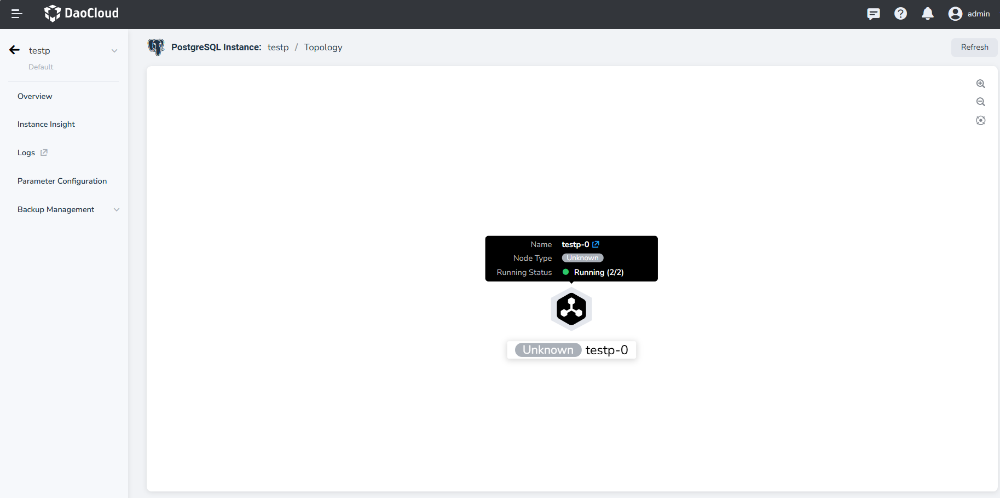
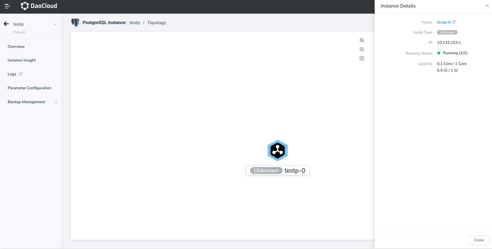

---
hide:
  - toc
---

# Instance Topology

The PostgreSQL instance topology displays the state of data synchronization between nodes in the instance, 
as well as basic information.

## Steps

Click to enter the details page of the target instance, then in the left navigation bar, select **Topology**.

- In the Topology page, you can see the primary-standby relationships between instance nodes and the direction of 
  data synchronization.

- Click the icon in the upper right corner to zoom in or out of the topology diagram.

    

- Hovering over a node or clicking a node allows you to view detailed information about the selected node, 
  including its IP, running status, synchronization status, and more. The synchronization status information 
  includes the node's log status and synchronization progress, such as the amount of logs sent, written, 
  and replicated.

    