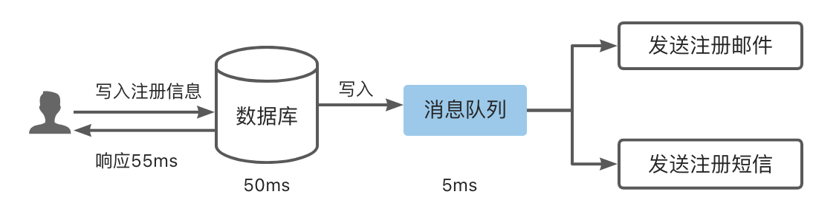
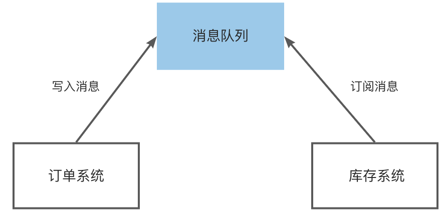
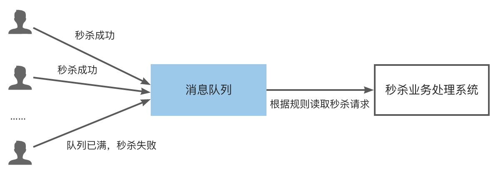

# Applicable scene

RabbitMQ is applicable to a wide range of scenarios, and this section lists several typical scenarios.

## Asynchronous processing

Scenario description: After the user registers, it is necessary to send a registration email and a registration SMS.

After the message queue is introduced, the user's response time is equal to the time of writing to the database + the time of writing to the message queue (this can be ignored).
After the introduction of message queue post-processing, the response time is 3 times that of serial and 2 times that of parallel.

## Application Decoupling

Scenario description: The number of orders placed by users surges during promotional activities. After users place orders, the order system needs to notify the inventory system.

The traditional method is that the order system calls the interface of the inventory system, which will cause the order to fail when the inventory system fails.
If you use a message queue (as shown in the figure below), after the user places an order, the order system completes the persistence process, writes the message into the message queue, and returns the user's order placement success.
Subscribe to the news of the order, get the news of the order, and perform library operations. Even if the inventory system fails, the message queue can ensure reliable delivery of messages without causing message loss.

## Traffic clipping

Scenario description: A flash sale event planned by a certain platform usually causes the application to be unavailable due to excessive traffic.

In order to solve this problem, a message queue is generally added to the front end of the application.
The number of active people can be controlled through the message queue, and orders exceeding this certain threshold are discarded directly, and at the same time, it can relieve short-term high traffic from overwhelming the application.
After the server receives the user's request, it first writes into the message queue. If the message queue length exceeds the maximum value, it will directly discard the user's request or jump to the error page.
The seckill business performs follow-up processing according to the request information in the message queue.

