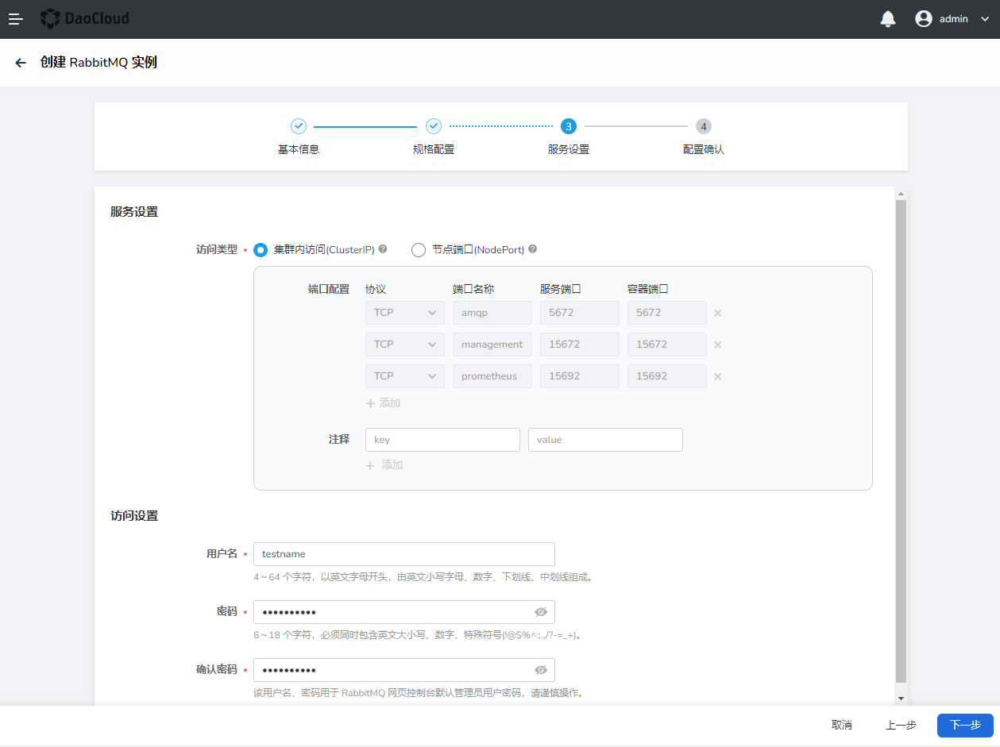
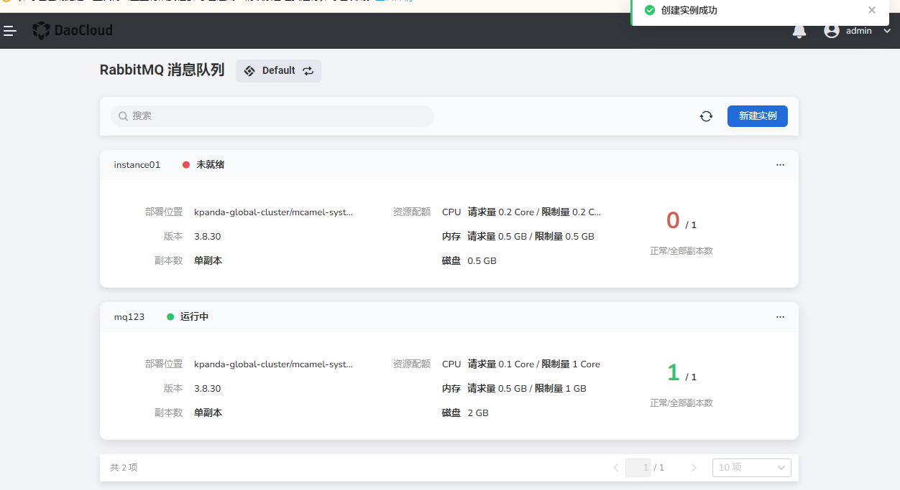

# Create RabbitMQ

In the RabbitMQ message queue, do the following:

1. Click `New Instance` in the upper right corner.

    

2. On the `Create a RabbitMQ instance` page, after setting the basic information, click `Next`.

    

3. After configuring the specifications, click `Next`.

    - Version: The version number of RabbitMQ, currently only supports RabbitMQ 3.7.20.
    - Number of copies: 1, 3, 5, 7 copies are supported.
    - Resource Quota: Select the rules according to the actual situation.
    - Storage Volume: Select the storage volume and the total amount of storage space for the RabbitMQ instance.

    

4. After setting up the service, click `Next`.

    - Access method: You can choose intra-cluster access or Nodeport access.
    - Service settings: set the username and password for connecting to the RabbitMQ instance.
    
    

5. Confirm that the instance information is correct, and click `Confirm` to complete the creation.

    

6. On the instance list page, check whether the instance is successfully created. The status of the newly created instance is `Not Ready`, and it will change to `Running` after a few minutes.

    