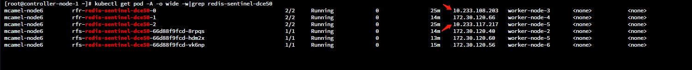

# External Access Based on Spiderpool

## Configuration Goal

Since Redis itself does not provide the ability for external access to the cluster, other networking functionalities need to be used to achieve this access requirement. In this example, we use calico/cilium + macvlan standalone + spiderpool for support.

## Prerequisites

The __multus-underlay__ and __spiderpool__ have been deployed in the DCE 5.0 cluster.


## Environment Setup

1. Verify the deployment of macvlan. Run the following command to check the deployment status and you should see a similar response as shown in the image below:

    ```shell
    kubectl get network-attachment-definitions -A
    ```

    

    If you see __macvlan-vlan0(standalone)__ and __macvlan-overlay-vlan0(overlay)__, it means that macvlan has been deployed in the cluster.

    !!! note

        Redis only supports external access through __macvlan standalone__ mode.

2. Create a subnet and IP pool. Please refer to the documentation [Create Subnet and IP Pool](https://docs.daocloud.io/network/modules/spiderpool/createpool.html) for detailed instructions.

    

    !!! note

        Redis can only use existing subnets and IP pools, so be sure to perform the manual creation operation first.

## Redis Instance Configuration

### Cluster Mode

1. Modify the __CR__ (rediscluster) of the Redis instance and add the following content under the metadata field:

    ```yaml
    annotations:
      v1.multus-cni.io/default-network: kube-system/macvlan-vlan0
      ipam.spidernet.io/ippools: '[{"interface":"eth0","ipv4":["ippool-redis"]}]'
    ```

2. After updating the __CR__, check the node information of the instance. If you see IP address changes similar to the following image, it means the configuration is successful:

    

    

3. After the configuration is complete, you can access the node from outside the cluster and verify that it is accessible.

    

### Sentinel Mode

1. Update the __CR__ (redisfailover) of the Redis instance and add the following content to the __spec.redis__ and __spec.sentinel__ fields respectively:

    ```yaml
    podAnnotations:
      v1.multus-cni.io/default-network: kube-system/macvlan-vlan0
      ipam.spidernet.io/ippools: '[{"interface":"eth0","ipv4":["ippool-redis"]}]'
    ```

    !!! note

        For cilium, you need to add __annotations__ to the __deployment__ of __redis-operator__.
        The field location is __spec.template.metadata.annotations__.

        For calico, there is no need to update __redis-operator__.

2. After updating the __CR__, check the node information of the instance. If you see IP address changes similar to the following image, it means the configuration is successful:

    

    

3. After the configuration is complete, you can access the node from outside the cluster and verify that it is accessible.

    

!!! note "Notice"

    When the workload `updateStrategy` in Redis Sentinel mode is set to `OnDelete`,
    the old version of the Pod will not be immediately deleted after updating the CR.
    You need to manually restart the Pod for the changes to take effect.

The following image shows a screenshot of the data that hasn't been updated after modifying the CR:


