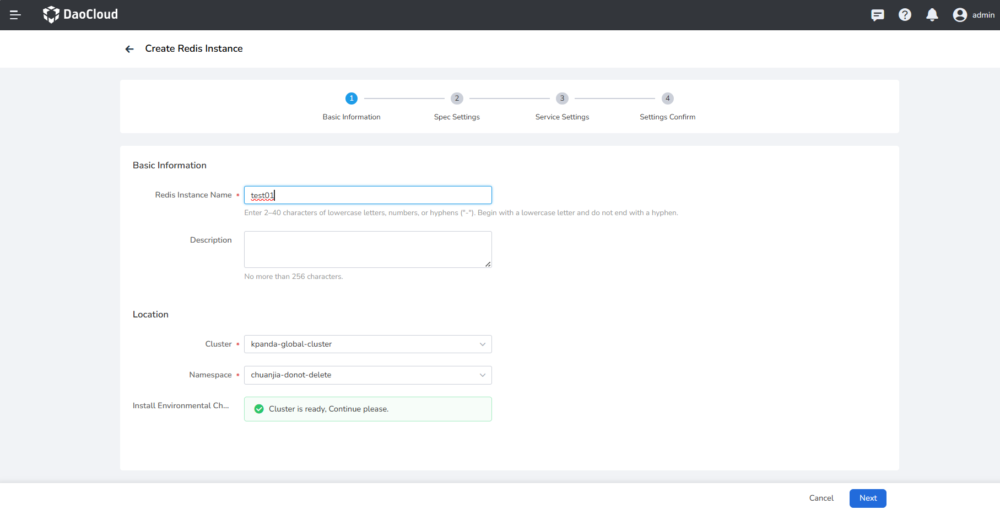
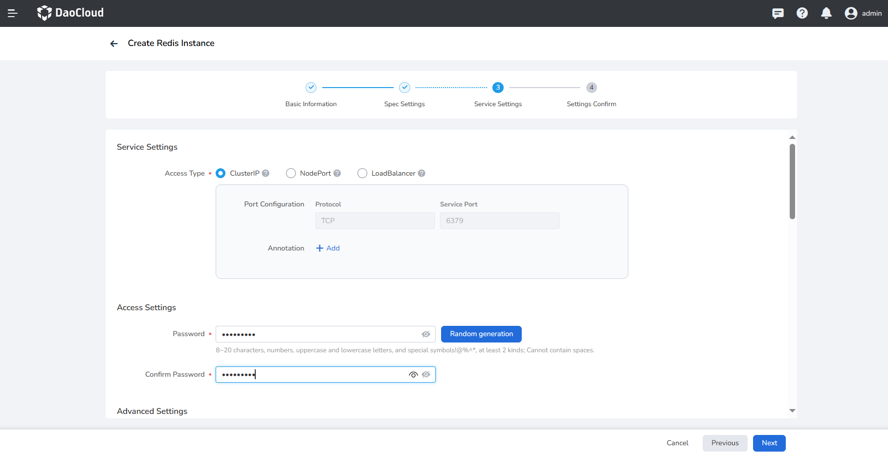
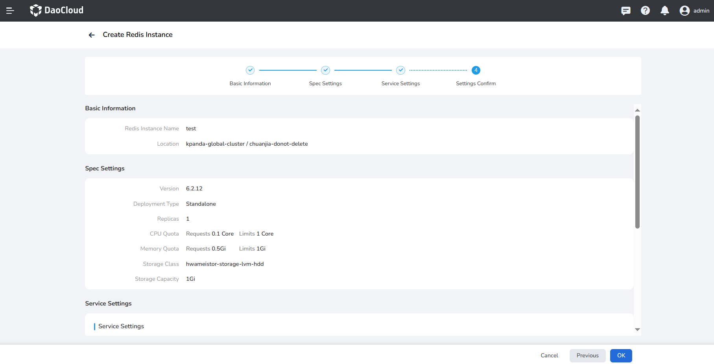

---
hide:
  - toc
---

# Create a Redis instance

After accessing the Redis cache service, follow the steps below to create a Redis instance.

1. In the instance list of the Redis cache service, click the __New Instance__ button.

    

2. On the __Create Redis Instance__ page, after configuring __Basic Information__ , click __Next__ .

    

3. After configuring __Spec Settings__ including deployment type, CPU quota, memory quota, storage class and capacity, click __Next__ .

    

4. Set __Service Settings__ such as username and password, and ClusterIP is used as the access method by default.

    

5. After confirming that the basic information, specification configuration, and service settings are correct, click __OK__ .

    

6. Return to the instance list, and the screen will prompt __Instance created successfully__ . The status of the newly created instance is __Not Ready__ , and it will become __Running__ after a while.

    