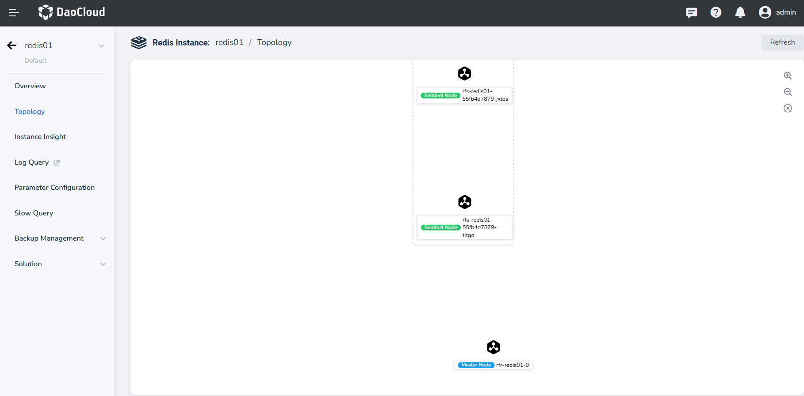
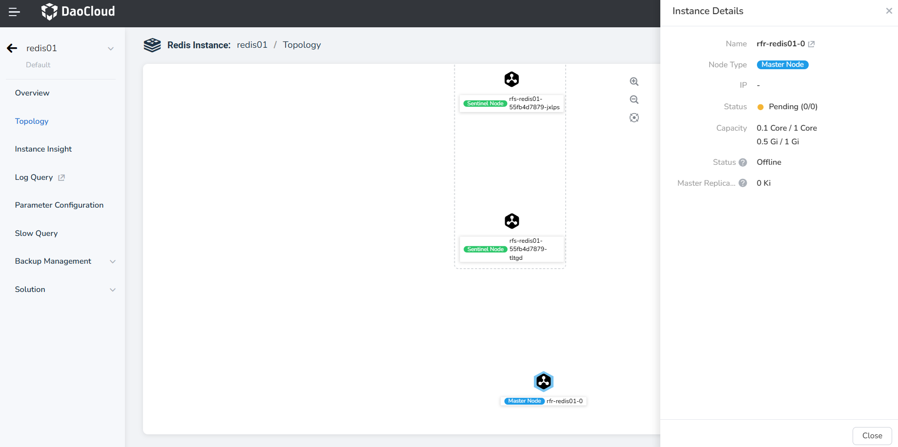

---
hide:
  - toc
---

# Instance Topology

The Redis instance topology displays the state of data synchronization between nodes in the instance, 
as well as basic information.

## Steps

Click to enter the details page of the target instance, then in the left navigation bar, select **Instance Topology**.

- In the topology, you can see the active-standby relationships between instance nodes and the direction 
  of data synchronization.

- Click the icon in the upper right corner to zoom in or out of the topology diagram.

    

- Hovering over a node or clicking a node allows you to view detailed information about the selected node, 
  including its IP, running status, capacity, master-replica offset.

    