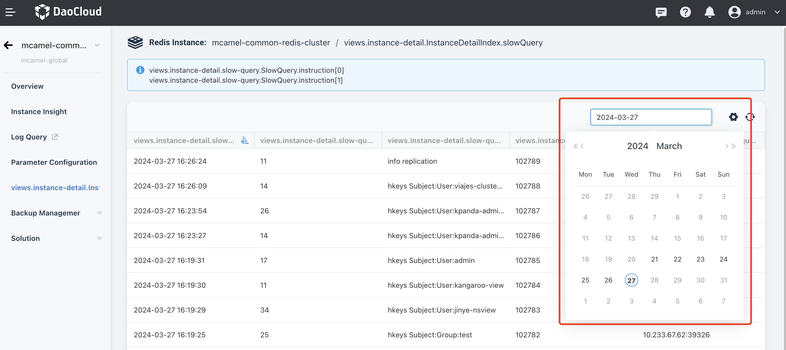

# Slow queries

Slow queries refer to queries in Redis that take longer than a specified duration to execute. The default duration for saving slow query logs is 7 days.
When a master-slave switch occurs, the slow query logs will switch to the new master node's logs, and the historical slow query logs will also be stored on the new master node.

In addition to the traditional command line interface, DCE 5.0 Redis provides a graphical interface for performing slow queries.

You can query events within any chosen day of the 7-day period that exceed the preset duration.

