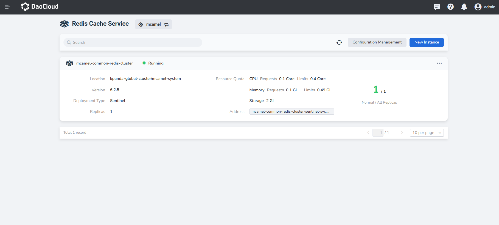
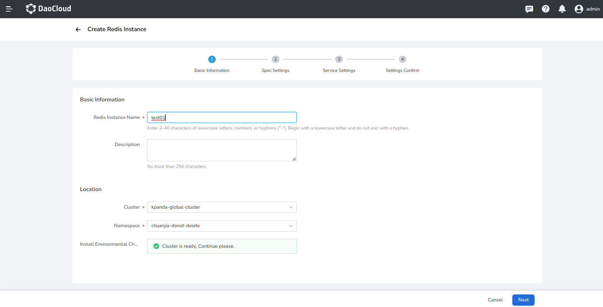
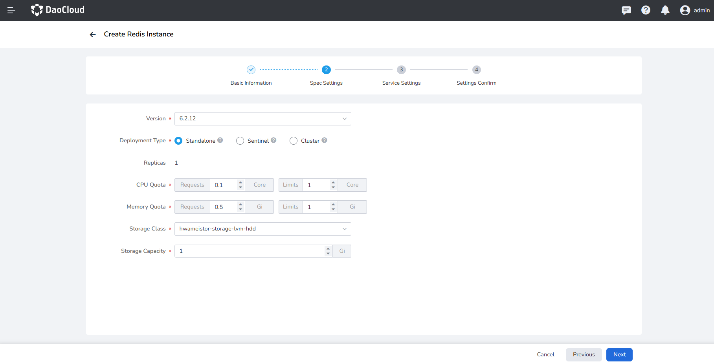
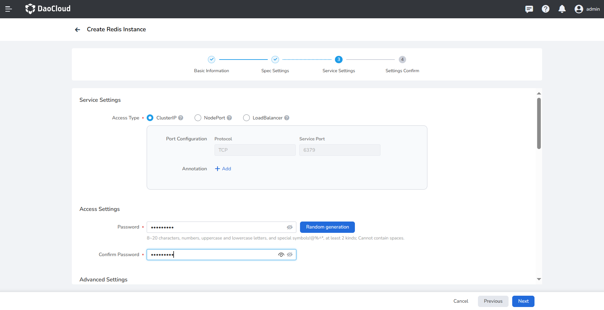
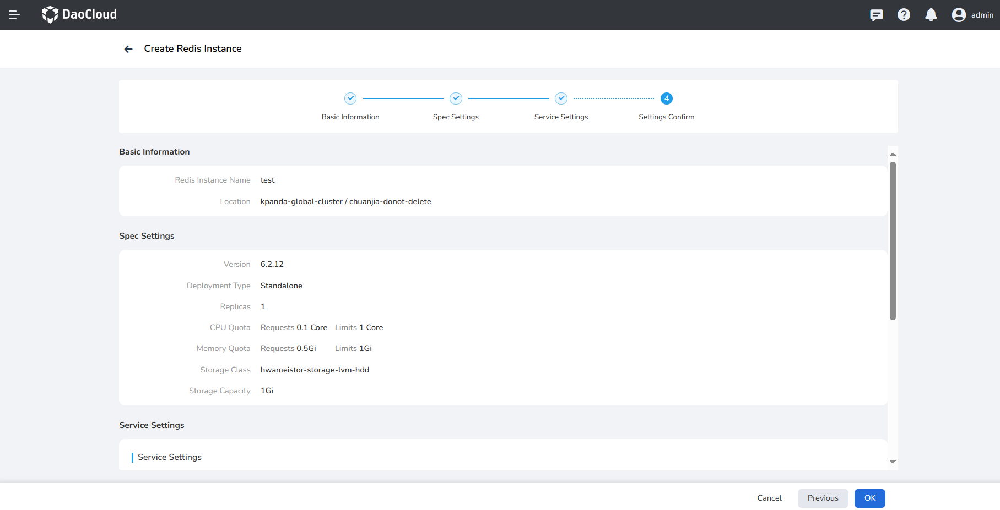
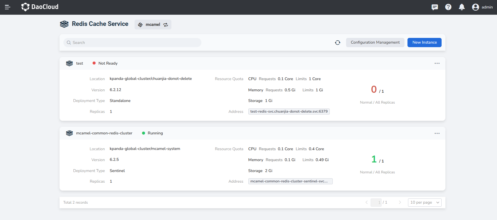

# Create a Redis instance

After accessing the Redis cache service, follow the steps below to create a Redis instance.

1. In the instance list of the Redis cache service, click the `New Deployment` button.

    

2. On the `Create Redis Instance` page, after configuring `Basic Information`, click `Next`.

    

3. After selecting the deployment type, CPU, memory and storage, etc. `Specification Configuration`, click `Next`.

    

4. Set `service settings` such as user name and password, and use ClusterIP as the access method by default.

    

5. After confirming that the basic information, specification configuration, and service settings are correct, click `Confirm`.

    

6. Return to the instance list, and the screen will prompt `Instance created successfully`. The status of the newly created instance is `Not Ready`, and it will become `Running` after a while.

    