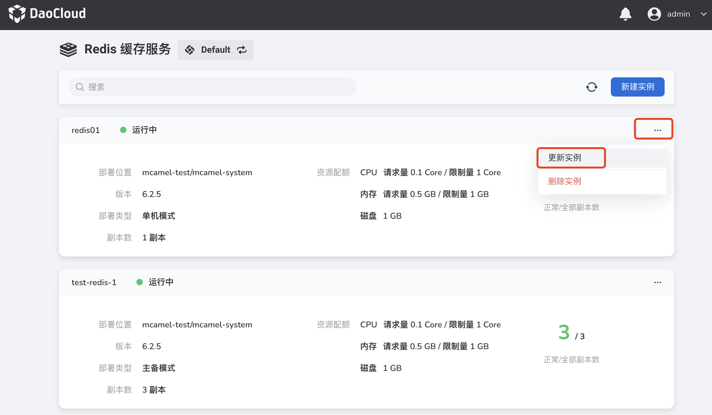
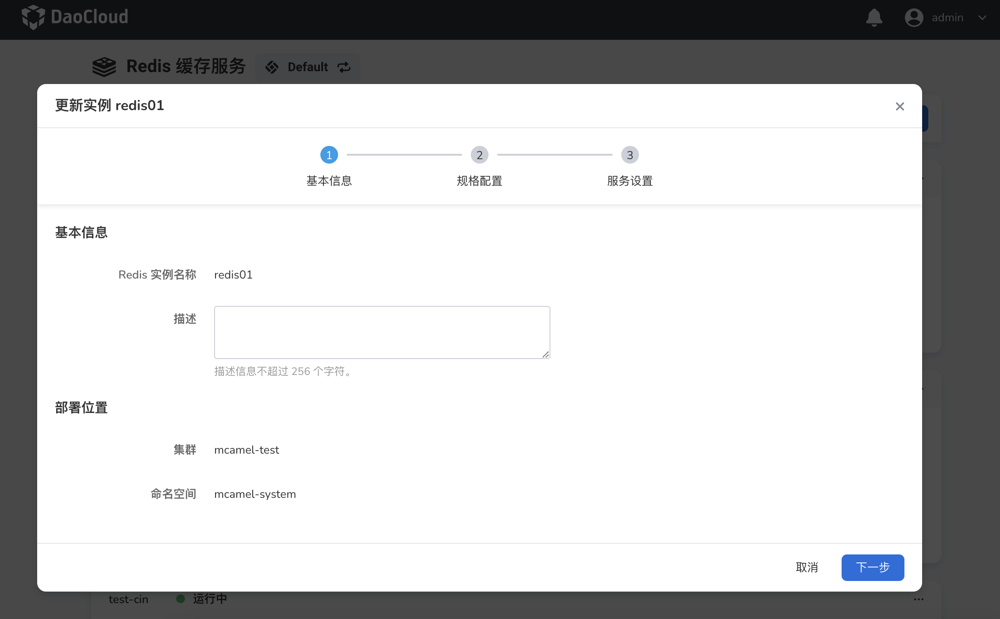
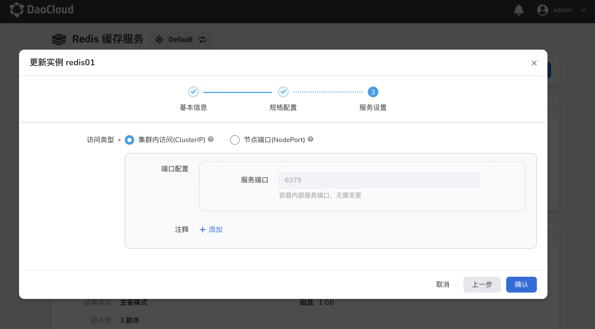

# Update the Redis instance

If you want to update or modify the resource configuration of Redis, you can follow the instructions on this page.

1. In the instance list, click the `...` button on the right, and select `Update Instance` from the pop-up menu.

    

2. Basic information: Only the description can be modified. Then click `Next`.

    

3. After modifying the specification configuration, click `Next`.

    

4. After modifying the service settings, click `Confirm`.

    