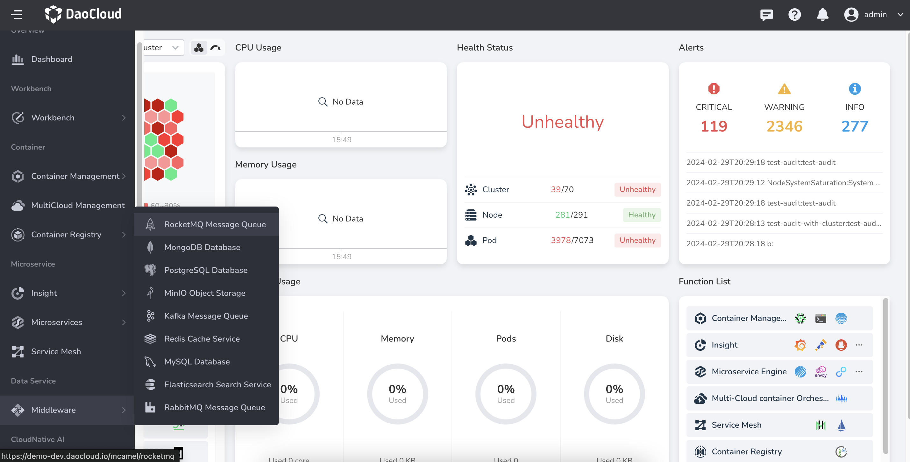
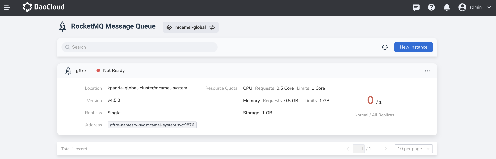
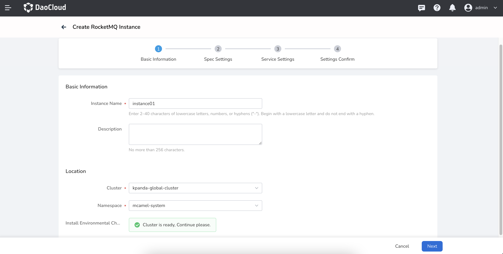
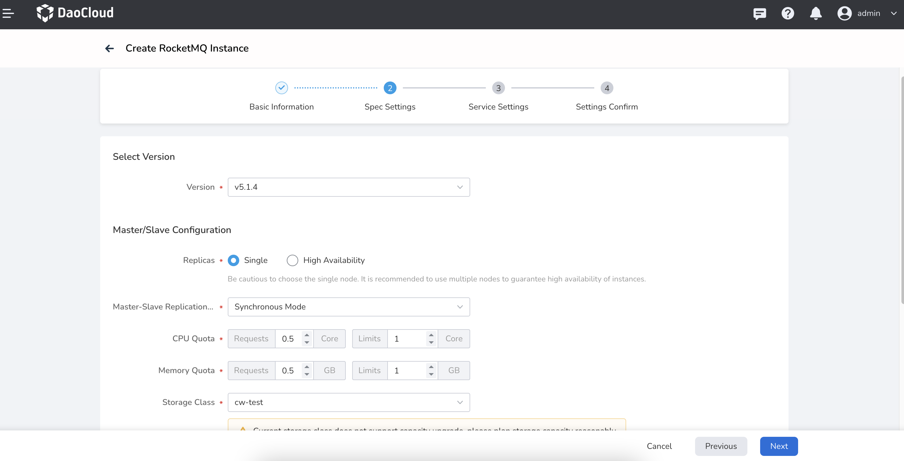
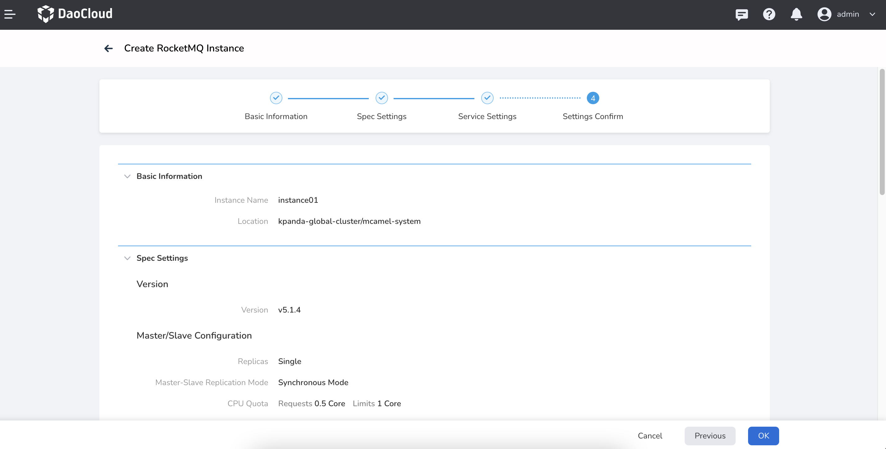

# Create RocketMQ Instance

This page explains the steps to create a RocketMQ instance.

1. From the left navigation bar, select __Middleware__ -> __RocketMQ Message Queue__ .

    { width=1000px }

2. Enter the target workspace and click __New Instance__ .

    - Instance Name: 2-40 characters, can only contain lowercase letters, numbers, and hyphens ("-"), and must start with a lowercase letter and end with a letter or number.
    - Cluster / Namespace: Choose the location where the instance will be deployed.
    - Installation Environment Check: If the installation environment check fails, you need to install the components as prompted before proceeding to the next step.

    { width=1000px }

3. Fill in the spec settings below, then click __Next__ .

    - Deployment mode cannot be changed after instance creation.
    - It is recommended to use a high-availability deployment mode in production mode.
    - At least 4 replicas are required in high-availability mode.
    - Storage Class: The selected storage class should have sufficient available resources, otherwise, instance creation may fail due to resource insufficiency.
    - Storage Capacity: How much capacity each disk has. It cannot be reduced after instance creation.
    - Disks per Replica: How many secondary disks are provided for each replica. It cannot be reduced after instance creation.

    { width=1000px }

4. Fill in the service settings below, then click __Next__ .

    - Cluster Internal Access: Service can only be accessed within the same cluster.
    - Node Port: Access the service through the node's IP and static port, supporting access from outside the cluster.
    - Load Balancer: Use the cloud service provider's load balancer to make the service publicly accessible.
    - Load Balancer/External Traffic Strategy: Specify whether the service routes external traffic to a node locally or within the cluster.
    - Cluster: Traffic can be forwarded to Pods on other nodes in the cluster.
    - Local: Traffic can only be forwarded to Pods on the local node.
    - Console Account: Username and password required to access this newly created instance.

    { width=1000px }

5. Confirm that the instance configuration information is correct, then click __OK__ to complete the creation.

    { width=1000px }

6. Return to the instance list page to check if the instance was created successfully.

    The status of the instance being created is __Not Ready__, and it will change to __Running__ once all related containers have successfully started.
