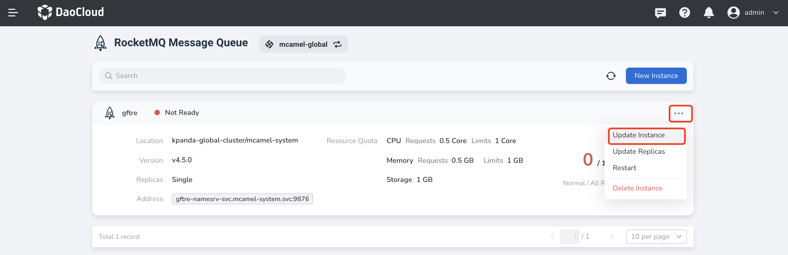
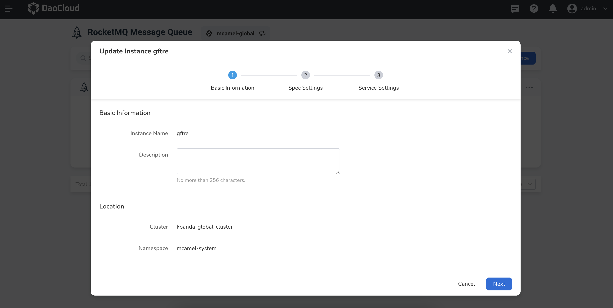
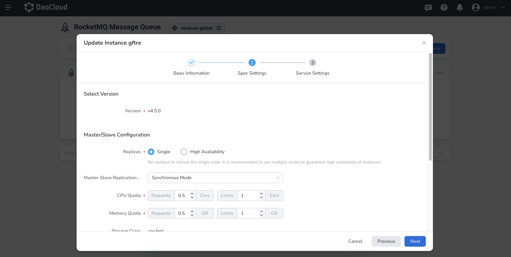
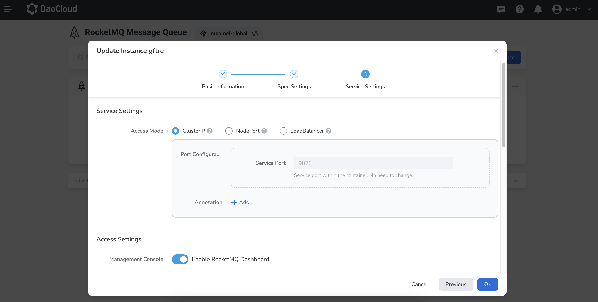

# Update RocketMQ Instance

This page explains the steps to update a RocketMQ instance.

1. In the instance list, click the right side __...__ and select __Update Instance__ from the pop-up menu.

    

2. Modify the basic information, then click __Next__ .

    - Only description information can be modified
    - Instance name and deployment location cannot be changed

    

3. Modify the spec settings, then click __Next__ .

    

4. Modify the service settings, then click __OK__ .

    

5. Return to the instance list, and a message will be displayed in the top right corner of the screen: Update instance successful.
