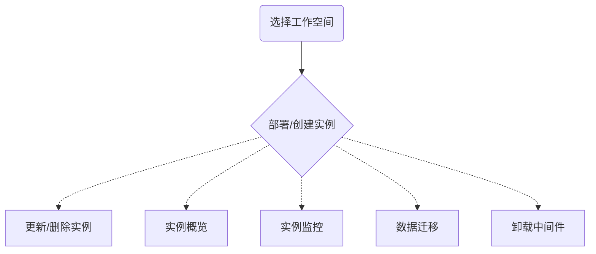

---
hide:
  - toc
---

# 数据服务介绍

DCE 5.0 针对实际应用场景，精选了一些经典的数据服务中间件，通过前后端开发，能够满足各类应用场景的开发和维护。

用户可以按需安装/启用以下数据服务中间件，即插即用：

- [Elasticsearch 搜索服务](elasticsearch/intro/what.md)：目前首选的全文搜索引擎
- [Kafka 消息队列](./kafka/intro/what.md)：常用于消息传输的数据管道
- [MinIO 对象存储](./minio/intro/what.md)：一款非常热门的轻量对象存储方案
- [MySQL 数据库](mysql/intro/what.md)：最流行的开源关系型数据库之一
- [RabbitMQ 消息队列](rabbitmq/intro/what.md)：常用于交易数据的传输管道
- [Redis 缓存服务](./redis/intro/what.md)：一种内存数据库
- [PostgreSQL 数据库](./postgresql/intro/what.md)：最流行的开源关系型数据库之一

## 数据服务学习路径

上述几个数据服务中间件的学习路径大致相同，此处以 RabbitMQ 为例，简单说明学习路径。

!!! info

    在下方流程流程图中点击相应文字可以直接跳转到对应的操作指南页面。

[Elasticsearch](elasticsearch/intro/what.md){ .md-button .md-button--primary }
[Kafka](./kafka/intro/what.md){ .md-button .md-button--primary }
[MinIO](./minio/intro/what.md){ .md-button .md-button--primary }
[MySQL](mysql/intro/what.md){ .md-button .md-button--primary }
[RabbitMQ](rabbitmq/intro/what.md){ .md-button .md-button--primary }
[Redis](./redis/intro/what.md){ .md-button .md-button--primary }
[PostgreSQL](./postgresql/intro/what.md){ .md-button .md-button--primary }
