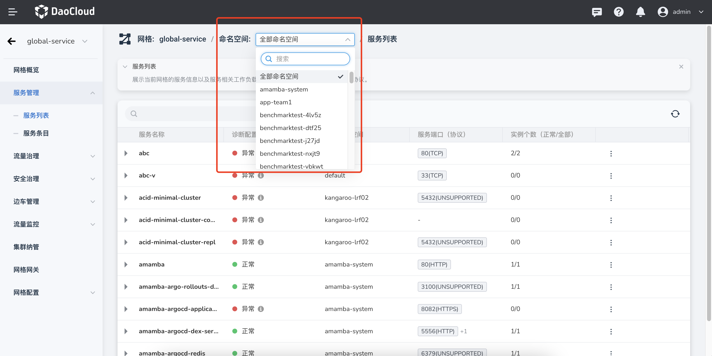
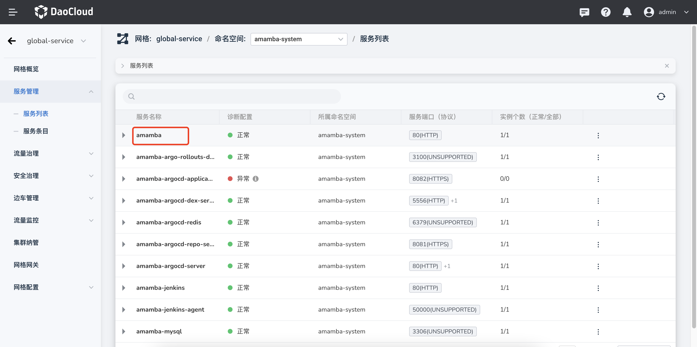
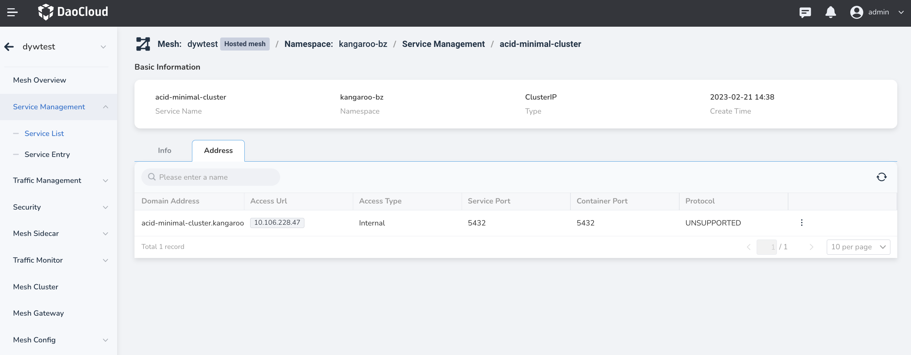
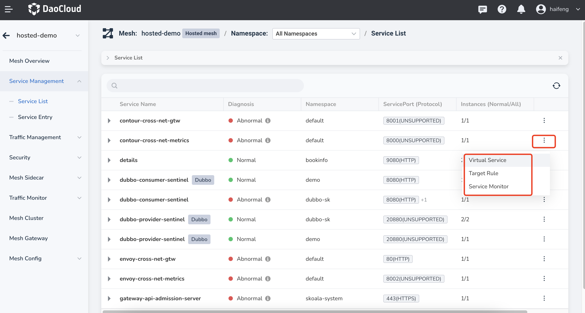

---
hide:
  - toc
---

# service management

Service management lists all the services that have been injected into the sidecar in the cluster under the current mesh, and you can filter services based on the namespace.

The service mesh aggregates the services of each cluster, and the services with the same name under the same namespace will be aggregated into one service, which is conducive to unified traffic management for cross-cluster collaborative services.

You can click a service name to enter the details page to view specific information such as the service address and port of each cluster. You can also modify the communication protocol in the `Address Information` tab.

Pay special attention to the `Diagnostic Configuration` column in the list of services. When the diagnostic information is `abnormal`, hovering the cursor over `ⓘ` will display the cause of the exception. The abnormal state will affect mesh-related capabilities such as service traffic governance in the next stage.

On the right side of the service list, click `⋮` to select the corresponding menu item, and you can jump to traffic management and security management.

For how to create and configure services, please refer to [Creating Services](../../../kpanda/07UserGuide/ServicesandRoutes/CreatingServices.md).