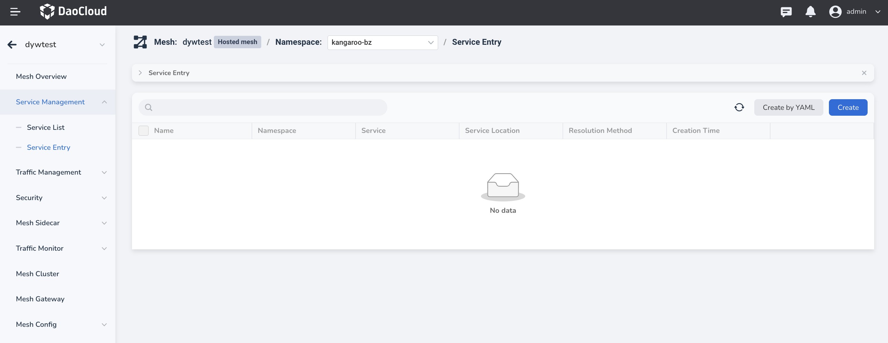
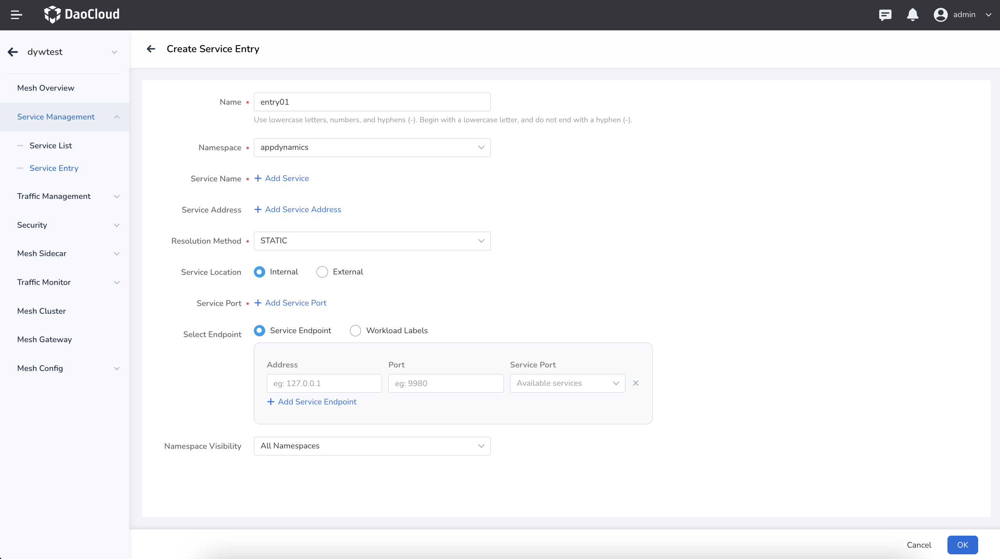
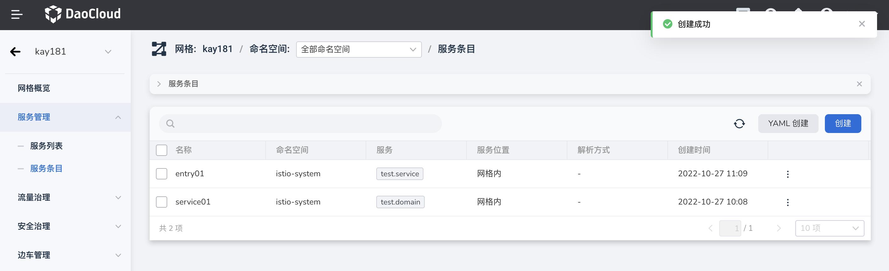
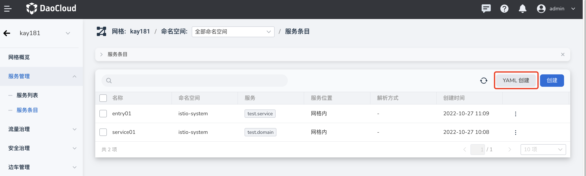
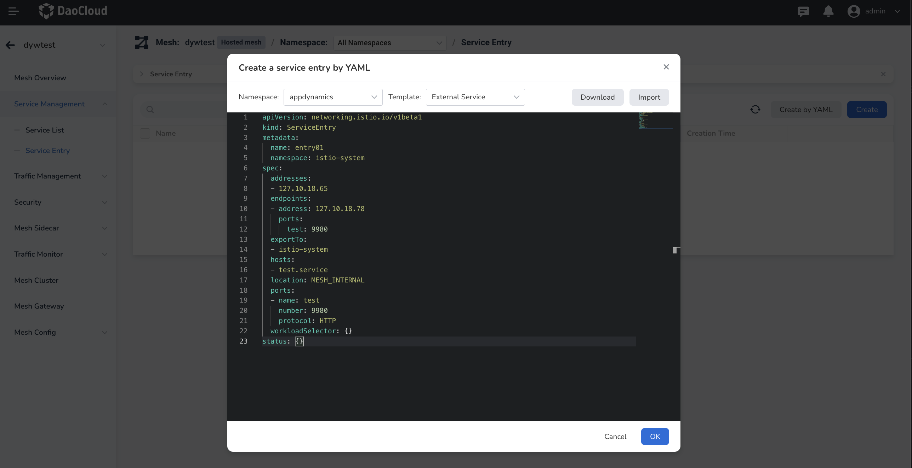

# service entry

Service entries can add external services, web APIs, or virtual machines to the service mesh's internal service registry.
Taking an external service as an example, after adding a service entry, the Envoy proxy can send traffic to the external service, and the service mesh can also perform traffic governance on the external service through virtual services and target rules, as if the service entry is a mesh Same as normal service in .

Service mesh provides two creation methods: Create with YAML and wizard creation.

## Graphic wizard creation

This method of creation is relatively simple and intuitive.

1. After entering the selected mesh, click `Traffic Governance` -> `Service Entry` in the left navigation bar, and click the `Create` button in the upper right corner.

    

2. On the `Create Service Entry` page, configure various parameters and click `OK`. For the meaning of specific parameters, please refer to [parameter description](#parameters)

    

3. Return to the list of service items, and the screen prompts that the creation is successful.

    

5. On the right side of the list, click `⋮` in the operation column to perform more operations through the pop-up menu.

    

## Create with YAML

1. After entering the selected mesh, click `Traffic Governance` -> `Service Entry` in the left navigation bar, and click the `Create with YAML` button in the upper right corner.

    

2. Select the namespace, select the template, modify the parameters of each field, or directly import the existing YAML file, and click `OK` after confirming that the parameters are correct.

    

3. Return to the list of service items, and the screen prompts that the creation is successful.

    

Here is an example of a standard service entry YAML:

```yaml
apiVersion: networking.istio.io/v1beta1
kind: ServiceEntry
metadata:
  name: entry01
  namespace: istio-system
spec:
  addresses:
  - 127.10.18.65
  endpoints:
  - address: 127.10.18.78
    ports:
      test: 9980
  exportTo:
  -istio-system
  hosts:
  - test.service
  location: MESH_INTERNAL
  ports:
  - name: test
    number: 9980
    protocol: HTTP
  workloadSelector: {}
status: {}
```

## Concept introduction

The meaning of each parameter in the above YAML file and creation wizard is briefly explained as follows.

-Hosts

    Service Name. Can be used for hosts field matching in traffic governance policies (virtual services, destination rules, etc.).

    - In HTTP traffic, the service name will be the HTTP Host or Authority header
    - In HTTP, TLS traffic with SNI names, the service name will be the SNI name

-Addresses

    service address. The virtual IP address associated with the service, which can also be a CIDR prefix.

    - If the Addresses field is set, the service name and IP/CIDR of the requested HTTP traffic will be matched to confirm whether it belongs to the service.
    - If the Addresses field is empty, traffic is identified based on the destination port only. At this time, any other service in the mesh cannot share this port, and the sidecar will forward all incoming traffic on this port to the specified destination IP/host.

-Ports
  
    service port. The port associated with the service. If the endpoint is a Unix domain socket address, there must be a port.

-Location
    
    service address. A valid IP address needs to be entered. Used to indicate whether the service is inside the mesh.

- Resolution

    Parsing method. Multiple resolution methods for service addresses are provided:

    - NONE: Forward traffic directly to the service address or the address of the service endpoint, if present.
    - STATIC: Use a static address in the service endpoint.
    - DNS: Attempts to resolve IP addresses by asynchronously querying the ambient DNS.
    - If no service endpoint is set and no wildcards are used, the DNS address specified in the service name field will be resolved.
    - If a service endpoint is specified, the DNS address specified in the service endpoint will be resolved. DNS resolution cannot be used with Unix domain socket service endpoints.
    - DNS_ROUND_ROBIN: Attempts to resolve an IP address by asynchronously querying the ambient DNS. Different from the DNS method, the DNS_ROUND_ROBIN method only uses the first IP address returned after the connection is established, and does not depend on the complete result of DNS resolution.

- Endpoint

    service endpoint. Endpoint information related to the service, including IP address, port and service port name, etc.

- WorkloadSelector

    Workload selection tab. A key-value pair used to select the workload of the internal service of the mesh. This item and the service endpoint are optional.

<!-- How to use these service entries after creation? -->