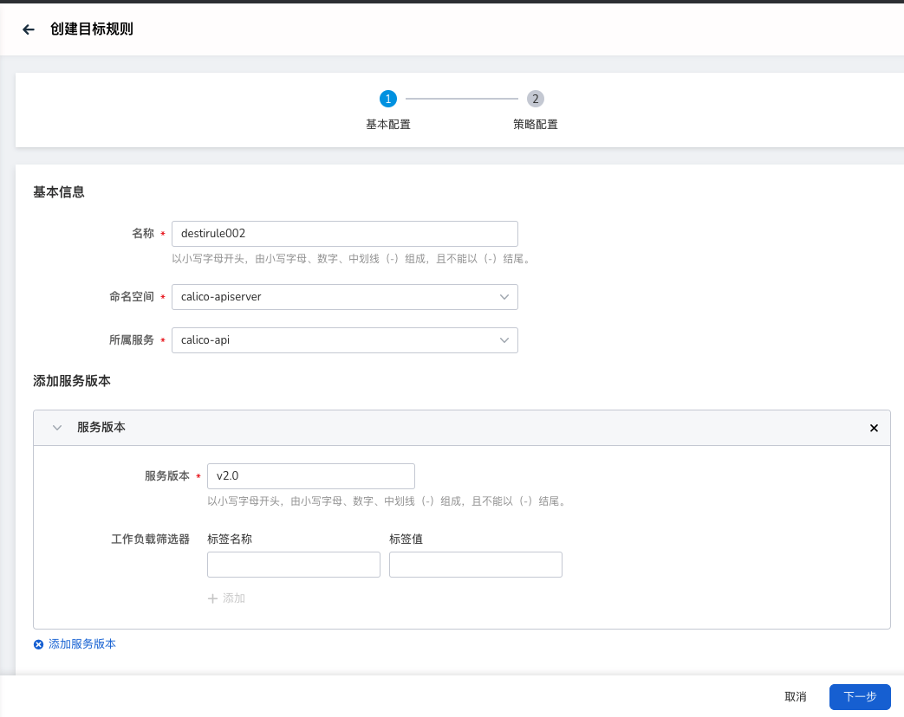
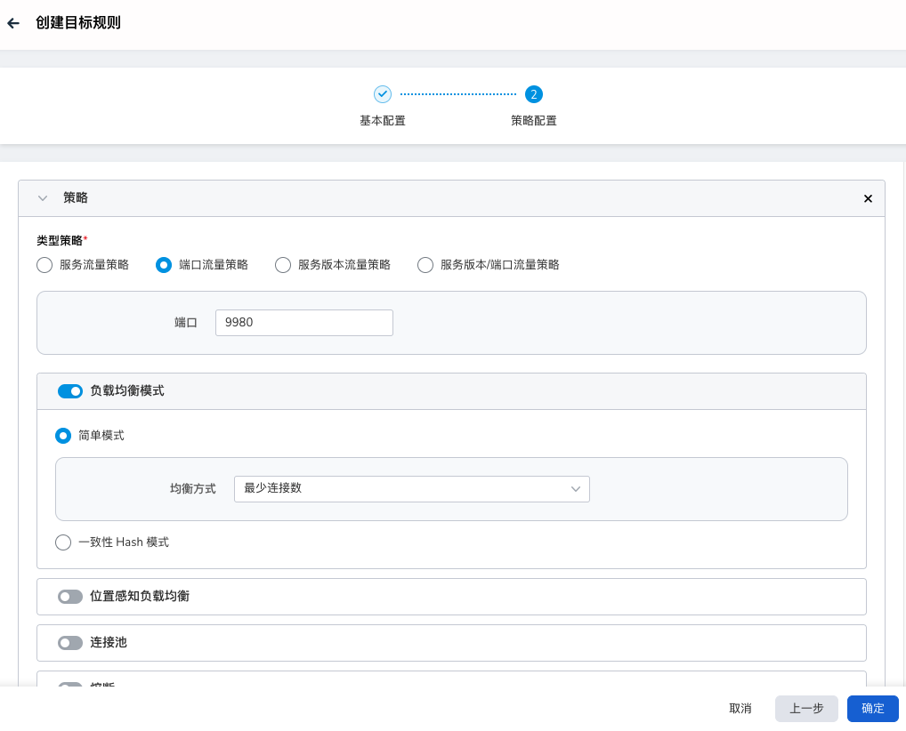
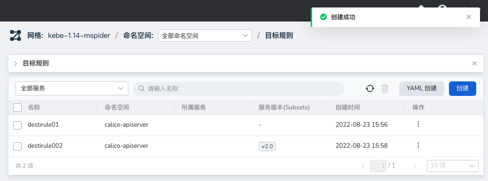

# target rule

Destination rules are also an important part of service governance. Destination rules divide request traffic through ports, service versions, etc., and customize envoy traffic policies for each request traffic. The policies applied to traffic not only have load Balance, as well as the minimum number of connections, fuses, etc.

## Concept introduction

Several important fields are as follows:

- Host

    Use the short name of the Kubernetes Service. The meaning is the same as the `host` field of `destination` in VirtualService. The service must exist in the corresponding service registry, otherwise it will be ignored.

-LoadBalancer

    By default, Istio uses a round-robin load balancing strategy, where each instance in the pool gets requests in turn.
    Istio also supports the following load balancing models, which can be specified in a DestinationRule for traffic to a specific service or subset of services.

    - Random: Requests go to instances in the pool in a random fashion.
    - Weight: Requests go to instances according to the specified percentage.
    - Least Requested: Requests are routed to the least accessed instance.

-Subsets

    `subsets` is a collection of service endpoints, which can be used in scenarios such as A/B testing or version routing.
    The traffic of a service can be divided into N shares for the client to use in different scenarios.
    `name` field is mainly used by `destination` in VirtualService after definition.
    Each subset is defined based on one or more `labels`, which in Kubernetes are key/value pairs attached to objects like Pods, based on the services corresponding to the `host`.
    These labels are applied to the Deployment of the Kubernetes service and serve as metadata information (Metadata) to identify different versions.

- Outlier Detection
  
    Fuse is a design pattern to reduce service exceptions and service delays. It mainly handles service exceptions without any sense and ensures that no cascade or even avalanche will occur.
    If the cumulative number of service errors within a certain period of time exceeds the predefined threshold, the wrong service will be removed from the load balancing pool, and the health status of the service will continue to be monitored. When the service returns to normal, it will be removed from the load balancing pool. The service is then moved back to the load balancing pool.

## Steps

Service mesh provides two creation methods: wizard and YAML. The specific steps to create through the wizard are as follows:

1. Click `Traffic Governance` -> `Target Rules` in the left navigation bar, and click the `Create` button in the upper right corner.

    

2. In the `Create Target` interface, first perform the basic configuration and then click `Next`.

    

3. Follow the screen prompts to select the route configuration, and click `OK`.

    

4. Return to the target rule list, and the screen prompts that the creation is successful.

    

5. On the right side of the list, click `⋮` in the operation column to perform more operations through the pop-up menu.

    