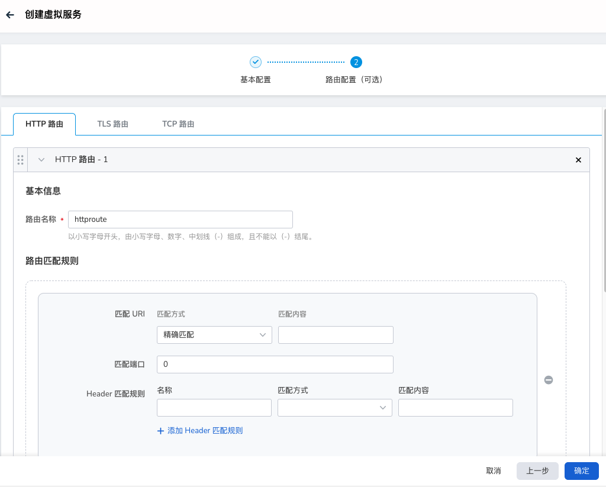

# virtual service

In the virtual service (VirtualService), various matching methods (port, host, header, etc.) can be used to implement routing and forwarding of different regions and user requests, distribute them to specific service versions, and divide the load according to the weight ratio.

The virtual service provides routing support for HTTP, TCP, and TLS protocols.

## Concept introduction

-Hosts

    The destination host for the traffic. It can come from service registration information, service entry, or user-defined service domain name. Can be a DNS name with a wildcard prefix, or an IP address.
    Depending on the platform, a short name may also be used instead of the FQDN. In this scenario, the specific conversion process from the short name to the FQDN must be completed by the underlying platform.

    A hostname can only be defined in one VirtualService. Traffic properties that can be used to control multiple HTTP and TCP ports in the same VirtualService.

    Note that when using the short name of the service (e.g. using reviews instead of `reviews.default.svc.cluster.local`), the service mesh will process this name according to the namespace the rule is in, not The namespace in which the service resides.
    Assuming a rule in the `default` namespace contains a host reference for reviews, it will be treated as `reviews.default.svc.cluster.local`, regardless of the namespace where the reviews service resides.

    To avoid possible misconfigurations, it is recommended to use FQDNs for service references.
    The hosts field is valid for both HTTP and TCP services.
    Services in the grid, that is, services registered in the service registry, must be referenced using their registered names; only Gateway-defined services can use IP addresses.

    Example:

    ```yaml
    spec:
      hosts:
      - ratings.prod.svc.cluster.local
    ```

-Gateways

    These Hosts can be exposed outside the mesh by binding the VirtualService to the same Host's Gateway Rules.

    Mesh uses the default reserved word mesh to refer to all sidecars in the mesh.
    When this field is omitted, the default value (mesh) will be used, that is, it will take effect for all Sidecars in the grid.
    If gateway rules are set for the gateways field (there can be more than one), it will only be applied to the declared gateway rules.
    If you want to take effect on gateway rules and all services at the same time, you need to explicitly add mesh to the gateways list.

    Example:

    ```yaml
    gateways:
    -bookinfo-gateway
    - mesh
    ```

-Http

    An ordered list of rules. This field contains all routing configuration functions for the http protocol. For service ports whose names are prefixed with `http-`, `http2-`, `grpc-`, or whose protocols are HTTP, HTTP2, GRPC and terminated TLS,
    In addition, ServiceEntry using HTTP, HTTP2, and GRPC protocols are all valid.
    Traffic will use the first rule that matches.

    Description of the main fields under http:

    - Match

        Matches the conditions to be met for the rule to activate. All conditions within a single match block have AND semantics, while lists of match blocks have OR semantics.
        If any one of the matching blocks succeeds, the rule is matched.

    -Route

        http rules can redirect or forward (default) traffic.

    -Redirect

        http rules can redirect or forward (default) traffic.
        Routing/redirection will be ignored if the traffic pass option is specified in the rule.
        The redirect primitive can be used to send HTTP 301 redirects to other URIs or authorities.

    -Rewrite

        Rewrite HTTP URI and Authority header, rewrite cannot be used with redirection primitive.

    -Fault

        Fault injection strategy, applicable to client-side HTTP communication.
        If the fault injection policy is enabled on the client side, no timeouts or retries will be enabled.

    -Mirror/MirrorPercent

        Mirror HTTP traffic to another target, and can set the mirror ratio.

    - Tcp

        An ordered list of routes for transparent TCP traffic.
        TCP routing works on all ports except HTTP and TLS.
        Incoming traffic will use the first rule that matches.

    - Tls

        An ordered list, corresponding to pass through TLS and HTTPS traffic. The routing process is usually done using the SNI in the ClientHello message.
        TLS routing is usually applied to platform service ports with https- and tls- prefixes, or HTTPS and TLS protocol ports transparently transmitted by Gateway, and ServiceEntry ports using HTTPS or TLS protocols.
        Note: https- or tls- port traffic that is not associated with VirtualService will be regarded as transparent TCP traffic.

        The subfields of the Tcp protocol and tls are relatively simple, only including match and route, and are similar to http, so I won’t repeat them here.

## Steps

Service mesh provides two creation methods: wizard and YAML. The specific steps to create through the wizard are as follows:

1. Click `Traffic Management` -> `Virtual Service` in the left navigation bar, and click the `Create` button in the upper right corner.

    

2. In the `Create Virtual Service` interface, first perform the basic configuration and then click `Next`.

    

3. Follow the screen prompts to select the route configuration, and click `OK`.

    

4. Return to the virtual service list, and the screen prompts that the creation is successful.

    

5. On the right side of the list, click `⋮` in the operation column to perform more operations through the pop-up menu.

    