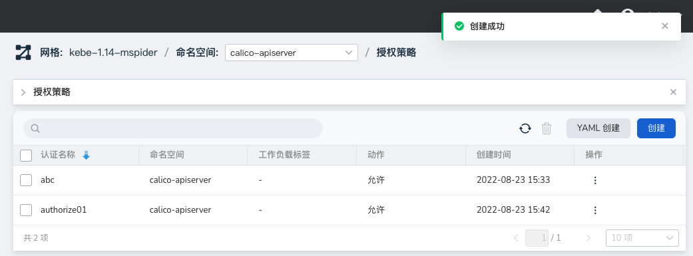
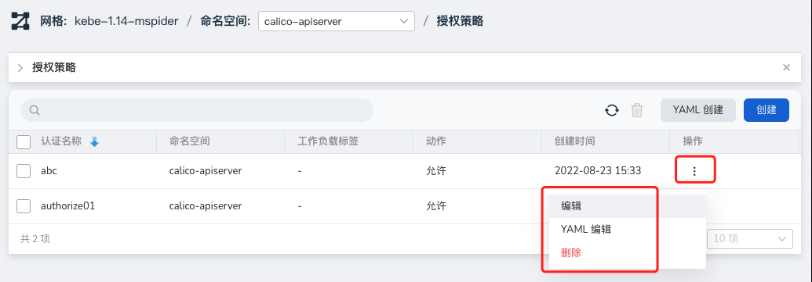

---
hide:
  - toc
---

# Authorization policy

The authorization policy is similar to a four-layer to seven-layer "firewall". Like a traditional firewall, it analyzes and matches the data flow, and then executes corresponding actions. The authorization policy applies whether the request is from internal or external.

Service mesh provides two creation methods: wizard and YAML. The specific steps to create through the wizard are as follows:

1. In the left navigation bar, click `Security Governance` -> `Authorization Policy`, and click the `Create` button in the upper right corner.

    

2. In the `Create Authorization Policy` interface, first perform the basic configuration and then click `Next`.

    

3. After setting the policy according to the screen prompts, click `OK`.

    

4. Return to the authorization list, and the screen prompts that the creation is successful.

    

5. On the right side of the list, click `⋮` in the operation column to perform more operations through the pop-up menu.

    

!!! note

    - For the configuration of specific parameters, please refer to [Security Governance Parameter Configuration](./params.md).
    - For a more intuitive operation demonstration, please refer to [Video Tutorial](../../../videos/mspider.md).