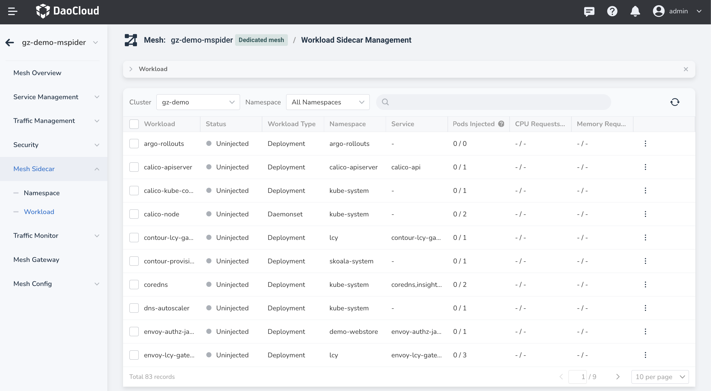
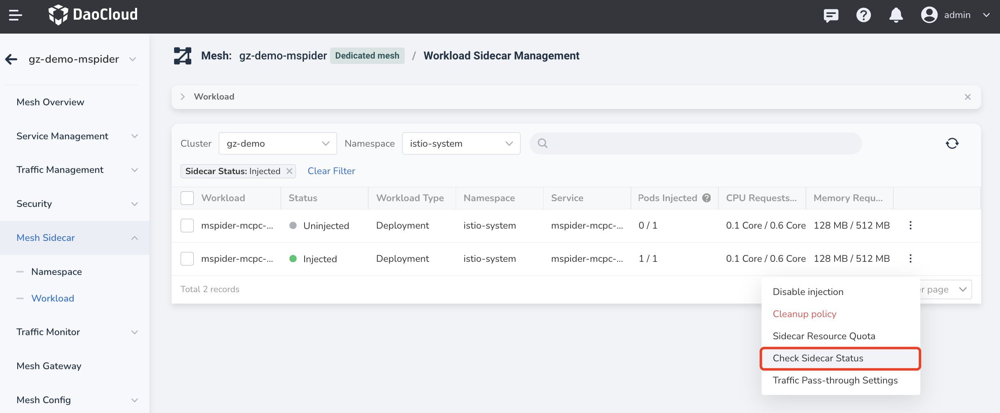
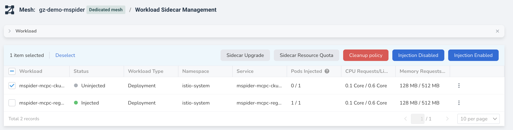
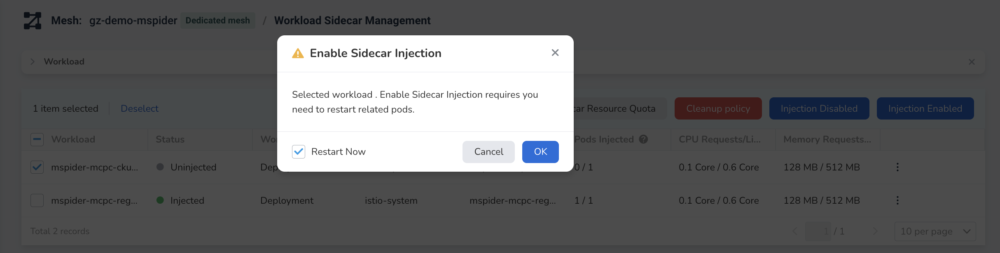
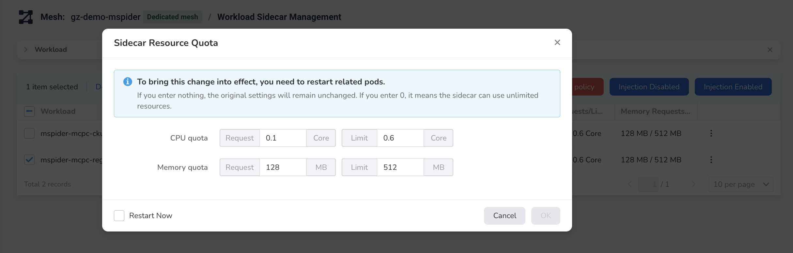
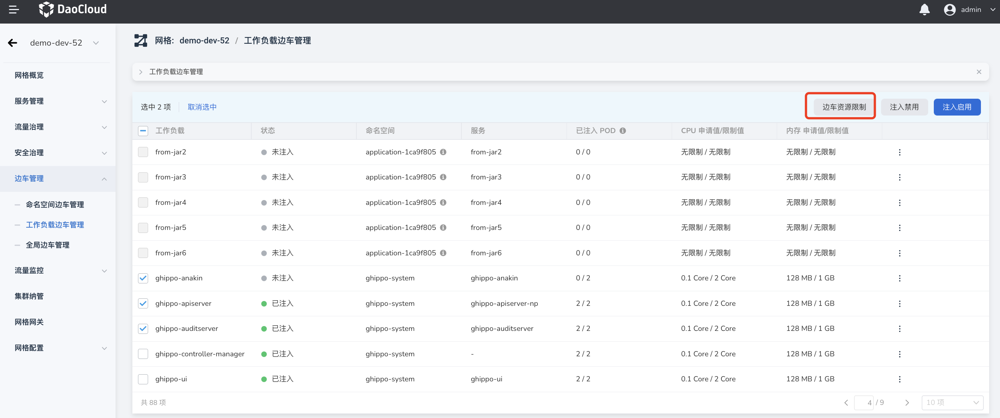
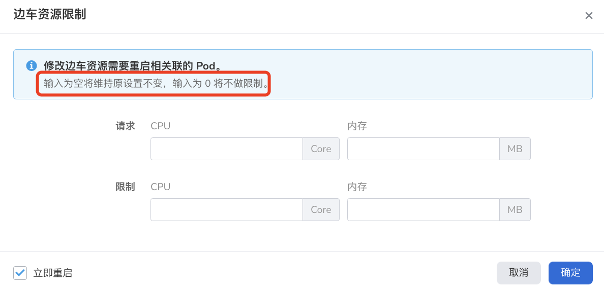

# Workload sidecar management

Users can perform operations such as viewing, enabling, and disabling sidecar injections on workloads, and can also set resource limits for workloads.

## View sidecar injection information

In the left navigation bar, click `Sidecar Management` -> `Workload Sidecar Management`, after selecting a cluster, you can view all workloads under the cluster and their sidecar injection status, namespace, resource limit, etc. information.

The meaning of each column is as follows:

| Workloads | All workloads under the selected cluster (excluding workloads whose system usage cannot be injected by sidecars) |
| ----------------- | -------------------------------- -------------------------------- |
| Status | Three states: Injected - sidecar auto-injection completed Not Injected - sidecar auto-injection disabled Pending restart - istio-injection for the namespace in question has changed , but the related Pod has not restarted |
| namespace | the namespace to which the workload belongs; |
| Service | This workload-related service, there may be multiple items, and the expansion and contraction list can be used. After the user clicks, the floating window will display all the content; |
| Injected Pod | The injection status of the Pod under the workload; Format: Injected Pod/All Pods that can be injected If the injection status of the workload is `Injected`, but some Pods are not injected , such as 3/5, this item will be highlighted to remind the user that there is a Pod that fails to be injected and needs to be dealt with in time |
| CPU application value/limit value | Contains two values ​​of `request` resource and `limit` resource, if the user has not set the resource, this item is `not set`.  Format: request / limit |
| Memory application value/limit value | Contains two values ​​of `request` resource and `limit` resource, if the user has not set the resource, this item is `not set`.  Format: request / limit |
|Operation| Contains two operation links: Sidecar resource limit: make resource settings for the current workload, this operation is valid for all state workloads; View sidecar state: only when the state is` Injected workloads are displayed, calling the `Sidecar Running Status` dialog; |

When there are many workloads, you can sort the workload names, and use the search function to find the target workload under the current cluster.

## View sidecar running status

On the right side of the workload sidecar list, click the icon `┇` in the `Operation` column, and select `View Sidecar Status` from the pop-up menu. You can view the current running status and resource limit value of the sidecar.

## Enable sidecar injection

After selecting one or more workloads, automatic sidecar injection can be enabled. This operation will restart the relevant Pod, so please confirm that the Pod can be restarted before performing this operation. The specific operation steps are as follows:

1. Select one or more workloads that do not have sidecar injection enabled, and click the Enable Injection button on the right.
   
    

2. In the pop-up dialog box, confirm whether the number of selected workloads is correct. After confirmation, check `Restart Now` and click `OK`.
   
    

3. Return to the sidecar list of the workload, and you can see that the `Status` of the selected workload has changed to `Injected`. After the workload is restarted, the sidecar injection will be completed. For the progress of the injection, see the `Injected POD` column.

    

!!! note

    If the `injection enable/disable` operation has been performed in the namespace to which the workload belongs but the workload has not been restarted, the workload will not be able to perform new sidecar-related operations.
    A complete restart is required before new sidecar operations can be performed.

## Disable sidecar injection

After selecting one or more workloads, automatic sidecar injection can be disabled. This operation will restart the relevant Pod, so please confirm that the Pod can be restarted before performing this operation. The specific operation steps are as follows:

1. Select one or more workloads with sidecar injection enabled, and click the `Injection Disable` button on the right.
   
    

2. In the pop-up dialog box, confirm whether the number of selected workloads is correct. After confirmation, check `Restart Now` and click `OK`.
   
    

3. Return to the sidecar list of the workload, and you can see that the `Status` of the selected workload has changed to `Not Injected`. For related uninstallation progress, please check the `Injected POD` column.

    

## Sidecar resource limit

To prevent workload resources from being overcommitted, resource usage limits can be set for workloads. This operation will restart the relevant Pod, so please confirm that the Pod can be restarted before performing this operation. The specific operation steps are as follows:

1. Select one (or more) workloads with sidecar injection enabled, and click the `Sidecar Resource Limit` button.

    

2. In the pop-up dialog box, set the CPU/memory request value and limit value respectively. Select `Restart Now` and click `OK`.

    

3. In the workload sidecar management list, you can see that the data in `CPU Requested Value/Limited Value` and `Memory Requested Value/Limited Value` of the specified workload have been updated.