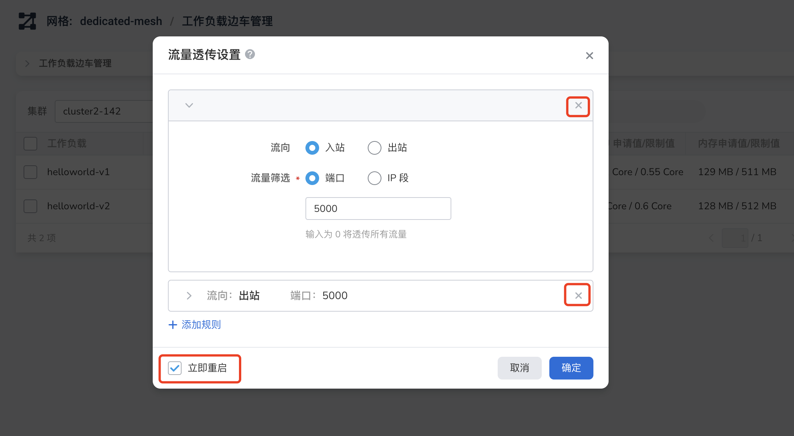
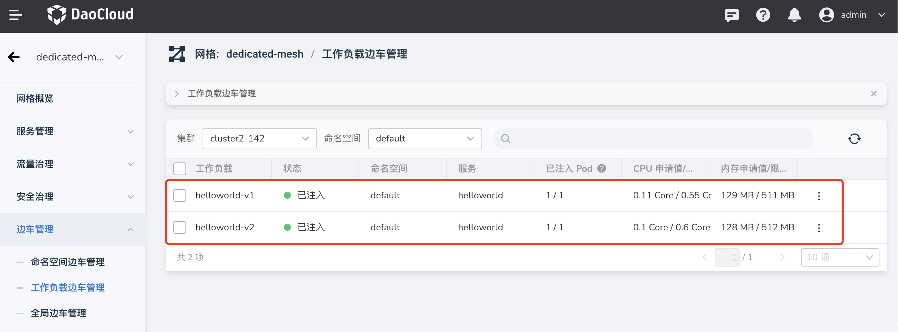

---
hide:
   - toc
---

# Sidecar traffic passthrough

Traffic passthrough refers to the fact that all or part of the upstream and downstream traffic of the workload is directly sent to the workload itself without being forwarded by the sidecar.

The DCE 5.0 service mesh realizes the controllable sidecar passthrough of workload outbound/inbound traffic, and can implement interception settings for specific ports and IP segments.

- Feature setting object: Workload
- Setting parameters: port, IP segment
- Flow direction: inbound, outbound

Fields related to traffic passthrough:

```none
traffic.sidecar.istio.io/excludeOutboundPorts
traffic.sidecar.istio.io/excludeOutboundIPRanges
```

## Enable traffic passthrough

This section explains how to enable/disable traffic passthrough on the DCE GUI.

1. Click a mesh name, click `Mesh Sidecar` -> `Workload`.

     

1. Click `⋮` on the right side of a load, and select `Traffic Passthrough Settings` in the pop-up menu.

     

1. After setting the parameters of traffic passthrough, check `Restart Now` and click `OK`.

     

1. The screen prompts that the traffic passthrough setting is successful. Please refer to [How to check the effect of traffic passthrough](#check-traffic-passthrough-effect).

     

1. If the traffic passthrough is enabled, the pop-up window of the above step 3 will display the set parameters, click the x on the right, check `Restart now`, and click `OK` to disable the traffic passthrough.

     

## Check traffic passthrough effect

In this section, in a real mesh cluster, check the effect before and after traffic passthrough.

1. Preparations

     - Prepare a cluster 10.64.30.142
     - In the `default` namespace, configure 2 workloads `helloworld-v1` and `helloworld-v2`, and inject sidecars
     - It is planned to enable traffic passthrough only for `helloworld-v1`, and then compare the traffic routing changes of the two loads

     

1. Log in to the cluster via ssh.

     ```bash
     ssh root@10.64.30.142
     ```

1. Check that 2 Deployments are running in the default namespace.

     ```console
     $ kubectl get deploy -n default
     NAME READY UP-TO-DATE AVAILABLE AGE
     helloworld-v1 1/1 1 1 42d
     helloworld-v2 1/1 1 1 42d
     ```

1. Perform the following steps to check the effect of traffic passthrough from the terminal and browser respectively.

=== "Before enabling traffic passthrough"

     View the yaml content of helloworld-v1.

     ```bash
     kubectl get deploy -n default helloworld-v1 -oyaml
     ```

     ```yaml
     apiVersion: apps/v1
     kind: Deployment
     metadata:
       annotations:
         deployment.kubernetes.io/revision: "30"
         kubectl.kubernetes.io/last-applied-configuration: |
           {"apiVersion":"apps/v1","kind":"Deployment","metadata":{"annotations":{},"labels":{"app":"helloworld","version":"v1 "},"name":"helloworld-v1","namespace":"default"},"spec":{"replicas":1,"selector":{"matchLabels":{"app":"helloworld" ,"version":"v1"}},"template":{"metadata":{"labels":{"app":"helloworld","version":"v1"}},"spec":{" containers":[{"image":"release-ci.daocloud.io/mspider/helloworld/examples-helloworld-v1","imagePullPolicy":"IfNotPresent","name":"helloworld","ports":[ {"containerPort":5000}],"resources":{"requests":{"cpu":"100m"}}}]}}}}
       creationTimestamp: "2022-12-22T09:08:01Z"
       generation: 137079
       labels:
         app: helloworld
         version: v1
       name: helloworld-v1
       namespace: default
       resourceVersion: "14935716"
       uid: 60aa9520-f559-48cb-8c42-713ee1ac9eae
     spec:
       progressDeadlineSeconds: 600
       replicas: 1
       revisionHistoryLimit: 10
       selector:
         matchLabels:
           app: helloworld
           version: v1
       strategy:
         rollingUpdate:
           maxSurge: 25%
           maxUnavailable: 25%
         type: RollingUpdate
       template:
         metadata:
           annotations:
             sidecar.istio.io/proxyCPU: 110m
             sidecar.istio.io/proxyCPULimit: 550m
             sidecar.istio.io/proxyMemory: 129Mi
             sidecar.istio.io/proxyMemoryLimit: 511Mi
           creationTimestamp: null
           labels:
             app: helloworld
             sidecar.istio.io/inject: "true" # (1)
             version: v1
         spec:
           containers:
           - image: release-ci.daocloud.io/mspider/helloworld/examples-helloworld-v1
             imagePullPolicy: IfNotPresent
             name: helloworld
             ports:
             - containerPort: 5000
               protocol: TCP
             resources:
               requests:
                 cpu: 100m
             terminationMessagePath: /dev/termination-log
             terminationMessagePolicy: File
           dnsPolicy: ClusterFirst
           restartPolicy: Always
           schedulerName: default-scheduler
           securityContext: {}
           terminationGracePeriodSeconds: 30
     ...
     ```

     1. The sidecar is injected

     **Verified via command line terminal (accessed via clusterIP inside the mesh)**
    
     Check the svc of the default namespace to get the clusterIP and Port:

     ```console
     $ kubectl get svc -n default
     NAME TYPE CLUSTER-IP EXTERNAL-IP PORT(S) AGE
     helloworld ClusterIP 10.108.55.123 <none> 5000/TCP 42d
     kubernetes ClusterIP 10.96.0.1 <none> 443/TCP 49d
     ```

     Execute the curl command to view the traffic routing of helloworld:

     ```bash
     $ curl -sSI 10.108.55.123:5000/hello
     HTTP/1.1 200 OK
     content-type: text/html; charset=utf-8
     content-length: 59
     server: istio-envoy # (1)
     date: Fri, 03 Feb 2023 06:23:27 GMT
     x-envoy-upstream-service-time: 59 # (2)
     x-envoy-decorator-operation: helloworld.default.svc.cluster.local:5000/*
     ```

     1. Traffic goes through istio-envoy
     2. There are upstream upstream services

     **Browser verification (ingress is required when external applications access services in the mesh)**

     See istio-ingressgateway in action:

     ```console
     $ kubectl get svc -n istio-system
     NAME TYPE CLUSTER-IP EXTERNAL-IP PORT(S) AGE
     istio-ingressgateway LoadBalancer 10.99.52.144 <pending> 15021:32711/TCP,80:31904/TCP,443:31472/TCP 35d
     istiod ClusterIP 10.99.119.136 <none> 15010/TCP,15012/TCP,443/TCP,15014/TCP 35d
     mspider-mcpc-ckube-remote ClusterIP 10.97.149.192 <none> 80/TCP 35d
     ```

     Go to http://10.64.30.142:31904/hello , refresh repeatedly, and find that the following two outputs appear alternately:

     ```console
     Hello version: v1, instance: helloworld-v1-97b7b5954-p2qh9
     Hello version: v2, instance: helloworld-v2-55dd7b9686-gv9p4
     ```

=== "After enabling traffic passthrough"

     View the yaml content of helloworld-v1 again:

     ```bash
     kubectl get deploy -n default helloworld-v1 -oyaml
     ```

     ```yaml
     apiVersion: apps/v1
     kind: Deployment
     metadata:
       annotations:
         deployment.kubernetes.io/revision: "31"
         kubectl.kubernetes.io/last-applied-configuration: |
           {"apiVersion":"apps/v1","kind":"Deployment","metadata":{"annotations":{},"labels":{"app":"helloworld","version":"v1 "},"name":"helloworld-v1","namespace":"default"},"spec":{"replicas":1,"selector":{"matchLabels":{"app":"helloworld" ,"version":"v1"}},"template":{"metadata":{"labels":{"app":"helloworld","version":"v1"}},"spec":{" containers":[{"image":"release-ci.daocloud.io/mspider/helloworld/examples-helloworld-v1","imagePullPolicy":"IfNotPresent","name":"helloworld","ports":[ {"containerPort":5000}],"resources":{"requests":{"cpu":"100m"}}}]}}}}
       creationTimestamp: "2022-12-22T09:08:01Z"
       generation: 137109
       labels:
         app: helloworld
         version: v1
       name: helloworld-v1
       namespace: default
       resourceVersion: "14941155"
       uid: 60aa9520-f559-48cb-8c42-713ee1ac9eae
     spec:
       progressDeadlineSeconds: 600
       replicas: 1
       revisionHistoryLimit: 10
       selector:
         matchLabels:
           app: helloworld
           version: v1
       strategy:
         rollingUpdate:
           maxSurge: 25%
           maxUnavailable: 25%
         type: RollingUpdate
       template:
         metadata:
           annotations:
             sidecar.istio.io/proxyCPU: 110m
             sidecar.istio.io/proxyCPULimit: 550m
             sidecar.istio.io/proxyMemory: 129Mi
             sidecar.istio.io/proxyMemoryLimit: 511Mi
             traffic.sidecar.istio.io/excludeInboundPorts: "5000" # (1)
             traffic.sidecar.istio.io/excludeOutboundPorts: "5000" # (2)
           creationTimestamp: null
           labels:
             app: helloworld
             sidecar.istio.io/inject: "true" # (3)
             version: v1
         spec:
           containers:
           - image: release-ci.daocloud.io/mspider/helloworld/examples-helloworld-v1
             imagePullPolicy: IfNotPresent
             name: helloworld
             ports:
             - containerPort: 5000
               protocol: TCP
             resources:
               requests:
                 cpu: 100m
             terminationMessagePath: /dev/termination-log
             terminationMessagePolicy: File
           dnsPolicy: ClusterFirst
           restartPolicy: Always
           schedulerName: default-scheduler
           securityContext: {}
           terminationGracePeriodSeconds: 30
     ...
     ```

     1. Inbound traffic is excluded `InboundPorts: "5000"`
     2. Outbound traffic is excluded `OutboundPorts: "5000"`
     3. The sidecar is injected

     **Verified via the command line terminal (accessed through clusterIP inside the mesh)**
    
     Check the svc of the default namespace to get the clusterIP and Port:

     ```console
     $ kubectl get svc -n default
     NAME TYPE CLUSTER-IP EXTERNAL-IP PORT(S) AGE
     helloworld ClusterIP 10.108.55.123 <none> 5000/TCP 42d
     kubernetes ClusterIP 10.96.0.1 <none> 443/TCP 49d
     ```

     Execute the curl command to view the traffic routing of helloworld. Currently, the traffic is going through the k8s default route. The traffic has been transparently transmitted without passing through the sidecar.

     ```bash
     $ curl -sSI 10.108.55.123:5000/hello
     HTTP/1.0 200 OK
     Content-Type: text/html; charset=utf-8
     Content-Length: 60
     Server: Werkzeug/0.12.2 Python/2.7.13 # (1)
     Date: Fri, 03 Feb 2023 06:33:13 GMT
     ```

     1. This is the default traffic route of K8s without going through the sidecar

     **Browser verification (ingress is required when external applications access services in the mesh)**
    
     See istio-ingressgateway in action:

     ```console
     $ kubectl get svc -n istio-system
     NAME TYPE CLUSTER-IP EXTERNAL-IP PORT(S) AGE
     istio-ingressgateway LoadBalancer 10.99.52.144 <pending> 15021:32711/TCP,80:31904/TCP,443:31472/TCP 35d
     istiod ClusterIP 10.99.119.136 <none> 15010/TCP,15012/TCP,443/TCP,15014/TCP 35d
     mspider-mcpc-ckube-remote ClusterIP 10.97.149.192 <none> 80/TCP 35d
     ```

     Go to http://10.64.30.142:31904/hello , refresh repeatedly, and find that the output is only:

     ```console
     Hello version: v2, instance: helloworld-v2-55dd7b9686-gv9p4
     ```
