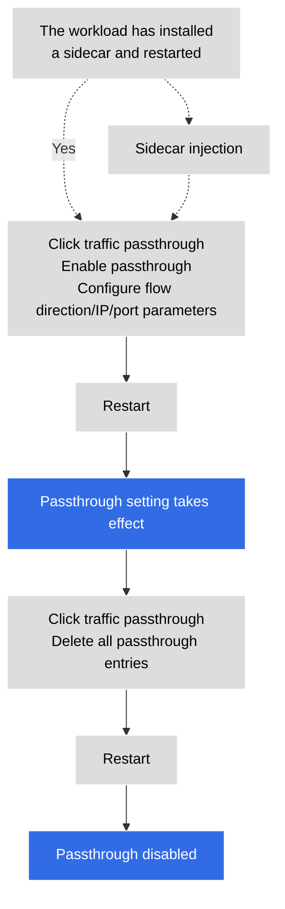
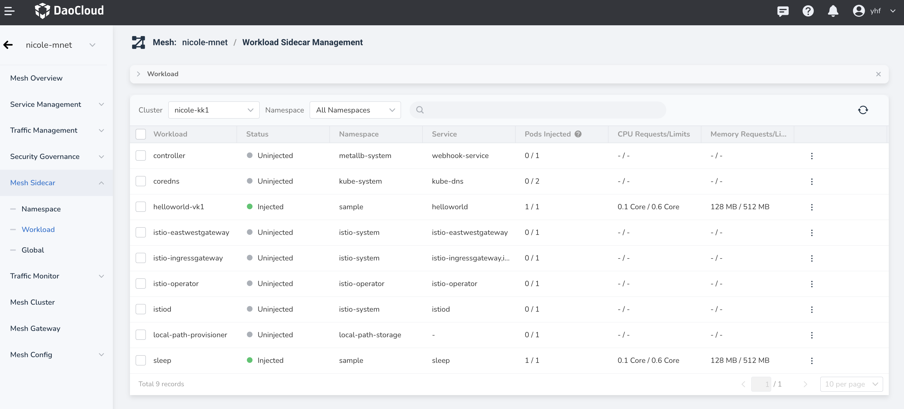
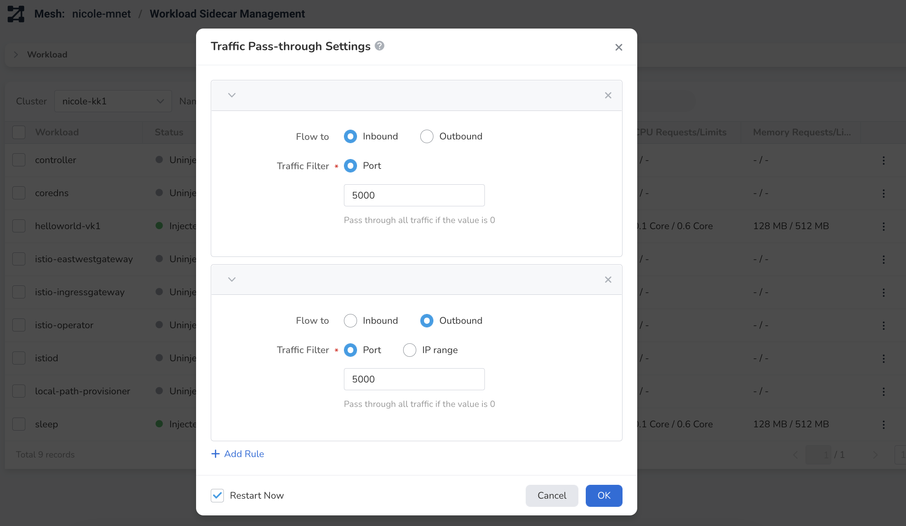

# Sidecar traffic passthrough

Traffic passthrough refers to the fact that all or part of the upstream and downstream traffic of the workload is directly sent to the workload itself without being forwarded by the sidecar.

The DCE 5.0 service mesh realizes the controllable sidecar passthrough of workload outbound/inbound traffic, and can implement interception settings for specific ports and IPs.

- Feature setting object: Workload
- Setting parameters: port, IP
- Flow direction: inbound, outbound

Istio applicable fields:

```none
traffic.sidecar.istio.io/excludeOutboundPorts
traffic.sidecar.istio.io/excludeOutboundIPRanges
```

**Operation process for enabling/disabling traffic passthrough**



## Enable traffic passthrough

1. Enter a mesh, click `Sidecar Management` -> `Workload Sidecar Management`.

    

1. Click `⋮` on the right side of a load, and select `Traffic passthrough Settings` in the pop-up menu.

    

1. After setting the parameters of traffic passthrough, click `OK`.

    

1. The screen prompts that the traffic passthrough setting is successful.

    
