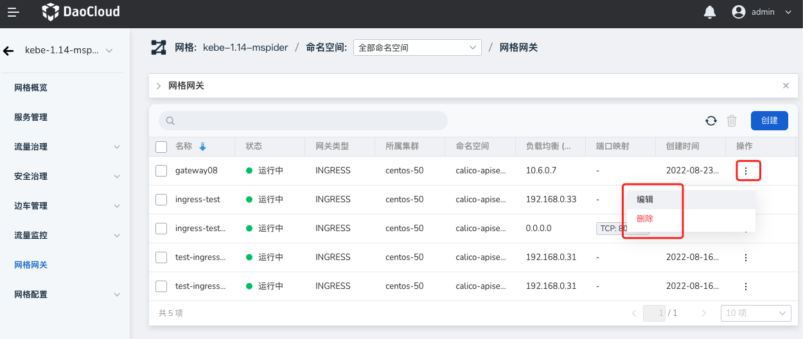

---
hide:
  - toc
---

# Manage mesh gateways

The grid gateway function provides the creation and management functions of grid gateway instances. Users can manage grid gateway instances in the current grid on this page.

There are two types of mesh gateways: Ingress (inbound) and Egress (outbound).
The Ingress gateway is used to define the traffic entry of the application in the service grid. All traffic entering the application in the service grid should pass through the Ingress gateway.
The egress gateway is used to define the traffic egress of the application in the grid, so that the traffic of external services can pass through the egress gateway uniformly, so as to achieve more precise traffic control.
Gateway instances also run Envoy, but unlike sidecars, meshes run as separate instances.

The steps to create a grid gateway are as follows.

1. Click `Grid Gateway` in the left navigation bar to enter the gateway list, and click the `Create` button in the upper right corner.

    

2. In the `Create Grid Gateway` window, follow the prompts to configure parameters, which are basically required. After checking the configuration information is correct, click `OK`.

    

3. Return to the grid gateway list, and the upper right corner of the screen will prompt that the creation is successful. The status of the newly created grid gateway is `creating`.

    

4. Refresh the page after a few seconds, and the status will change to `Running`, indicating that the gateway is successfully configured. Click `...` on the right side of the list to perform edit and delete operations.

    

!!! info

    For a more intuitive operation demonstration, please refer to [Video Tutorial](../../../videos/mspider.md).