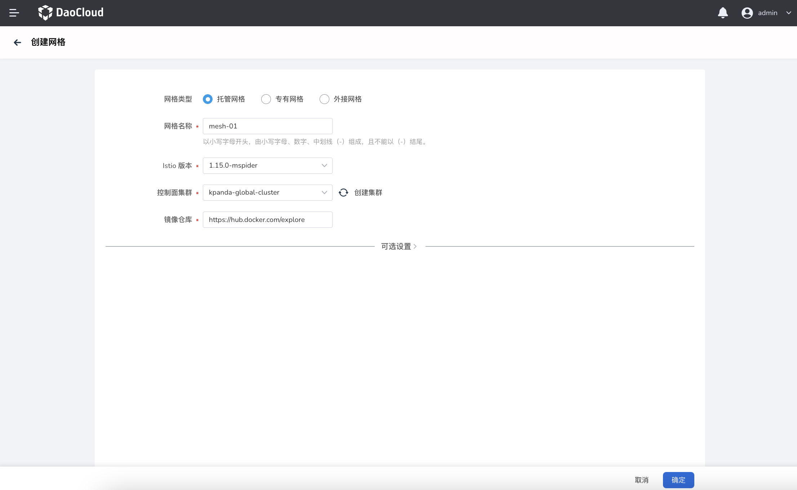

# create managed/private grid

The DCE 5.0 service grid supports the creation of managed grids, dedicated grids, and external grids. The steps to create a managed grid/proprietary grid are as follows:

!!! info
    - Managed grid refers to the separation of grid core control plane components from the concept of working clusters, which can be deployed in an independent control plane cluster, reducing the user's O&M burden and resource consumption, and users can control the components located in the same grid Unified management of multi-cluster services in .
    - The biggest difference between dedicated and managed grids is: dedicated grids are single-cluster models.
    - For information on how to integrate an integrated mesh, see [Create an integrated mesh](integrate-mesh.md).

1. In the upper right corner of the service mesh list page, click `Create mesh`.

    

2. Select `Hosted Grid` or `Proprietary Grid` and fill in the grid configuration information.
   
    - Grid name: start with a lowercase letter, consist of lowercase letters, numbers, dashes (-), and cannot end with a dash (-)
    - Alias: used to improve ease of use and grid recognition, you can enter letters, numbers, Chinese and other symbols, within 60 characters
    - Istio version: The Istio version number that the current system can support. Select one as the Istio version of the currently created grid. If it is a managed grid, then all managed clusters will use this version of Istio.
    - Control plane cluster: the cluster used to run the grid management plane, the list includes the clusters that the current grid platform can access and are in normal state. The item comes with a refresh icon and a `Create Cluster` button. Click `Create Cluster` to jump to `Container Management Platform` to create a new cluster. After the creation is complete, return to this page and click the refresh icon to update the list.
    - Mirror warehouse: Enter the address of the mirror warehouse that contains the data surface component mirror. If the cluster can access the public network, you can fill in the official mirror address: `release.daocloud.io/mspider`. For private environments, please upload the mirror yourself and fill in the actual address.
  
    

3. Click the `OK` button to complete the mesh creation. The system automatically returns to the grid list, and you can view and manage the newly added grids.

!!! info

    After the managed grid is created, no managed cluster has been connected, and the grid is in the state of `not ready`. Users can [Add Cluster](../08ClusterManagement/README.md), wait for the cluster access to complete, and select the cluster access that requires service management.

## Optional settings

After filling out the basic configuration correctly, you can successfully create a basic hosted grid. If you want to use advanced features, you can click `Optional Settings` to fill in the optional configuration.

- Grid Scale: Contains four size options and provides resource suggestion information related to the selected size
- Sidecar injection strategy: You can enable/disable the sidecar automatic injection strategy at the grid level. After enabling, all access clusters will automatically inject sidecars
- Sidecar resource setting: implement resource restrictions on injected sidecars of all clusters under the grid, which can be used as the default sidecar resource value under the grid. The execution priority of sidecar resource limit rules at each level is: workload-level resource limit -> cluster-level resource limit -> grid resource limit

