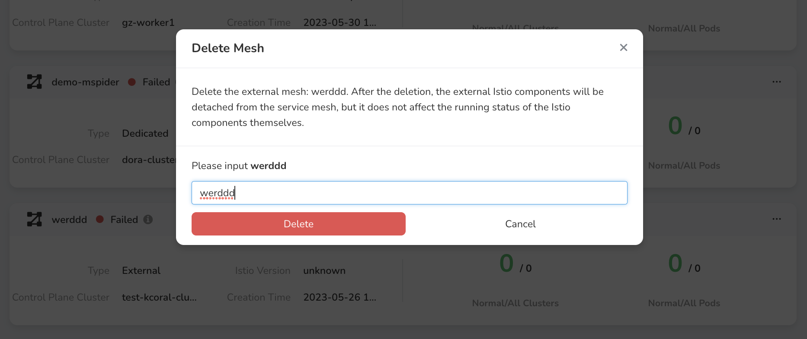

---
hide:
  - toc
---

# delete mesh

When the user no longer uses the grid management service, the delete operation can be used. To delete the grid, the user needs to complete a series of pre-operations before activating the `OK` button in the dialog box.

!!! danger

    After the delete operation is performed, the grid cannot be restored. If you need to manage it again, you need to recreate the grid.

1. On the right side of the grid list, click the `...` button, and select `Delete` from the pop-up menu.

    

1. According to the grid type, the system will automatically detect whether the deletion condition is met.

    - Delete the circumscribed mesh.

        

    - Removed proprietary meshes. You need to follow the prompts to remove the sidecar, clear the gateway, and remove the cluster.

        

    - Delete managed grid. You need to follow the prompts to remove the sidecar, clear the gateway, and remove the cluster.

        

1. After clearing all dependencies, enter the confirmation code prompted on the screen, the `Delete` button is activated, click the `Delete` button to delete the grid.