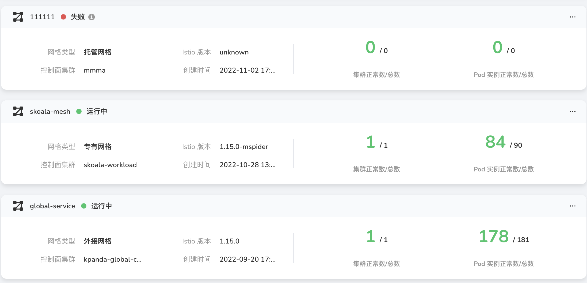
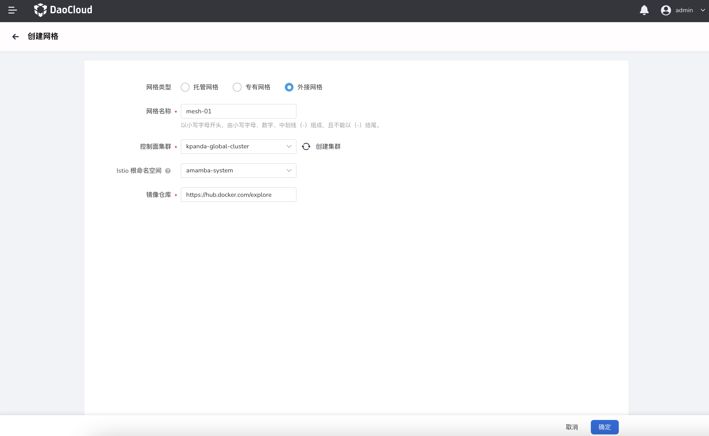

---
hide:
  - toc
---

# Create the circumscribed grid

1. In the upper right corner of the service mesh list page, click `Create mesh`.

    

2. Select `External Grid` and fill in the grid configuration information.

    - Grid name: start with a lowercase letter, consist of lowercase letters, numbers, dashes (-), and cannot end with a dash (-)
    - Control plane cluster: the cluster used to run the grid management plane, the list includes the clusters that the current grid platform can access and are in normal state.
      The item comes with a refresh icon and a `Create Cluster` button. Click `Create Cluster` to jump to `Container Management Platform` to create a new cluster. After the creation is complete, return to this page and click the refresh icon to update the list.
    - Istio root namespace: The Istio root namespace where the mesh resides.
    - Mirror warehouse: Enter the URL address of the mirror warehouse.
  
        

3. Click the `OK` button to complete the mesh creation. The system automatically returns to the grid list, and you can view and manage the newly added grids.