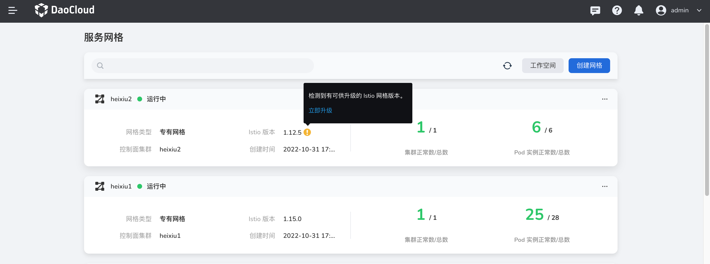
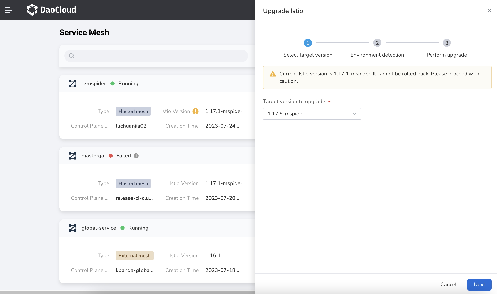
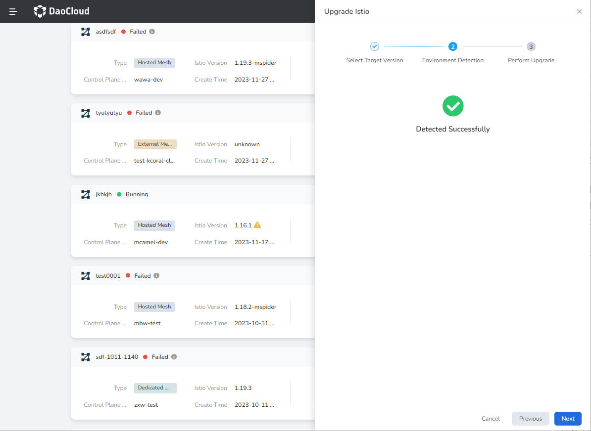
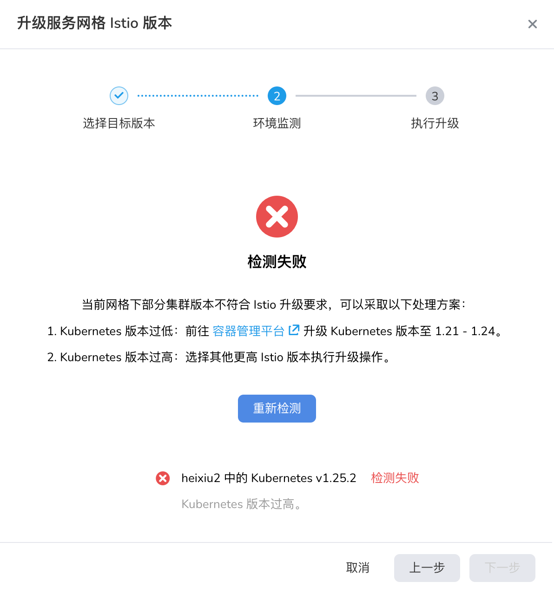
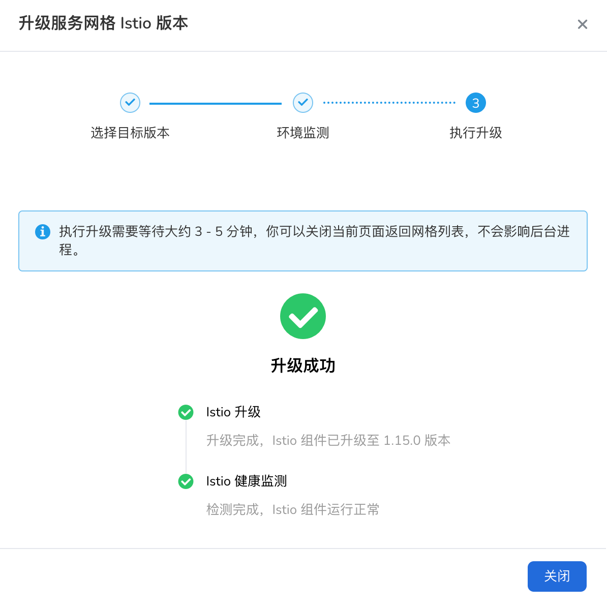
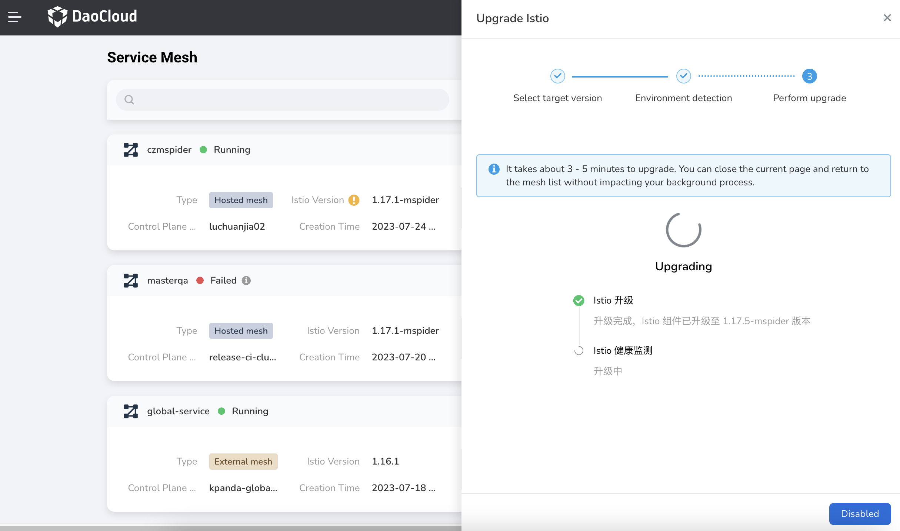

---
hide:
  - toc
---

# Mesh Istio version upgrade

The Istio version of the mesh can be continuously upgraded, and DaoCloud provides two types of upgraded versions, the native version and the customized version.

- Native version: community-native Istio, without any customized modification;
- Customized version: Based on the customization of the community version (version suffix: -mspider), functional enhancements and innovations have been made in communication performance, governance capabilities, and hot upgrade capabilities.

The upgrade process of these two types of versions is the same, but mixed upgrades of different types are not supported.

When there is a newer Istio version in the system image repository, an exclamation mark icon will appear on the upgradeable mesh card in the `mesh List`, click the `Upgrade Now` button to enter the upgrade wizard;

The Istio upgrade wizard includes three steps: `select target version`, `environment detection`, and `execute upgrade`. After the upgrade is completed, the mesh can go online immediately. Specific steps are as follows:

1. **Select the target version**: Select the version you want to upgrade from the list. After the upgrade, you will not be able to roll back to a lower version. It is recommended to choose carefully.

    

2. **Environment monitoring**: The system will check whether the version of each cluster (k8s) under the mesh meets the upgrade requirements based on the selected target version. If the requirements are met, the `Next` button will be activated. Otherwise, the user needs to process the environment question.

    

 - If the cluster (k8s) version is too low, you can first upgrade the cluster (k8s) version on the container management platform, and click the `Recheck` button;

- If the version of the cluster (k8s) is too high, it is recommended to fall back to "Select Target Version" to select a higher version of Istio.

    

3. **Execute upgrade**: After the environment test passes, it will enter the upgrade stage, which includes two stages of `upgrade` and `health check`.

- Istio upgrade: Istio image pull and control plane component upgrade

- Istio health checks: Istio control plane component health checks

    

After the upgrade is complete, return to the mesh list page, and you can see that the Istio version of the mesh has changed.

    

!!! note

    - Once the upgrade process starts, it cannot be terminated, and it is recommended not to perform any setup operations on the mesh during the upgrade.
    - For a more intuitive operation demonstration, please refer to [Video Tutorial](../../../videos/mspider.md).