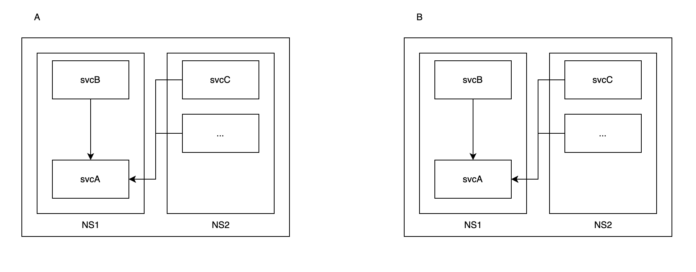

# Accurate Traffic Control for Multicloud Mesh

> The cases introduced in this article are based on real business application evolution.
>
> After enabling the multi-cloud interconnection mesh basic environment,
> there is a requirement that the business access traffic does not cross clusters.

## Environment

- Clusters: A, B
- Namespaces: NS1, NS2
- Services: svcA, svcB ... (multiple services)

## Background

In namespaces NS1 and NS2 of clusters A and B, there are several services with the same name
(svcA, svcB ...). Other services call svcA, as shown in the following diagram:

The services with the same name in the two clusters do not have the same business logic.
For example, svcA in namespace NS1 of cluster A and svcA in namespace NS1 of cluster B
are not the same business service. They only have the same name, but different business logics.
The same applies to other services.

## Scenario 1: Normal Active-Active Disaster Recovery

If the services in clusters A and B both inject Istio Sidecars, as shown below:

Without any special configurations, the traffic between the two clusters is interconnected,
and the related services serve as disaster recovery solutions for each other.
For example, svcB in cluster A can access svcA in cluster A and svcA in cluster B.

**Conclusion: This is a typical disaster recovery scenario using the multi-cloud capabilities
of the mesh. However, in this case, because the services in the two clusters have different
business logics despite having the same names, it will lead to business problems.**

## Scenario 2: Restricting Inter-Cluster Communication Using Sidecar

Inject Istio Sidecars into the services of one cluster and leave the services of
the other cluster without Istio Sidecars, as shown below:

In this case, without any additional configurations, the traffic between the two clusters will
not be interconnected. For example, svcB in cluster B can only access svcA in cluster B,
but not svcA in cluster A. This can also be confirmed by the simulated results of the official Istio demo:

As the services in cluster A are not injected with sidecars, they cannot access the services
in cluster B using Istio capabilities.

The same applies in reverse,
**Conclusion: In simple terms, when the services of one cluster are injected with sidecars
and the services of another cluster are not, by default, there will be no inter-cluster traffic.
In this case, the services in both clusters have different business logics, which meets the business requirements.**

## Scenario 3: Restricting Inter-Cluster Communication Using Traffic Rules

If the services in clusters A and B both inject Istio Sidecars, but it is required that the
traffic between them should not cross clusters, we need to configure special routing rules
to restrict the traffic from the remote cluster:

When the rules take effect, the services will only access upstream services within their own cluster:

Even if the upstream services within the local cluster are unreachable, the services will not access the remote cluster:

**Conclusion: By accurately restricting traffic through DR, it is possible to limit
inter-cluster access even in a fully injected Sidecar scenario. Therefore, in this case,
it also meets the business expectation of accurate control over inter-cluster communication
for certain business traffic, ensuring normal business logic.**
