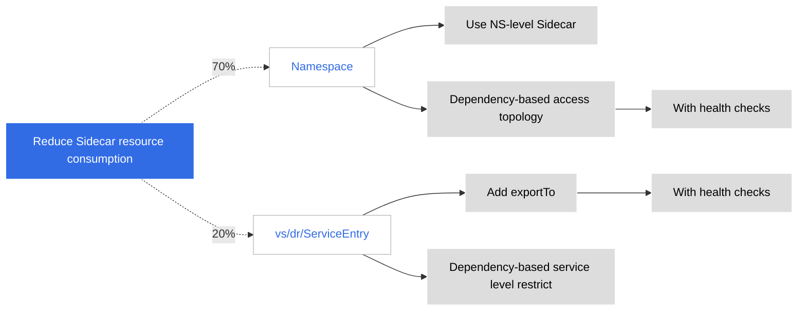
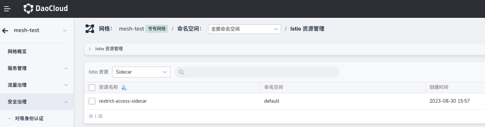
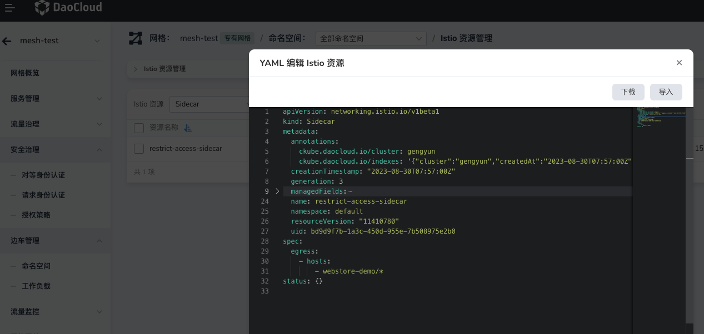
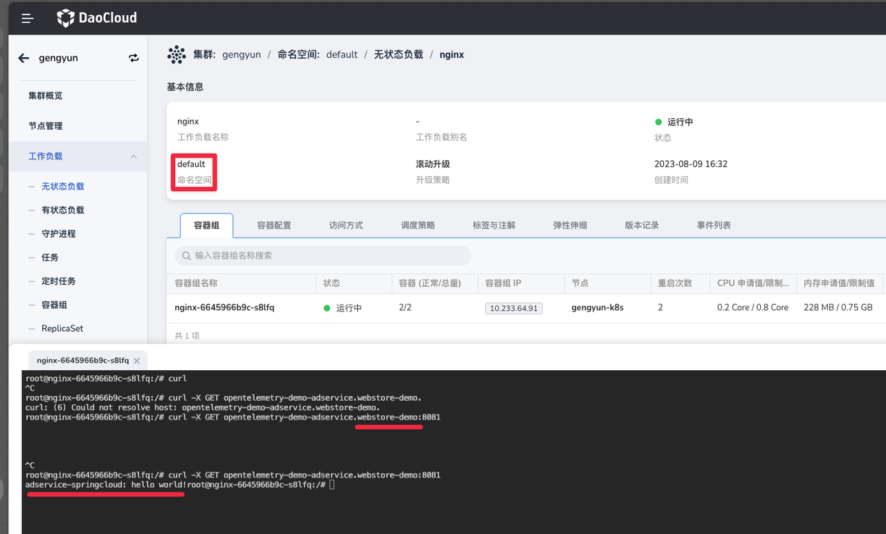

# Optimizing Sidecar Resource Usage

In the design philosophy of Istio, the Sidecar caches information for all services in the cluster
by default. This leads to high resource consumption by the Sidecar, especially when there are
hundreds or thousands of business Pods.



To alleviate the issue of resource consumption, you can implement the following configurations.

## Technical Solution

1. Namespace-Level sidecar restriction.

    ```yaml
    apiVersion: networking.istio.io/v1beta1
    kind: Sidecar
    metadata:
      name: restrict-access-sidecar
      namespace: namespace1
    spec:
      egress:
      - hosts:
        - namespace2/*
        - namespace3/*
    ```

    The above YAML restricts the services under `namespace1` to only access services in `namespace2` and `namespace3`.

    To implement this, you need to add a whitelist of other namespaces that can be accessed by
    the namespace managed by the cluster.

    There are a few considerations to keep in mind with this approach:

    - Whether there is a global switch for enabling the whitelist mechanism
    - Whether modifying the whitelist will require Sidecar updates or restarts
    - Whether there are corresponding health check prompts when application access issues occur
    - Whether a method similar to NS-group (read from workspaces) can automatically
      configure bidirectional Sidecar namespace accessibility (with a global switch)

2. Adding `exportTo` to Istio Resources

    By using Sidecar access control under the Namespace, you can still achieve namespace-level
    restrict. If you need to reduce resource consumption, you can add the corresponding
    `exportTo` configuration to the Istio resources, declaring which namespaces can access these resources.

    This approach incurs higher configuration costs.
    If implemented, batch configuration capabilities should be considered:

    ```yaml
    apiVersion: networking.istio.io/v1alpha3
    kind: VirtualService
    metadata:
      name: my-virtual-service
      namespace: my-namespace
    spec:
      exportTo:
      - "namespace1"
      - "namespace2"
      hosts:
      - "*"
      http:
      - route:
        - destination:
          host: my-service
    ```

## Demo

- Prepare two services in different namespaces: `NS-a` and `NS-b`
- Ensure that both services have Sidecars successfully injected
- Create a Sidecar resource with YAML content as follows:

    

    ```yaml
    apiVersion: networking.istio.io/v1beta1
    kind: Sidecar
    metadata:
      name: restrict-access-sidecar
      namespace: default # current namespace
    spec:
      egress:
        - hosts:
          # allow current namespace request this namespace service
          - webstore-demo/*
    ```

    

- Access Result

    
