# Restricting Service Access with Mesh for Targeted Traffic

In certain business scenarios, it is necessary to restrict access to specific services only for other services. This can be achieved by leveraging the capabilities of Istio for centralized management.

In Istio, we can use `Egress` to control the outbound traffic from a service and `Service Entry` to control external services in the mesh. By combining these with an authorization policy, we can control the traffic and permissions for service access. This article explains how to use Egress and authorization policies to manage traffic and permissions for outbound service access.

## Prerequisites

Firstly, ensure that your mesh is in a healthy state. If you haven't installed Istio yet, please refer to the [Mesh Installation Guide](../install/install.md).

### Enabling Outbound Traffic Only

To configure the mesh for outbound traffic only, modify the governance information of the mesh as shown in the screenshots below. Please note that after making these changes, you will need to use `Service Entry` to allow access to services outside the cluster.

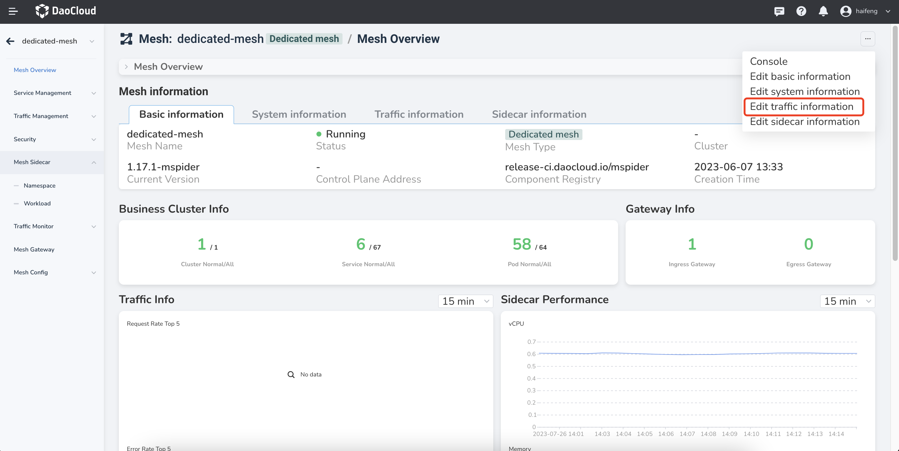

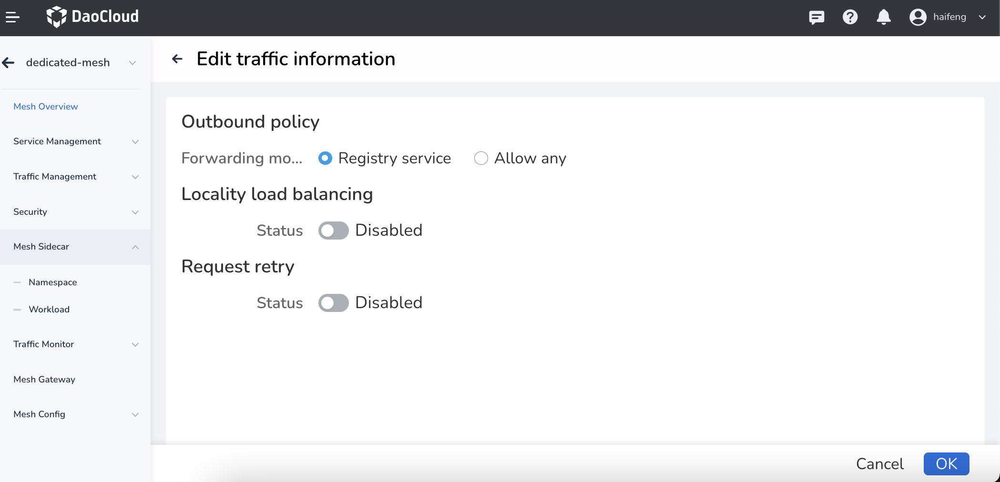

### Creating an Egress Gateway

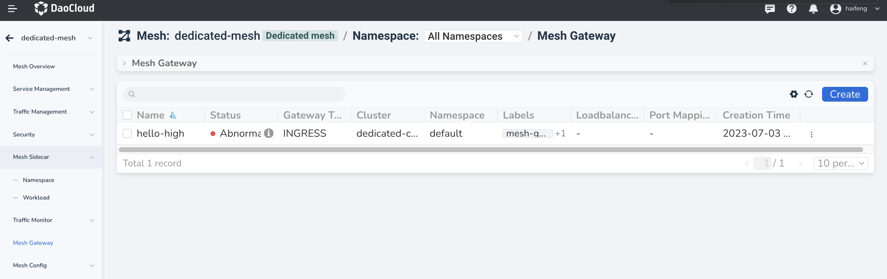

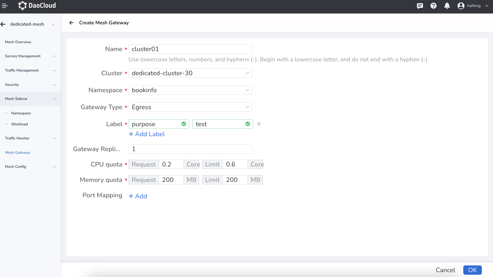

### Setting up a Test Application

You can use any application for testing purposes. In the following steps, we will perform network access tests by entering the pod using `kubectl exec pod`. It is recommended to ensure that the application has the `curl` command available.

> Here, we are using a simple example called `bookinfo`, but you can use any other application.

Additionally, ensure that the application's `Pod` has been successfully injected with a sidecar. You can check the status of the corresponding service in the mesh interface.

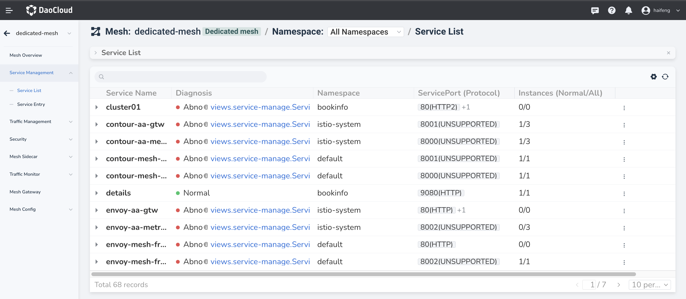

## Rule Configuration

Below are example rules, which can be created using YAML format through the service mesh interface to define and understand resources easily.

### Creating a Service Entry

Firstly, let's create an allowed egress access address. In this example, we will use **baidu**. Follow the steps shown in the screenshots below.

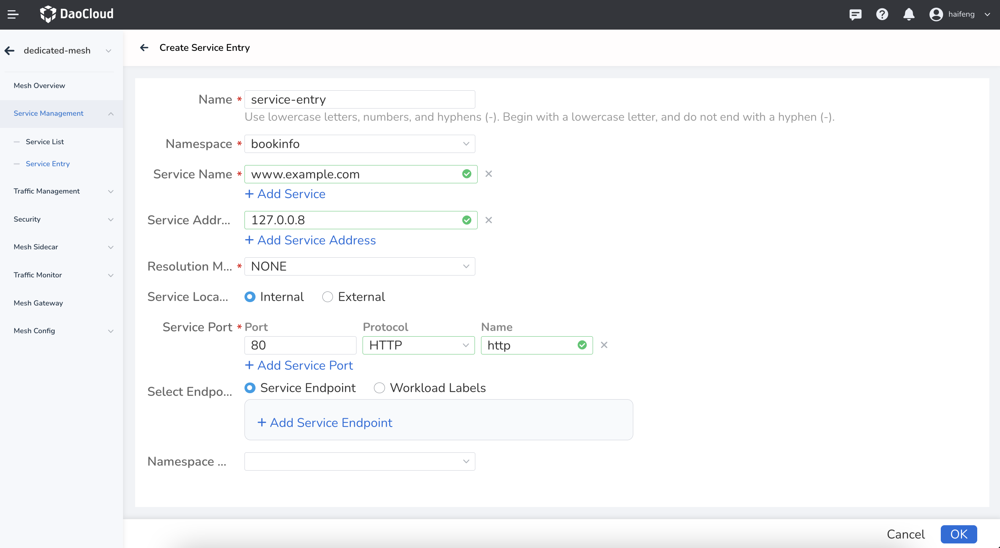

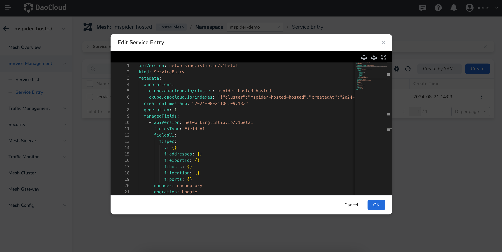

### Creating a Virtual Service

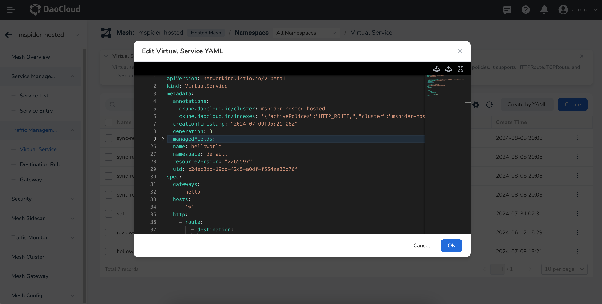

### Creating Gateway Rules

Note the use of `ISTIO_MUTAL` to enable authorization policies.

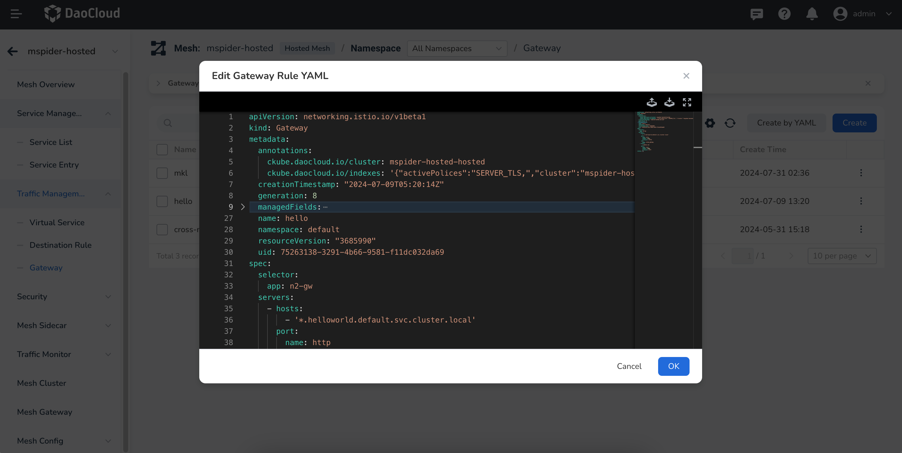

### Creating a DR (Destination Rule) for Gateway Rules

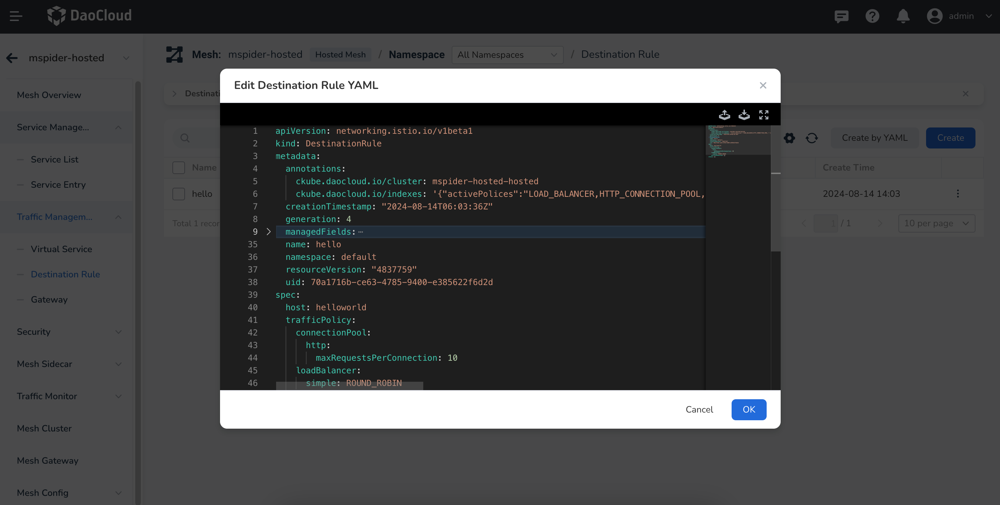

### Creating a DR for **baidu**

Route all traffic through HTTPS.

## Enabling Authorization Policies

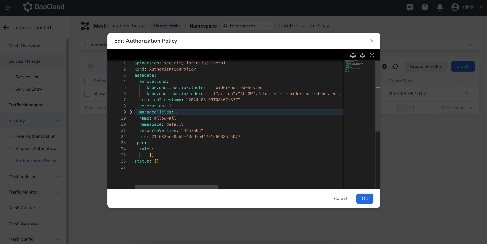

## Functionality Testing

### Accessing baidu from the Pod of the sample application

You should see successful access results because we have enabled outbound traffic and restricted usage to specific services within the mesh.

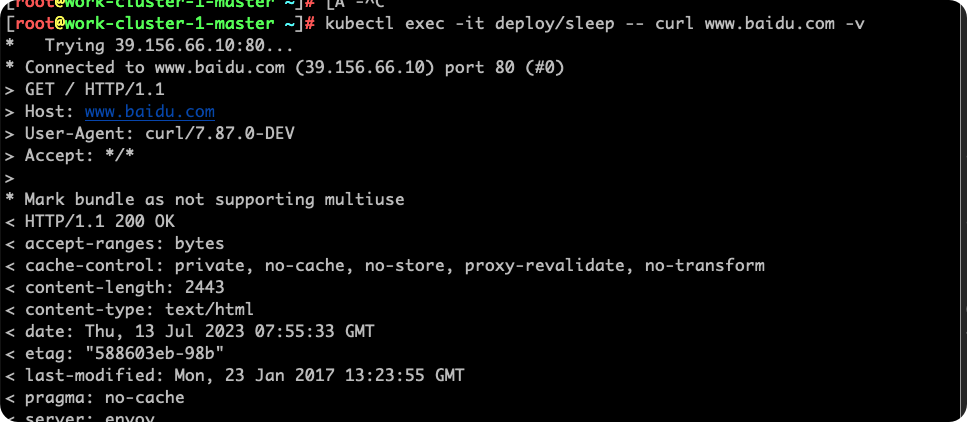

### Accessing baidu from the Pod of another application

At this point, access from other services is denied due to the restricted source service.

