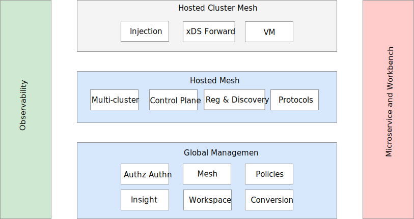
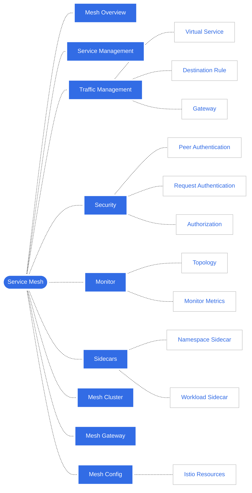

# Architecture of Service Mesh

The service mesh module enables multi-mesh management and multicluster service aggregation governance.
Users can connect clusters from different sources to the mesh in a multicloud environment for
unified traffic and security management.

In terms of overall architecture, service mesh products can be divided into three levels:
global mesh management, control plane, and data plane.

- **Global mesh management**

    This module runs on an independent control plane cluster called the Global Service Cluster (GSC).
    It manages multiple service meshes in a unified way and handles interactions with end-users.
    The entire mesh management platform's main business logic, such as resource configuration and
    security governance, is constructed at this layer. It is also the primary module responsible
    for docking with other systems, reducing the adaptation cost of other modules. As it does not
    participate in specific service governance affairs, it does not contain Istio related components.

- **Control plane**

    This module runs on the Mesh Control Plane Cluster (MCPC), which is essentially a user working cluster
    and mesh control plane. One GSC can manage multiple MCPCs. Core control components such as Istio are
    installed in the cluster as the core control plane of the mesh to directly manage multiple clusters
    in the mesh. It performs unified policy control and service discovery and executes and delivers various
    traffic policies and security policies. Only policies written to MCPC take effect for the entire mesh.

- **Data plane**

    This module contains the basic components of Istio but is not used as a control plane. It provides
    a mode similar to a management agent, responsible for sidecar injection, certificate forwarding,
    xDS forwarding, and other services. It synchronizes policies and service registration information
    from MCPC and sends them to the business sidecar of the cluster.

Extension modules that run through the overall architecture include observability, microservice governance, and Workbench.

- **Observability**

    Observability is handled by [Insight](../../../insight/intro/index.md). The service mesh obtains
    traffic metric information to draw a topology map through interface calls and directly calls
    Istio's native Grafana to provide users with various metric charts.

- **Microservice**

    The microservice platform empowers microservices with mesh capabilities through the mesh,
    enabling users to conduct unified management of various microservice systems through a single platform.

- **Workbench**

    Workbench is a core module of DCE 5.0, which is used to provide users with unified capabilities
    such as application orchestration, deployment, pipeline management, CICD, application monitoring, and log querying.

## Functional Architecture

As shown in the figure above, the service mesh provides nine modules and twelve sub-module features, realizing the ability of diversified cluster access and mesh management in multiple modes.
