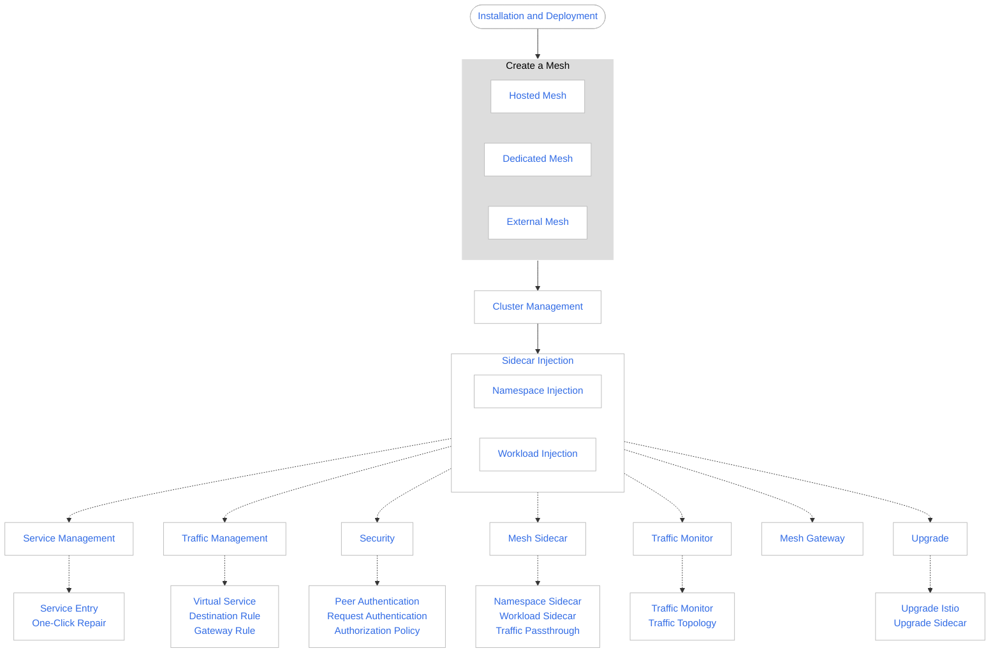

# What is Service Mesh?

Service Mesh is a next-generation, cloud native service mesh built on the open-source Istio technology.
It is a fully managed product with high performance and usability, providing a complete non-intrusive
microservice governance solution that can uniformly manage multi-cloud and multi-cluster environments.

Service Mesh offers service traffic governance, security governance, and service traffic monitoring to its users.
It allows access to traditional microservices in the form of infrastructure. The platform is seamlessly connected
to the DCE Container Management platform, providing an out-of-the-box experience to users. As an infrastructure,
it provides container microservice governance support for the microservice engine, making it easy for users to
manage all microservice systems through a single platform.

Service Mesh is compatible with the native Istio open-source service mesh, providing native Istio access management.
At a high level, Service Mesh helps reduce the complexity of service governance and decrease pressure on DevOps teams.
It streamlines microservice governance by providing an all-in-one solution that simplifies multi-cloud and multi-cluster environments.

## Product Benefits

DCE 5.0 Service Mesh offers several advantages compared to other products:

- Easy to Use: Users do not need to modify any business code or manually install agents.
  They can enable Service Mesh feature and experience rich non-intrusive service governance capabilities.

- Strategic Intelligent Routing and Elastic Traffic Management: Supports configuring load balancing, service routing,
  fault injection, circuit breaking, and other governance rules for services. Combined with a one-stop management
  system, it provides real-time, visualized micro-service traffic management that supports non-intrusive intelligent
  traffic management. It can perform dynamic intelligent routing and elastic traffic management without modifying
  the application. The following are additional features:

    - Routing rules such as weight, content, TCP/IP, etc.
    - HTTP sessions are maintained to meet the demands of business processing continuity.
    - Current limiting and fusing to achieve stable and reliable traces between services.
    - Network persistent connection management reduces resource loss and improves network throughput.
    - Service security certification: certification, authentication, audit, etc., providing the cornerstone of service security.

- Graphical Application Panorama Topology and Visualized Traffic Management: Provides visual traffic monitoring,
  including link information, service abnormal response, and long response delay, and comprehensively displays
  business operation status through charts and topologies. Service Mesh combines application operation and maintenance
  management and application performance management services to provide detailed microservice-level traffic monitoring,
  abnormal response traffic reports, and call chain information, enabling faster and more accurate location of problems.

- Enhanced Performance and Increased Reliability: The Service Mesh control plane and data plane are
  more reliable and performance-optimized based on the community version.

- Multicloud, Multicluster, Multi-infrastructure: Provides an O&M-free hosting control plane and offers multicloud
  and multicluster global unified service governance, security, and service operation monitoring capabilities.
  It also provides unified service discovery and management for multiple infrastructures such as containers
  and virtual machines (VMs).

- Protocol Extensions: Extend the support of Dubbo protocol.

- Legacy SDK Integration: Provides integrated solutions for traditional microservice SDKs such as Spring Cloud
  and Dubbo. Businesses developed by traditional microservice SDKs can be quickly migrated to cloud native mesh
  operating environments without extensive code modification.

## Learning Path

The learning path for the service mesh is as follows:

[Download DCE 5.0](../../download/index.md){ .md-button .md-button--primary }
[Install DCE 5.0](../../install/index.md){ .md-button .md-button--primary }
[Free Trial](../../dce/license0.md){ .md-button .md-button--primary }
