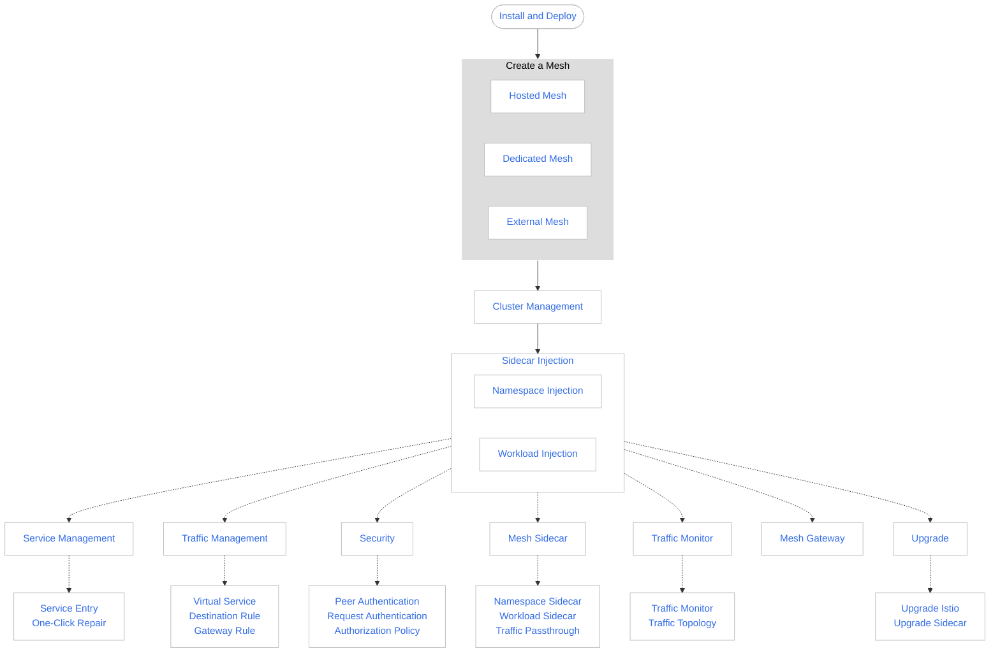

# What is a Service Mesh

A service mesh is the next generation service mesh built on the open-source technology of Istio,
which is designed for cloud native applications.

A service mesh is a fully managed service mesh product that offers high performance and ease of use.
It provides a complete non-intrusive microservices governance solution, which enables unified governance
of complex environments with multiple clouds and clusters. It offers service traffic governance,
security governance, service traffic monitoring, and integration with traditional microservices
(such as Spring Cloud and Dubbo).

DCE 5.0's service mesh is compatible with the native Istio open-source service mesh and provides
native Istio access management capabilities. At a higher level, a service mesh helps reduce the
complexity of service governance and alleviate the pressure on development and operations teams.

As a member of the DCE 5.0 product system, the service mesh seamlessly integrates with the
[container management platform](../../kpanda/intro/index.md), providing users with an
out-of-the-box experience. It also serves as infrastructure support for the
[microservice engine](../../skoala/intro/index.md), enabling unified management of various
microservice systems through a single platform.

## Product Advantages

DCE 5.0's service mesh has the following advantages compared to other products:

- Simple and easy to use

    No need to modify any business code or manually install proxies.
    Just enable the service mesh feature to experience rich non-intrusive service governance capabilities.

- Policy-based intelligent routing and elastic traffic management

    Supports governance rules for services such as load balancing, service routing, fault injection,
    and outlier detection. Combined with the all-in-one governance system, it provides real-time and
    visualized microservice traffic management. Supports non-intrusive intelligent traffic governance,
    enabling dynamic intelligent routing and elastic traffic management without any application modification.

    - Weighted, content, TCP/IP, and other routing rules.
    - HTTP session persistence to meet the continuous processing needs of businesses.
    - Rate limiting and outlier detection to achieve stable and reliable service-to-service links.
    - Network connection management to reduce resource consumption and improve network throughput.
    - Service security authentication: authentication, authorization, auditing, etc., providing
      a foundation for service security.

- Graphical application panoramic topology and visualized traffic governance

    The service mesh provides visualized traffic monitoring, including link information,
    service abnormal responses, and excessively long response latency. It comprehensively
    displays the operation of the business through various forms such as charts and topologies.

    The service mesh can be combined with application operation and maintenance management and
    application performance management services to provide detailed microservice-level traffic monitoring,
    abnormal response traffic reports, and invocation chain information. It enables faster and more
    accurate problem localization.

- Enhanced performance and reliability

    The service mesh control plane and data plane are based on the community version but with
    enhanced reliability and performance optimization.

- Multi-cloud, multi-cluster, and multi-infrastructure

    Provides a managed control plane, which offers unified service governance, security, and
    service operation monitoring capabilities across multiple clouds and clusters. It also
    provides unified service discovery and management for various infrastructures such as
    containers and virtual machines (VMs).

- Protocol extension

    Supports the extension of the Dubbo protocol.

- Traditional SDK integration

    Provides integration solutions for traditional microservice SDKs such as Spring Cloud and Dubbo.
    Applications developed with traditional microservice SDKs can be quickly migrated to cloud native
    container mesh runtime environments without extensive code modification.

## Learning Journey

The recommended journey for learning the service mesh is as follows:

[Download DCE 5.0](../../download/index.md){ .md-button .md-button--primary }
[Install DCE 5.0](../../install/index.md){ .md-button .md-button--primary }
[Free Trial](../../dce/license0.md){ .md-button .md-button--primary }
