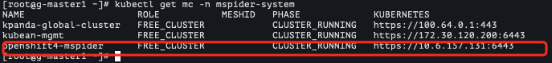
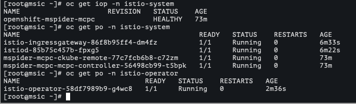
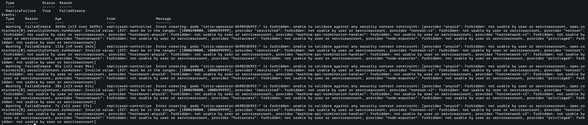
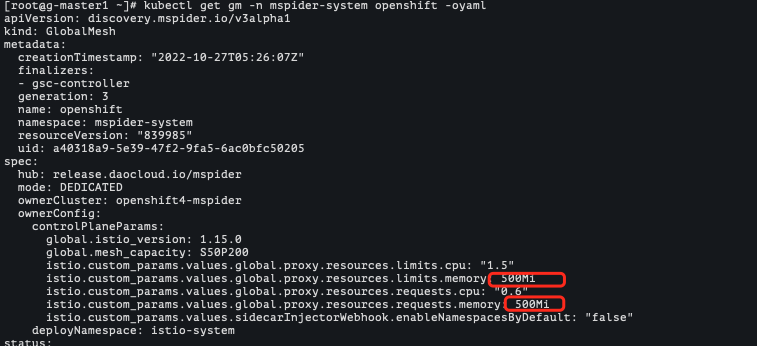
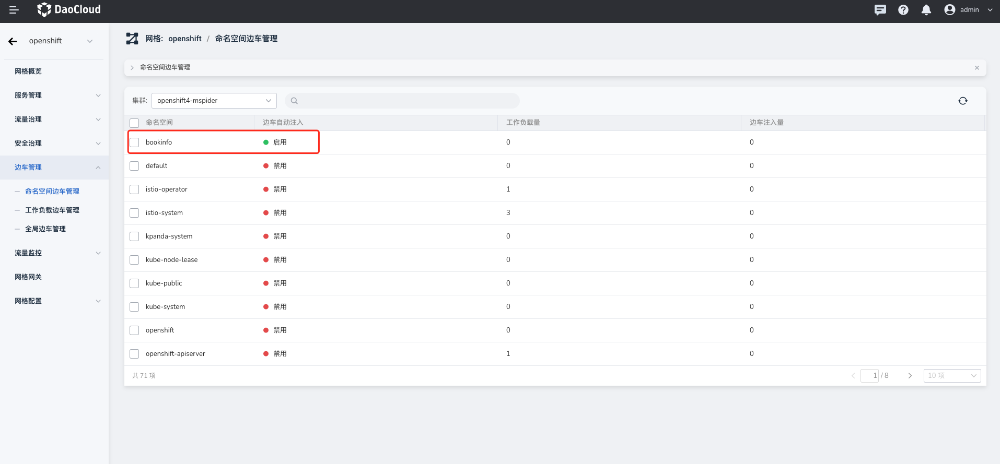
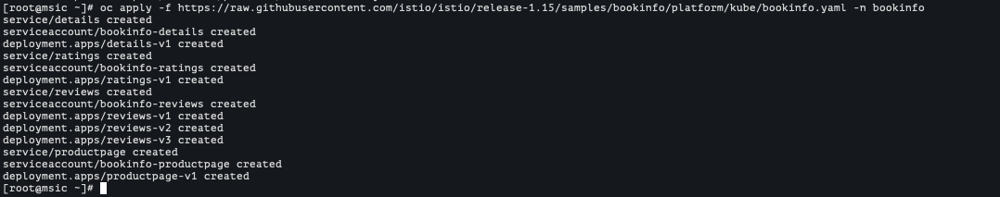

# Compatibility Test Report - OpenShift

Based on OpenShift, test service mesh compatibility when creating a proprietary mesh.

This test report takes OpenShift 4.11 as an example to elaborate on the compatibility test process when the service mesh is connected to the OpenShift proprietary mesh mode.

## Testing purposes

Verify that the DCE 5.0 service mesh is based on native istio and aggregates OpenShift single-cluster mode proprietary mesh from the control plane/data plane.

## test environment

### Service Mesh Environment

Based on demo-dev.daocloud.io

### OpenShift environment

OpenShift 3 nodes are prepared:

| HostName | IP | Kubernetes Version | Crictl Version | OS Kernel Version | OS Release |
| :---------------------------: | :----------: | :----- --------: | :---------- | :--------------------------: | :--------- |
| master01.mspider.openshift.io | 10.6.157.111 | v1.24.0+3882f8f | 1.24.2 | 4.18.0-372.26.1.el8_6.x86_64 | rhcos |
| master02.mspider.openshift.io | 10.6.157.112 | v1.24.0+3882f8f | 1.24.2 | 4.18.0-372.26.1.el8_6.x86_64 | rhcos |
| master03.mspider.openshift.io | 10.6.157.113 | v1.24.0+3882f8f | 1.24.2 | 4.18.0-372.26.1.el8_6.x86_64 | rhcos |

View the status of the 3 nodes:

```shell
oc get nodes -owide
```

The output is similar to:

```none
NAME STATUS ROLES AGE VERSION INTERNAL-IP EXTERNAL-IP OS-IMAGE KERNEL-VERSION CONTAINER-RUNTIME
master01.mspider.openshift.io Ready master.worker 7d3h v1.24.0+3882f8f 10.6.157.111 <none> Red Hat Enterprise Linux CoreOS 411.86.202209211811-0 (Ootpa) 4.18.0-372.26.1.el8_6.x86o_6 ://1.24.2-7.rhaos4.11.gitca400e0.el8
master02.mspider.openshift.io Ready master.worker 7d2h v1.24.0+3882f8f 10.6.157.112 <none> Red Hat Enterprise Linux CoreOS 411.86.202209211811-0 (Ootpa) 4.18.0-372.26.1.el8_6.x86o_6 ://1.24.2-7.rhaos4.11.gitca400e0.el8
master03.mspider.openshift.io Ready master.worker 7d2h v1.24.0+3882f8f 10.6.157.113 <none> Red Hat Enterprise Linux CoreOS 411.86.202209211811-0 (Ootpa) 4.18.0-372.26.1.el8_6.x86o_6 ://1.24.2-7.rhaos4.11.gitca400e0.el8
```

## Testing process

### Access OpenShift through container management

Get the kubeconfig (~/.kube/config) of the OpenShift cluster, and access the cluster in the container management of the demo-dev environment.

```yaml
clusters:
- cluster:
    insecure-skip-tls-verify: true
    server: https://10.6.157.130:6443
  name: mspider
contexts:
- context:
    cluster: mspider
    user: admin
  name: admin
current-context: admin
preferences: {}
users:
- name: admin
  user:
    client-certificate-data: LS0tLS1CRUdJTiBDRVJUSUZJQ0FURS0tLS0tCk1JSURaekNDQWsrZ0F3SUJBZ0lJV0wzelp0MFErbGt3RFFZSktvWklodmNOQVFFTEJRQXdOakVTTUJBR0ExVUUKQ3hNSmIzQmxibk5vYVdaME1TQXdIZ1lEVlFRREV4ZGhaRzFwYmkxcmRXSmxZMjl1Wm1sbkxYTnBaMjVsY2pBZQpGdzB5TWpFd01qWXhNekE1TWpaYUZ3MHpNakV3TWpNeE16QTVNalphTURBeEZ6QVZCZ05WQkFvVERuTjVjM1JsCmJUcHRZWE4wWlhKek1SVXdFd1lEVlFRREV3eHplWE4wWlcwNllXUnRhVzR3Z2dFaU1BMEdDU3FHU0liM0RRRUIKQVFVQUE0SUJEd0F3Z2dFS0FvSUJBUUNtZ2RKcUNCTCtGcmRmQmVseGU2dkNnbWpZMXJqN09rV1dDTHVUVWVJWgoyaWg1NHBWUVByUzVkQVEvbUVaME1NcTVBSmQ4dE1maWpVcFlnQkU4d1pmeU0wZEM0d3h0empXWnZvQWhSejZUCjFuRDFvd1RsZndJMDJjZ0lkZUpJSlJEa2tsV3JQUjVRZU0wbytLdWYrN1dFUDVSSW82bWVxVEtuUHBuMmRyaWwKQUxPSFIvQWFiaklqVG51YUM2QWNlSzdyN1VobGtQQ2pRK3dKdVI1cld5eW9HVFBTMlc4MVd6Mm9UNi9UQ05UVQpYTDhncWFoa2dlWGpYZkl0bzYweVVpNnV3K1dMNk1oc0NhVlpXZG1TaDVRMzZZdTlSZEFKazduaHlVR3JkNXRYCmplRm9LM0gyZjcycmwrOGdrcTdlVjNVYjRPY2pyU2VUUTIvNlY5NjhwQzcxQWdNQkFBR2pmekI5TUE0R0ExVWQKRHdFQi93UUVBd0lGb0RBZEJnTlZIU1VFRmpBVUJnZ3JCZ0VGQlFjREFRWUlLd1lCQlFVSEF3SXdEQVlEVlIwVApBUUgvQkFJd0FEQWRCZ05WSFE0RUZnUVVEdW1uRWkxWjRlLytlcjJXcEY4bTBLODhGcE13SHdZRFZSMGpCQmd3CkZvQVVBM1VjTVdYYjh5aE54TVgrOUhBcWpneTBYMnN3RFFZSktvWklodmNOQVFFTEJRQURnZ0VCQUYvL1BvM3MKSWp5N2tva1p2OU1LUDJvMm9ubWdhY0owNklIay9VbTVIbC8rMVE5WmhDeDJWSDNtWnIyME5kQ0M5Rm03OFovZwpoK3lDVi9hbGRXTnAxUXhyaWJUbGpscmNsek55L20vYWRmMUhKSGoram1mdEJFeCtmNkVEdFFQZ3BUZUlCbk01CnhzMDFSUldwVTBKVnVsYU5RclphNHUyYVZnc3h3djYzdEEyeXlzblpxbGFqWktNZjU3TEhNTjBKdE10K3FyTDMKS1p1R1pqblVvcDk3SFh0VDVBZ01jU1R1V0UyME9QR0tldFVuTVI3cldza2pvSlU5VWNSelBTQ1FGTWZCam53VQpNLzNRM0lYTmNVay9mSDdxZk1DV2pGL29sNWNXMnhZOTN4ekF0bTVFWVpUei9VRk4wOEFzS09qMS9hRWVBaHlICkFhclV5UHBEYTlwUkpJWT0KLS0tLS1FTkQgQ0VSVElGSUNBVEUtLS0tLQo=
    client-key-data: LS0tLS1CRUdJTiBSU0EgUFJJVkFURSBLRVktLS0tLQpNSUlFb3dJQkFBS0NBUUVBcG9IU2FnZ1MvaGEzWHdYcGNYdXJ3b0pvMk5hNCt6cEZsZ2k3azFIaUdkb29lZUtWClVENjB1WFFFUDVoR2REREt1UUNYZkxUSDRvMUtXSUFSUE1HWDhqTkhRdU1NYmM0MW1iNkFJVWMrazladzlhTUUKNVg4Q05ObklDSFhpU0NVUTVKSlZxejBlVUhqTktQaXJuL3UxaEQrVVNLT3BucWt5cHo2WjluYTRwUUN6aDBmdwpHbTR5STA1N21ndWdISGl1NisxSVpaRHdvMFBzQ2JrZWExc3NxQmt6MHRsdk5WczlxRSt2MHdqVTFGeS9JS21vClpJSGw0MTN5TGFPdE1sSXVyc1BsaStqSWJBbWxXVm5aa29lVU4rbUx2VVhRQ1pPNTRjbEJxM2ViVjQzaGFDdHgKOW4rOXE1ZnZJSkt1M2xkMUcrRG5JNjBuazBOditsZmV2S1F1OVFJREFRQUJBb0lCQUJ5dHo2Z2pxK0hIMTkydQpEdjlVNWNpaTNadzduN0RsNEladkNwL2RRcXhoUHdkL1YyaHk1SDNzMWE1K2MrUWZZMHRxSnExOEZkR1h0RzU1CjRINHVlaFZsYjZpOW9xNW5EaVJsQTN5MzRMZG1BQjdPN1ZENkIwOURFNGtoaE5BWVVraU1TK1VxcWNZQ2lKTysKQVJHVk1UYU9IT1JHRERrZnUzSEMvcEhNOFJDNlB3dzJxV1BCazZJKzJWbHdGZTNDMUZGTGpHL0IxQkFPaUZkYQpibUxkMU85cEt4QVMvODlBSzJYd0RBY1MwWk0zaDRTTkl5LzIvcVY0MHRHUFFhaG5RWEJKcGpNRy9ZQWV0U3JkClVES3VnSkF6azVvT2Q0Z1pVSlNzZFYvK3lCQlJlc2Zta3FpTTdxQXArZVpzbkxUUERYZy8zcDlCcXd2eHJUKzcKb3BGaFVTRUNnWUVBeVEyZFZaRHZHcWljTzFXSVF1VFZYbFBsdjd4dTl2aklic1pxZWV3K1FlVXBnYkFoOXFQMApwbDJsaGtFR1VIZjZzeUdnb3BUTnRaci9IYzVCUXRSbzJGbzl4Z25QZkxTQ21ZMS9FbTQyd3UzUmhJNVNZOU1ICmZWYVFTeS9vRTRrQ3Y1ZmpTSmM2dkZ1aHVYTllFWkhraWRmSHFValFDazduRTErY2lxT01YNWNDZ1lFQTFBTSsKVitXWXIvb0JSaEVpck9vbVF1U1l1d1lRcHhKaVF1UFBzUk9jR3VkRUFXU2V6SVVRV2RSTERETEl6cHhuUHhGQgpGMHRrQnY4VmhrMk9uS0dRazAweVZnTlhnOHlvMnBlNk8zQ0w1QUdiMTdPMlBvWmJ4Mkozc1JNa3Fuc015US92CkJVbUJ6YXVTTWEwVXprREFoU0xHaU01V253dDNMOEpEaUE0ZWQxTUNnWUFWUFAzd3l3V25FRWFvc2VsWi82aFcKZFpCZ2g3eEZGSlMvdHZBS2Z4MDRnc2Uycm05NENXdlBvemJZRHNobStiV2U5Sjl1YlQrcHZuelNuallncENXTApMVVUzUlZRSXZWektjYnNKckdEV2lKN0lYT3h4SlJxMmI4MkFVOGcxUUJUdFBsTkJHTkNZa3lscldMYmw3RDV6CkhUczNNN3plU2VWNUUzR0s1Nm50Y3dLQmdRRExNQVNheHE4cjBFVlNPbS9xR2tuckNCeWIrVGNTZDVyMmtsQmwKVys3YkZkTm1KbUhPanFSYUF3eWR0em9lVVdUZDI1SnZXZENXcC9lZ0RFcG1NSzFYanI5MEVhWFk2ZGJXRUYzcQpRM1crWWhCU2pLaFhpZnNCdm93Smg5ZzNEdEQxRFRFODl2TFJBdUtNZTEyYVFoS0FSaERSNGpiQUhJUHdvSlNLCkcwWDFnd0tCZ0J3cERlNmJWMGc2aEQzN1VVOStpQnBTblVnWWNzLzZBVlJOR0k5RDhreFFIb1JESnNWT2ZVV1QKaERDWDF2aUFpU0hEUStmSzlIZUhOWVk5Z05iRmdRakpDdlAxbHFRYU9IZnltUGliWUo5OVgxWnZ5eWlqNjJkbQo1a3gvMnhwOGJPanM0U2hCY21JcGc5TjFZODl1UWtpTlJ4MEl0NUdFRWJweFNXQ1U4TGEyCi0tLS0tRU5EIFJTQSBQUklWQVRFIEtFWS0tLS0tCg==
```

View the status of the access cluster in container management:


### Create a proprietary mesh

1. Log in to the global-cluster node to view the status of the service mesh synchronization container management access cluster.

     

1. After completing the configuration when creating the mesh, click `OK`.

     > For the control plane cluster, select the openshift4-mspider cluster accessed through container management

     

1. The OpenShift cluster is successfully connected to the mesh

     

1. Check whether each component is healthy

     

     

#### Problems encountered when connecting

1. Prompt error `istio-operator RS CreateFailed`

     

     Cause Analysis: OpenShift (Security Context Constraints) SCC has permission restrictions on creating Pods

     Workaround: Increase the SCC user namespace permission "privileged"

     ```sh
     oc adm policy add-scc-to-user privileged -z istio-operator
     oc adm policy add-scc-to-user privileged -z istio-system
     oc adm policy add-scc-to-group privileged system:authenticated
     ```

     Restarting istio-operator rs solves the problem.

2. Prompt error `message: no running Istio pods in "istio-system"`

     Cause analysis: The literal hint is that the istiod/istio-ingressgateway service pod is missing under the istio-system namespace.
     Actually, the format of the memory resource parameter in the mesh global sidecar resource limit is wrong; the correct format is 500Mi

     

     Solution: Modify the yaml file and add the Mi unit

     ```shell
     kubectl edit gm -n mspider-system openshift -oyaml
     ```

     

3. Prompt `pod Init:CrashLoopBackOff` when injecting sidecar

     activate ocp iptables

     ```yaml
     apiVersion: apps/v1
     kind: DaemonSet
     metadata:
       name: dsm-init
       namespace: openshift-sdn
     spec:
       revisionHistoryLimit: 10
       selector:
         matchLabels:
           app: dsm-init
       template:
         metadata:
           labels:
             app: dsm-init
             type: infra
         spec:
           containers:
           - command:
             - /bin/sh
             - -c
             -|
               #!/bin/sh
               set -x
               iptables -t nat -A OUTPUT -m tcp -p tcp -m owner ! --gid-owner 1337 -j REDIRECT --to-ports 15006
               iptables -t nat -D OUTPUT -m tcp -p tcp -m owner ! --gid-owner 1337 -j REDIRECT --to-ports 15006
               while true; do sleep 100d; done
             image: release.daocloud.io/mspider/proxyv2:1.15.0
             name: dsm-init
             resources:
               requests:
                 cpu: 100m
                 memory: 20Mi
             securityContext:
               privileged: true
           dnsPolicy: ClusterFirst
           hostNetwork: true
           hostPID: true
           nodeSelector:
             kubernetes.io/os:linux
           priorityClassName: system-node-critical
           restartPolicy: Always
           schedulerName: default-scheduler
           securityContext: {}
           serviceAccount: sdn
           serviceAccountName: sdn
     ```

     Run the command:

     ```shell
     kubectl edit gm -n mspider-system openshift -oyaml
     ```

     Add: `istio.custom_params.components.cni.enabled: "true"`

### Deploy bookinfo application test

Create a bookinfo namespace, and add SCC to the namespace when deploying the bookinfo application.

```shell
oc adm policy add-scc-to-user privileged -z bookinfo
```

1. Enable namespace sidecar injection

     

     

1. Terminal view bookinfo namespace Labels

     ```shell
     oc describe ns bookinfo |grep "istio-injection-enabled"
     ```

     The screen output is similar to:

     ```none
     Labels: istio-injection-enabled
     ```

1. Deploy the bookinfo application

     ```shell
     oc apply -f https://raw.githubusercontent.com/istio/istio/release-1.15/samples/bookinfo/platform/kube/bookinfo.yaml -n bookinfo
     ```

     

     ```shell
     oc get pod -n bookinfo
     ```
