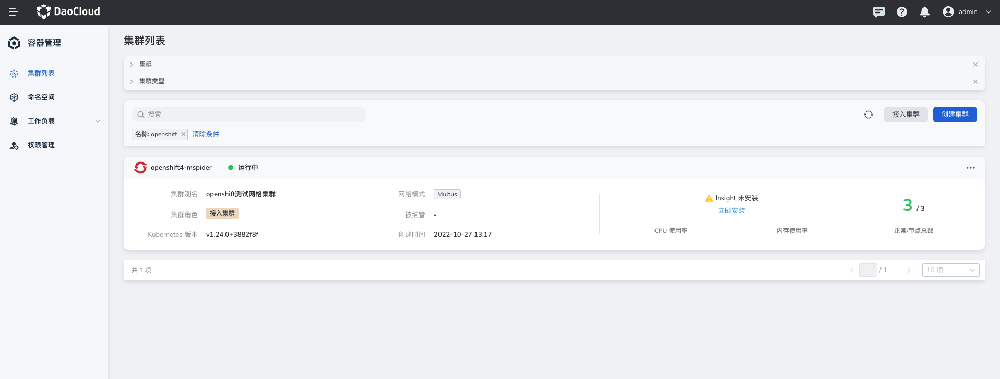
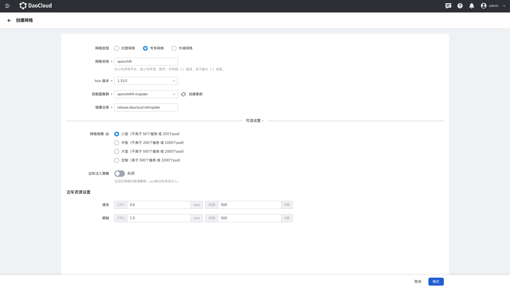
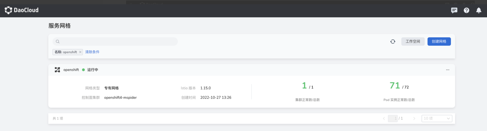
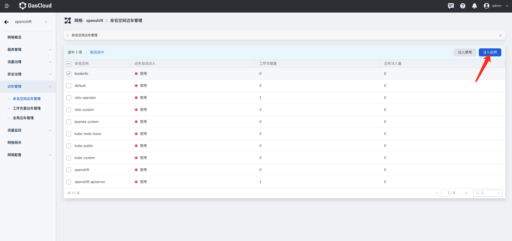

Compatibility Test Report - OpenShift

This report discusses the compatibility of the testing service mesh when creating a private mesh based on OpenShift.

Using OpenShift 4.11 as an example, this test report provides a detailed description of the compatibility testing process when integrating the service mesh with OpenShift's private mesh mode.

## Test Objectives

The objective is to validate the compatibility of creating a proprietary mesh based on native Istio on DCE 5.0 service mesh, aggregating the control plane and data plane in OpenShift's single cluster mode.

## Test Environment

### Service Mesh Environment

Based on demo-dev.daocloud.io

### OpenShift Environment

Prepared three nodes for OpenShift:

|           HostName            |      IP      | K8s Version | Crictl Version |         OS Kernel Version          | OS Release |
| :---------------------------: | :----------: | :-------------: | :---------- | :--------------------------: | :--------- |
| master01.mspider.openshift.io | 10.6.157.111 | v1.24.0+3882f8f | 1.24.2      | 4.18.0-372.26.1.el8_6.x86_64 | rhcos      |
| master02.mspider.openshift.io | 10.6.157.112 | v1.24.0+3882f8f | 1.24.2      | 4.18.0-372.26.1.el8_6.x86_64 | rhcos      |
| master03.mspider.openshift.io | 10.6.157.113 | v1.24.0+3882f8f | 1.24.2      | 4.18.0-372.26.1.el8_6.x86_64 | rhcos      |

Check the status of 3 nodes:

```shell
oc get nodes -owide
```

The output is similar to:

```none
NAME                          STATUS   ROLES          AGE   VERSION           INTERNAL-IP    EXTERNAL-IP OS-IMAGE                                                       KERNEL-VERSION                CONTAINER-RUNTIME
master01.mspider.openshift.io Ready    master.worker  7d3h  v1.24.0+3882f8f   10.6.157.111   <none>      Red Hat Enterprise Linux CoreOS 411.86.202209211811-0 (Ootpa)  4.18.0-372.26.1.el8_6.x86_64  cri-o://1.24.2-7.rhaos4.11.gitca400e0.el8
master02.mspider.openshift.io Ready    master.worker  7d2h  v1.24.0+3882f8f   10.6.157.112   <none>      Red Hat Enterprise Linux CoreOS 411.86.202209211811-0 (Ootpa)  4.18.0-372.26.1.el8_6.x86_64  cri-o://1.24.2-7.rhaos4.11.gitca400e0.el8
master03.mspider.openshift.io Ready    master.worker  7d2h  v1.24.0+3882f8f   10.6.157.113   <none>      Red Hat Enterprise Linux CoreOS 411.86.202209211811-0 (Ootpa)  4.18.0-372.26.1.el8_6.x86_64  cri-o://1.24.2-7.rhaos4.11.gitca400e0.el8
```

## Test Process

### Accessing OpenShift through Container Management

Retrieve the kubeconfig of the OpenShift cluster (located at ~/.kube/config) and use it to access the cluster in the container management of the demo-dev environment.

```yaml
clusters:
- cluster:
    insecure-skip-tls-verify: true
    server: https://10.6.157.130:6443
  name: mspider
contexts:
- context:
    cluster: mspider
    user: admin
  name: admin
current-context: admin
preferences: {}
users:
- name: admin
  user:
    client-certificate-data: LS0tLS1CRUdJTiBDRVJUSUZJQ0FURS0tLS0tCk1JSURaekNDQWsrZ0F3SUJBZ0lJV0wzelp0MFErbGt3RFFZSktvWklodmNOQVFFTEJRQXdOakVTTUJBR0ExVUUKQ3hNSmIzQmxibk5vYVdaME1TQXdIZ1lEVlFRREV4ZGhaRzFwYmkxcmRXSmxZMjl1Wm1sbkxYTnBaMjVsY2pBZQpGdzB5TWpFd01qWXhNekE1TWpaYUZ3MHpNakV3TWpNeE16QTVNalphTURBeEZ6QVZCZ05WQkFvVERuTjVjM1JsCmJUcHRZWE4wWlhKek1SVXdFd1lEVlFRREV3eHplWE4wWlcwNllXUnRhVzR3Z2dFaU1BMEdDU3FHU0liM0RRRUIKQVFVQUE0SUJEd0F3Z2dFS0FvSUJBUUNtZ2RKcUNCTCtGcmRmQmVseGU2dkNnbWpZMXJqN09rV1dDTHVUVWVJWgoyaWg1NHBWUVByUzVkQVEvbUVaME1NcTVBSmQ4dE1maWpVcFlnQkU4d1pmeU0wZEM0d3h0empXWnZvQWhSejZUCjFuRDFvd1RsZndJMDJjZ0lkZUpJSlJEa2tsV3JQUjVRZU0wbytLdWYrN1dFUDVSSW82bWVxVEtuUHBuMmRyaWwKQUxPSFIvQWFiaklqVG51YUM2QWNlSzdyN1VobGtQQ2pRK3dKdVI1cld5eW9HVFBTMlc4MVd6Mm9UNi9UQ05UVQpYTDhncWFoa2dlWGpYZkl0bzYweVVpNnV3K1dMNk1oc0NhVlpXZG1TaDVRMzZZdTlSZEFKazduaHlVR3JkNXRYCmplRm9LM0gyZjcycmwrOGdrcTdlVjNVYjRPY2pyU2VUUTIvNlY5NjhwQzcxQWdNQkFBR2pmekI5TUE0R0ExVWQKRHdFQi93UUVBd0lGb0RBZEJnTlZIU1VFRmpBVUJnZ3JCZ0VGQlFjREFRWUlLd1lCQlFVSEF3SXdEQVlEVlIwVApBUUgvQkFJd0FEQWRCZ05WSFE0RUZnUVVEdW1uRWkxWjRlLytlcjJXcEY4bTBLODhGcE13SHdZRFZSMGpCQmd3CkZvQVVBM1VjTVdYYjh5aE54TVgrOUhBcWpneTBYMnN3RFFZSktvWklodmNOQVFFTEJRQURnZ0VCQUYvL1BvM3MKSWp5N2tva1p2OU1LUDJvMm9ubWdhY0owNklIay9VbTVIbC8rMVE5WmhDeDJWSDNtWnIyME5kQ0M5Rm03OFovZwpoK3lDVi9hbGRXTnAxUXhyaWJUbGpscmNsek55L20vYWRmMUhKSGoram1mdEJFeCtmNkVEdFFQZ3BUZUlCbk01CnhzMDFSUldwVTBKVnVsYU5RclphNHUyYVZnc3h3djYzdEEyeXlzblpxbGFqWktNZjU3TEhNTjBKdE10K3FyTDMKS1p1R1pqblVvcDk3SFh0VDVBZ01jU1R1V0UyME9QR0tldFVuTVI3cldza2pvSlU5VWNSelBTQ1FGTWZCam53VQpNLzNRM0lYTmNVay9mSDdxZk1DV2pGL29sNWNXMnhZOTN4ekF0bTVFWVpUei9VRk4wOEFzS09qMS9hRWVBaHlICkFhclV5UHBEYTlwUkpJWT0KLS0tLS1FTkQgQ0VSVElGSUNBVEUtLS0tLQo=
    client-key-data: LS0tLS1CRUdJTiBSU0EgUFJJVkFURSBLRVktLS0tLQpNSUlFb3dJQkFBS0NBUUVBcG9IU2FnZ1MvaGEzWHdYcGNYdXJ3b0pvMk5hNCt6cEZsZ2k3azFIaUdkb29lZUtWClVENjB1WFFFUDVoR2REREt1UUNYZkxUSDRvMUtXSUFSUE1HWDhqTkhRdU1NYmM0MW1iNkFJVWMrazladzlhTUUKNVg4Q05ObklDSFhpU0NVUTVKSlZxejBlVUhqTktQaXJuL3UxaEQrVVNLT3BucWt5cHo2WjluYTRwUUN6aDBmdwpHbTR5STA1N21ndWdISGl1NisxSVpaRHdvMFBzQ2JrZWExc3NxQmt6MHRsdk5WczlxRSt2MHdqVTFGeS9JS21vClpJSGw0MTN5TGFPdE1sSXVyc1BsaStqSWJBbWxXVm5aa29lVU4rbUx2VVhRQ1pPNTRjbEJxM2ViVjQzaGFDdHgKOW4rOXE1ZnZJSkt1M2xkMUcrRG5JNjBuazBOditsZmV2S1F1OVFJREFRQUJBb0lCQUJ5dHo2Z2pxK0hIMTkydQpEdjlVNWNpaTNadzduN0RsNEladkNwL2RRcXhoUHdkL1YyaHk1SDNzMWE1K2MrUWZZMHRxSnExOEZkR1h0RzU1CjRINHVlaFZsYjZpOW9xNW5EaVJsQTN5MzRMZG1BQjdPN1ZENkIwOURFNGtoaE5BWVVraU1TK1VxcWNZQ2lKTysKQVJHVk1UYU9IT1JHRERrZnUzSEMvcEhNOFJDNlB3dzJxV1BCazZJKzJWbHdGZTNDMUZGTGpHL0IxQkFPaUZkYQpibUxkMU85cEt4QVMvODlBSzJYd0RBY1MwWk0zaDRTTkl5LzIvcVY0MHRHUFFhaG5RWEJKcGpNRy9ZQWV0U3JkClVES3VnSkF6azVvT2Q0Z1pVSlNzZFYvK3lCQlJlc2Zta3FpTTdxQXArZVpzbkxUUERYZy8zcDlCcXd2eHJUKzcKb3BGaFVTRUNnWUVBeVEyZFZaRHZHcWljTzFXSVF1VFZYbFBsdjd4dTl2aklic1pxZWV3K1FlVXBnYkFoOXFQMApwbDJsaGtFR1VIZjZzeUdnb3BUTnRaci9IYzVCUXRSbzJGbzl4Z25QZkxTQ21ZMS9FbTQyd3UzUmhJNVNZOU1ICmZWYVFTeS9vRTRrQ3Y1ZmpTSmM2dkZ1aHVYTllFWkhraWRmSHFValFDazduRTErY2lxT01YNWNDZ1lFQTFBTSsKVitXWXIvb0JSaEVpck9vbVF1U1l1d1lRcHhKaVF1UFBzUk9jR3VkRUFXU2V6SVVRV2RSTERETEl6cHhuUHhGQgpGMHRrQnY4VmhrMk9uS0dRazAweVZnTlhnOHlvMnBlNk8zQ0w1QUdiMTdPMlBvWmJ4Mkozc1JNa3Fuc015US92CkJVbUJ6YXVTTWEwVXprREFoU0xHaU01V253dDNMOEpEaUE0ZWQxTUNnWUFWUFAzd3l3V25FRWFvc2VsWi82aFcKZFpCZ2g3eEZGSlMvdHZBS2Z4MDRnc2Uycm05NENXdlBvemJZRHNobStiV2U5Sjl1YlQrcHZuelNuallncENXTApMVVUzUlZRSXZWektjYnNKckdEV2lKN0lYT3h4SlJxMmI4MkFVOGcxUUJUdFBsTkJHTkNZa3lscldMYmw3RDV6CkhUczNNN3plU2VWNUUzR0s1Nm50Y3dLQmdRRExNQVNheHE4cjBFVlNPbS9xR2tuckNCeWIrVGNTZDVyMmtsQmwKVys3YkZkTm1KbUhPanFSYUF3eWR0em9lVVdUZDI1SnZXZENXcC9lZ0RFcG1NSzFYanI5MEVhWFk2ZGJXRUYzcQpRM1crWWhCU2pLaFhpZnNCdm93Smg5ZzNEdEQxRFRFODl2TFJBdUtNZTEyYVFoS0FSaERSNGpiQUhJUHdvSlNLCkcwWDFnd0tCZ0J3cERlNmJWMGc2aEQzN1VVOStpQnBTblVnWWNzLzZBVlJOR0k5RDhreFFIb1JESnNWT2ZVV1QKaERDWDF2aUFpU0hEUStmSzlIZUhOWVk5Z05iRmdRakpDdlAxbHFRYU9IZnltUGliWUo5OVgxWnZ5eWlqNjJkbQo1a3gvMnhwOGJPanM0U2hCY21JcGc5TjFZODl1UWtpTlJ4MEl0NUdFRWJweFNXQ1U4TGEyCi0tLS0tRU5EIFJTQSBQUklWQVRFIEtFWS0tLS0tCg==
```

## Test Process

### Checking the Cluster Access Status in Container Management

View the status of the connected cluster in the container management:



### Creating a Private Mesh

1. Log in to the global-cluster node and check the status of the service mesh synchronization with the container management.

    

2. After completing the configuration for creating the mesh, click `OK`.

    > For the control plane cluster, select the openshift4-mspider cluster accessed through container management.

    

3. OpenShift cluster successfully connects to the mesh.

    

4. Check the health of each component.

    

    

#### Issues Encountered during Access

1. Error message: `istio-operator RS CreateFailed`

    

    Analysis: OpenShift's Security Context Constraints (SCC) have restrictions on Pod creation permissions.

    Solution: Add "privileged" SCC user namespace permission.

    ```sh
    oc adm policy add-scc-to-user privileged -z istio-operator
    oc adm policy add-scc-to-user privileged -z istio-system
    oc adm policy add-scc-to-group privileged system:authenticated
    ```

    Restarting the istio-operator rs resolves the issue.

2. Error message: `message: no running Istio pods in "istio-system"`

    Analysis: The literal message indicates a lack of istiod/istio-ingressgateway service pod in the
    istio-system namespace. However, the actual issue is an incorrect memory resource parameter format
    in the global mesh-sidecar resource restrictions, which should be formatted as 500Mi.

    

    Solution: Modify the YAML file and add the "Mi" unit.

    ```shell
    kubectl edit gm -n mspider-system openshift -oyaml
    ```

    

3. When injecting sidecar, receiving the error message `pod Init:CrashLoopBackOff`

    Activate OCP iptables.

    ```yaml
    apiVersion: apps/v1
    kind: DaemonSet
    metadata:
      name: dsm-init
      namespace: openshift-sdn
    spec:
      revisionHistoryLimit: 10
      selector:
        matchLabels:
          app: dsm-init
      template:
        metadata:
          labels:
            app: dsm-init
            type: infra
        spec:
          containers:
          - command:
            - /bin/sh
            - -c
            - |
              #!/bin/sh
              set -x
              iptables -t nat -A OUTPUT -m tcp -p tcp -m owner ! --gid-owner 1337 -j REDIRECT --to-ports 15006
              iptables -t nat -D OUTPUT -m tcp -p tcp -m owner ! --gid-owner 1337 -j REDIRECT --to-ports 15006
              while true; do sleep 100d; done
            image: release.daocloud.io/mspider/proxyv2:1.15.0
            name: dsm-init
            resources:
              requests:
                cpu: 100m
                memory: 20Mi
            securityContext:
              privileged: true
          dnsPolicy: ClusterFirst
          hostNetwork: true
          hostPID: true
          nodeSelector:
            kubernetes.io/os: linux
          priorityClassName: system-node-critical
          restartPolicy: Always
          schedulerName: default-scheduler
          securityContext: {}
          serviceAccount: sdn
          serviceAccountName: sdn
    ```

    Run the command below:

    ```shell
    kubectl edit gm -n mspider-system openshift -oyaml
    ```

    Add `istio.custom_params.components.cni.enabled: "true"`

### Deploying the bookinfo Application for Testing

Create the `bookinfo` namespace and add SCC to the namespace before deploying the bookinfo application.

```shell
oc adm policy add-scc-to-user privileged -z bookinfo
```

1. Enable sidecar injection for the namespace.

    

2. Terminal command to view the labels of the `bookinfo` namespace:

    ```shell
    oc describe ns bookinfo | grep "istio-injection-enabled"
    ```

    The output on the screen will be similar to:

    ```none
    Labels: istio-injection-enabled
    ```

3. Deploy the bookinfo application.

    ```shell
    oc apply -f https://raw.githubusercontent.com/istio/istio/release-1.15/samples/bookinfo/platform/kube/bookinfo.yaml -n bookinfo
    ```

    

    ```shell
    oc get pod -n bookinfo
    ```
