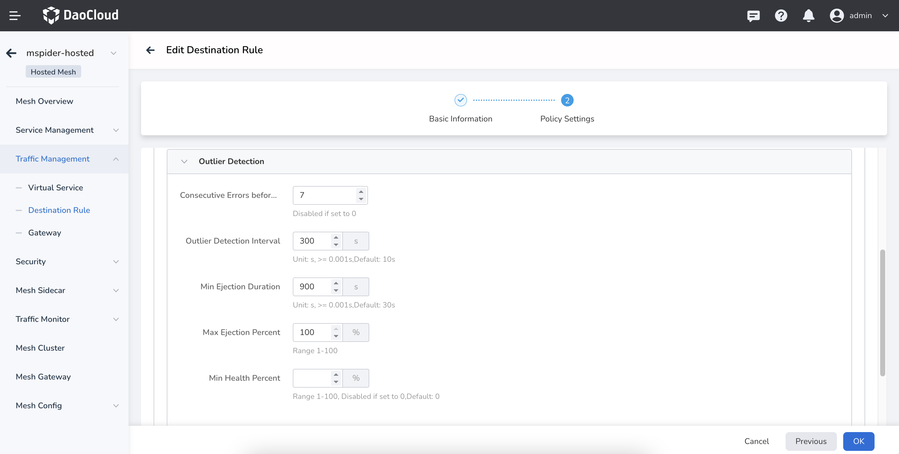

---
hide:
  - toc
---

# Cross-Cluster Interconnect Issues

This page explains issues related to cross-cluster interconnect in a service mesh and their solutions.

## Cross-Cluster Service Experiences 10s Access Latency

In a managed mesh with 2 clusters, both clusters have the same test service.
When accessing the test service via the ingress gateway, there are occasional 10-second delays.

### Cause Analysis

1. The clusters are managed, services are discovered, but multi-cloud interconnect is not enabled,
   causing network issues. Requests fail and fallback to the local cluster's test service, leading to delays.
2. Multi-cloud interconnect is enabled, clusters are in the same network group,
   but the network communication between pods in interconnected clusters is not established.
3. East-West gateways are in an abnormal state.
4. Some clusters are down. Multi-cloud interconnect solves the network connectivity between
   clusters but does not handle individual service anomalies. Hence, an outlier
   detection policy needs to be configured.

### Solutions

1. Enable multi-cloud interconnect.
2. Create multiple network groups, place clusters in different groups, and restart all pods.
3. Identify and fix the cause of the East-West gateway issues.
4. Enable outlier detection in the destination rule:

    

    After successful configuration, instances from down clusters will be automatically removed, preventing delays.

## Traffic in Mesh Only Hits Test Services in Some Clusters

In a managed mesh with 2 clusters, multi-cloud interconnect is enabled and successfully configured. However, continuous access to the test service via the ingress gateway only hits test services in some clusters.

### Cause Analysis

1. Some test services are in an abnormal state. Check the service status.
2. Some test services have not injected sidecars. Check the sidecar injection status.
3. Some test service configurations are incorrect. Check service configurations such as svc ports, port names, etc.
4. Multi-cloud interconnect was enabled after the test services were created.

### Solutions

1. Investigate and resolve the causes of service anomalies to restore normal service status.
2. Inject sidecars into the services.
3. Ensure consistent svc configurations for all test services.
   Use the __Service Management__ -> __Service List__ diagnostic function to assist in observation:

    

4. Restart all gateways, including self-built gateways and the North-South and East-West gateways in the data plane clusters:

    

By following these steps, you can troubleshoot and resolve issues related to cross-cluster interconnect in your service mesh.
