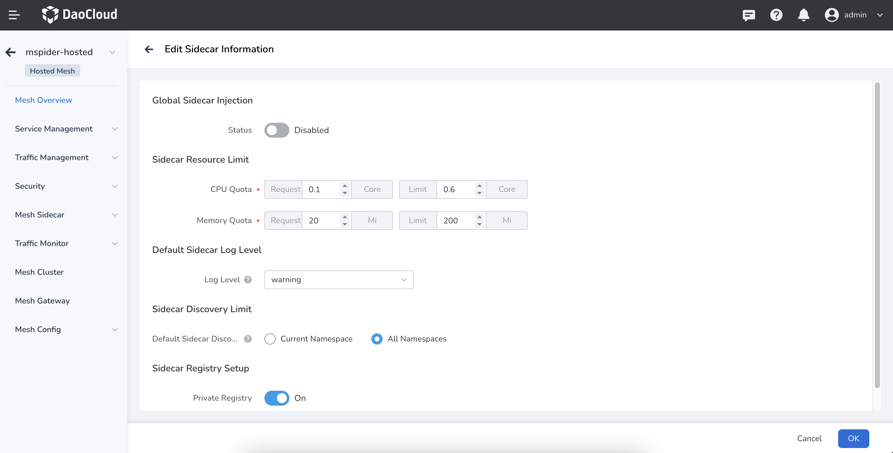
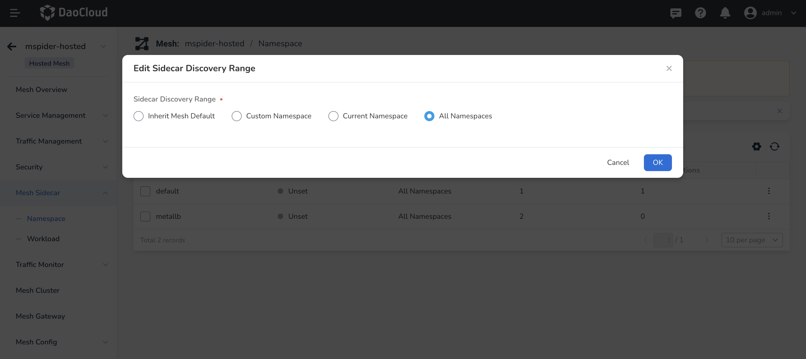
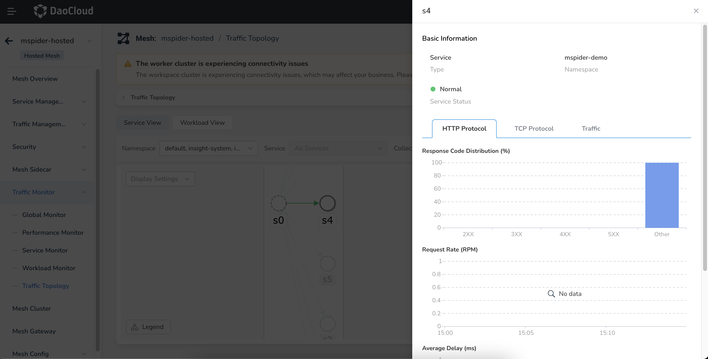
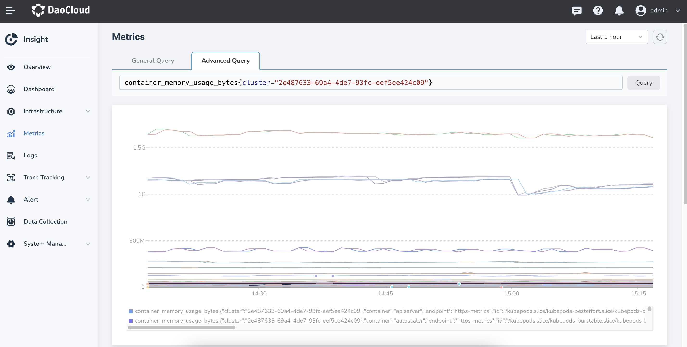

---
hide:
  - toc
---

# Sidecar Consuming a Large Amount of Memory

There are several situations that can cause this issue:

## Case 1

The namespace isolation feature for sidecar discovery scope is not enabled. The sidecar caches information about all services in the mesh. When the mesh cluster is large and there are many service discovery rules, it can consume a significant amount of memory.
It is recommended to enable this feature when creating the mesh or by selecting it in the __Mesh Overview__ -> __Edit Sidecar__ section. For cross-namespace access, configure individual namespaces in __Sidecar Management__ -> __Namespace__.

## Case 2

A large volume of traffic passing through the sidecar, high request latency, and large response body text can all consume more memory. You can confirm this by checking the monitoring topology.

## Case 3

Memory leak in the sidecar. Check using monitoring components, such as DCE 5.0 component Insight.
If the cluster traffic scale has not changed but the sidecar memory usage continues to rise, it could be a memory leak. Contact us to diagnose the issue.

