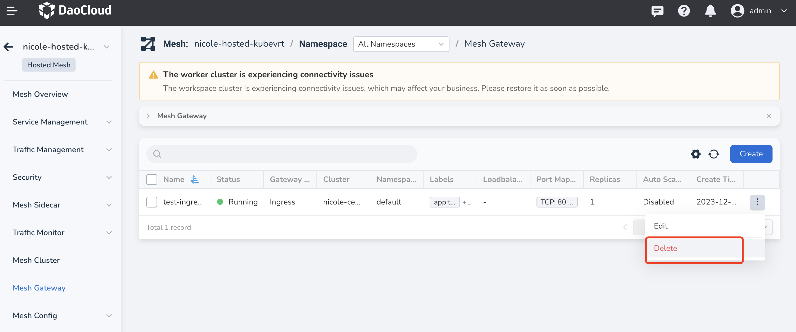
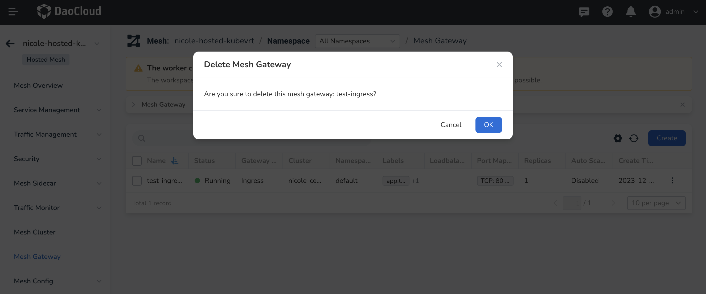
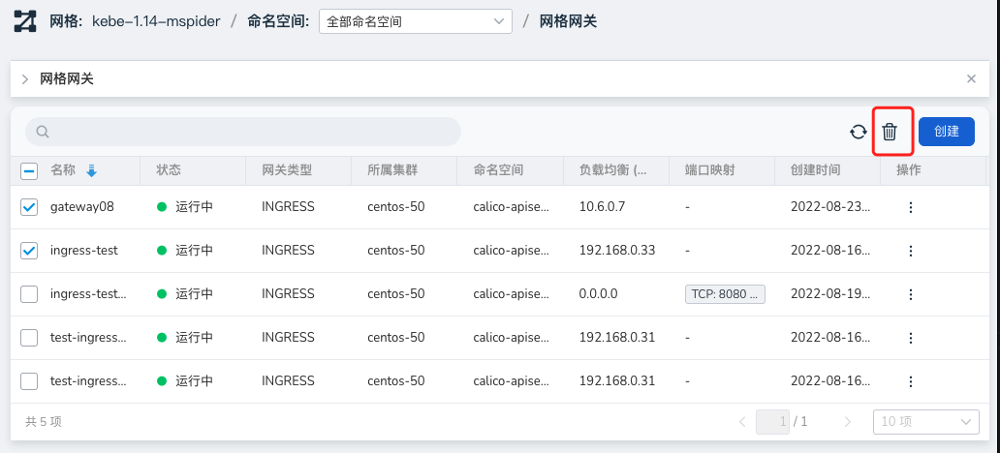

# Delete Mesh Gateway

If you want to delete one or more gateways, you can follow the instructions in this article.

## Delete a Gateway

!!! caution

    Before deleting a gateway, please check the corresponding Gateway and VirtualService resources
    to avoid invalid configurations and abnormal traffic.

The following steps are recommended to prevent accidental deletion.

1. After entering a specific mesh, click __Mesh Gateway__ in the left navigation bar.
   Click the __⋮__ button on the right side of the list, and select __Delete__ from the pop-up menu.

    

    Alternatively, you can check the checkbox in front of a gateway and click the __Delete__ button.

2. In the pop-up window, confirm the information is correct and click __OK__ to delete the gateway.

    

!!! warning

    After deleting a gateway, the related information will be lost. Please proceed with caution.

## Batch Delete

If you need to delete multiple gateways at once, you can use this operation.

1. Check multiple gateways in the gateway list and click the __Delete__ button on the upper right corner.

    

2. In the pop-up window, confirm the information is correct and click __OK__ to delete the selected gateways.

!!! warning
    
    Please do not use the batch deletion feature unless necessary. Deleted gateways
    cannot be recovered. Please proceed with caution.
