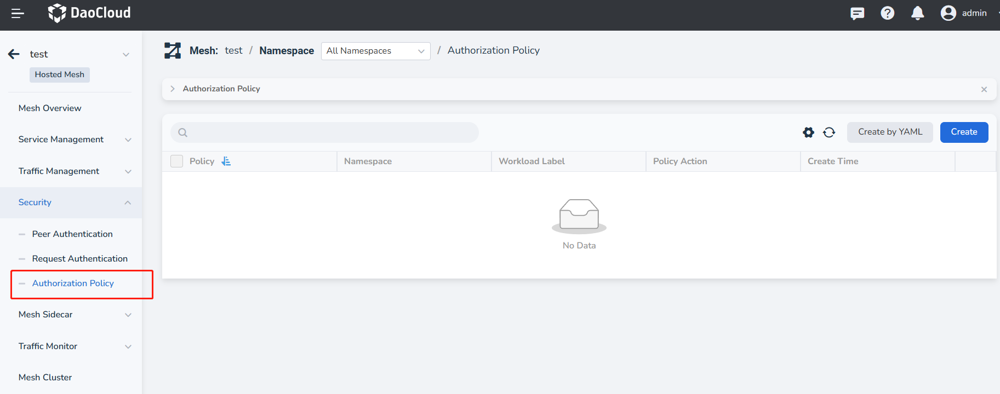
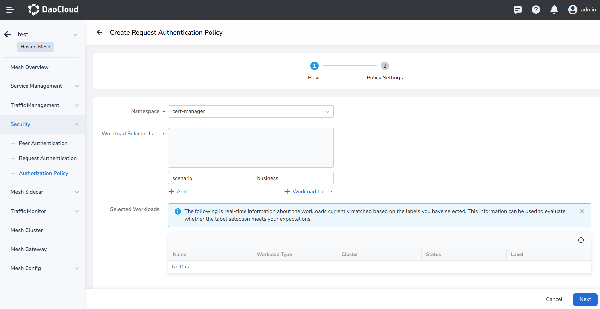
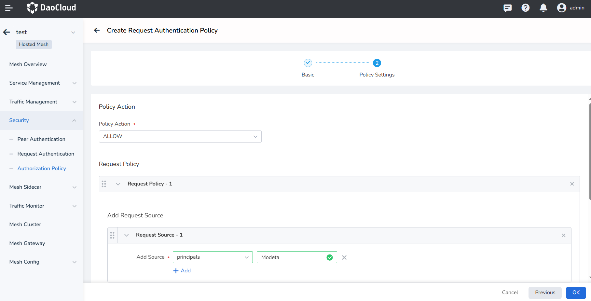
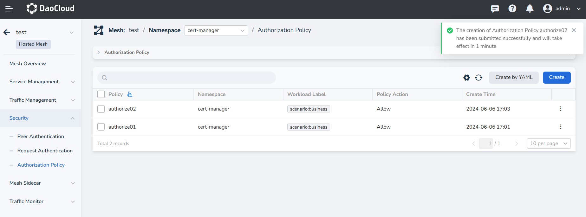
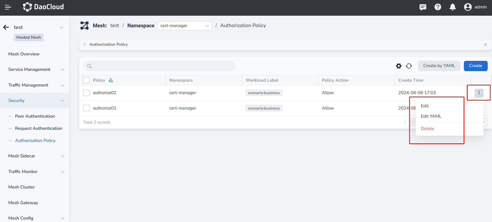

---
hide:
   - toc
---

# Authorization Policy

The authorization policy is similar to a four-layer to seven-layer "firewall". It will analyze and match the data flow 
like a traditional firewall, and then perform corresponding actions.
The authorization policy applies whether the request is from internal or external.

A reference YAML example for an authorization policy is as follows:

```yaml
apiVersion: security.istio.io/v1
kind: AuthorizationPolicy
metadata:
   name: "ratings-viewer"
   namespace: default
spec:
   selector:
     matchLabels:
       app: ratings
   action: ALLOW
   rules:
   - from:
     - source:
         principals: ["cluster.local/ns/default/sa/bookinfo-reviews"]
     to:
     - operation:
         methods: ["GET"]
```

Service mesh provides two creation methods: wizard and YAML. The specific steps to create through the wizard are as follows:

1. In the left navigation bar, click __Security__ -> __Authorization Policy__ , and click the __Create__ button in the upper right corner.

      

2. In the __Create Request Authentication Policy__ interface, firstly fill in the basic settings and then click __Next__ .

         

3. After setting the policy according to the screen prompts, click __OK__ . See [Policy Setting Parameter Description](./params.md#_10).

        

4. Return to the authorization list, and the screen prompts that the creation is successful.

       

5. On the right side of the list, click __⋮__ in the operation column to perform more operations through the pop-up menu.

    

!!! note

     - For the configuration of specific parameters, please refer to [Authorization Policy Parameter Configuration](./params.md#_8).
     - For a more intuitive operation demonstration, please refer to [Video Tutorial](../../../videos/mspider.md).
