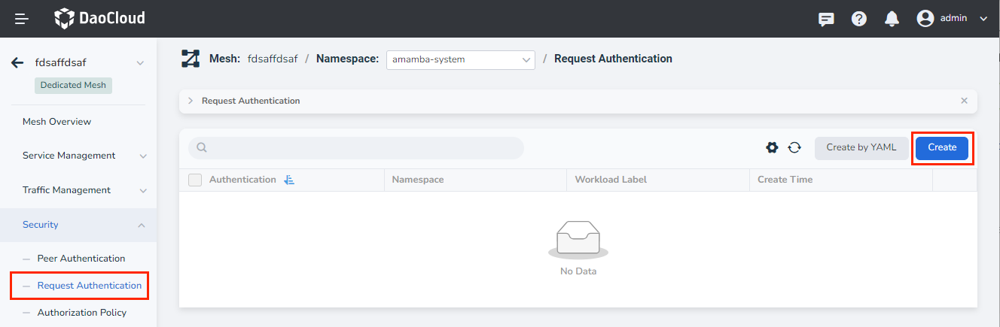
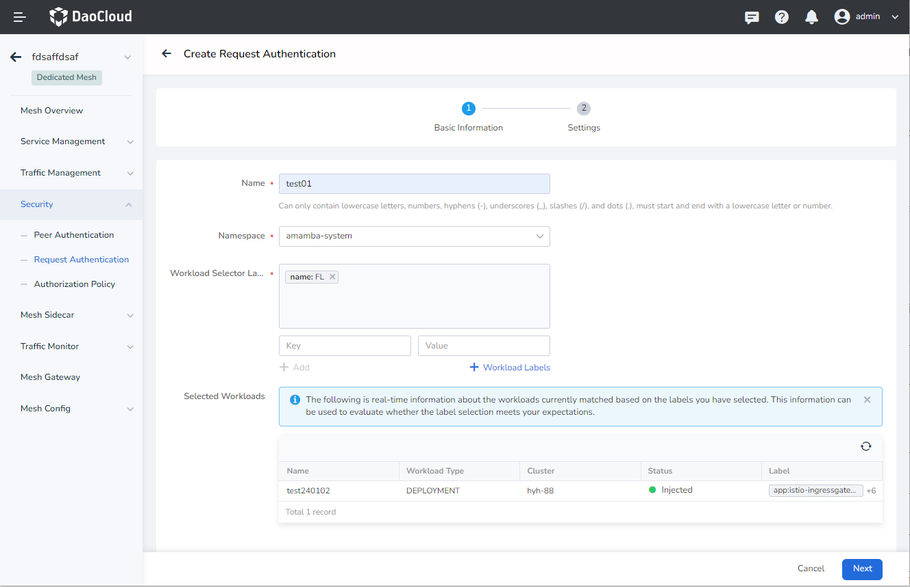
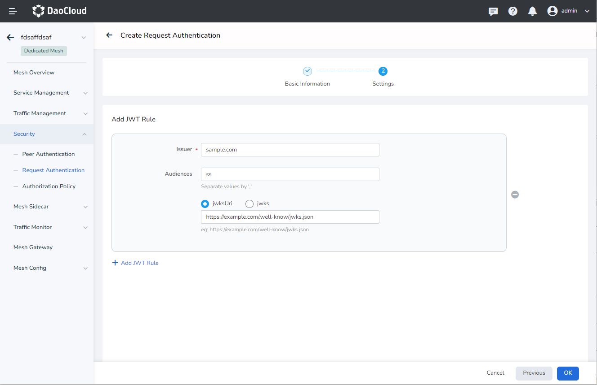
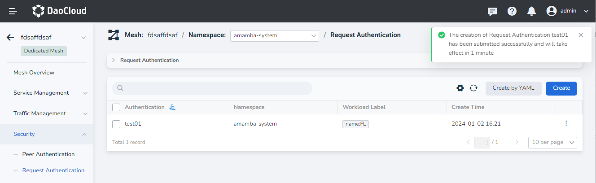
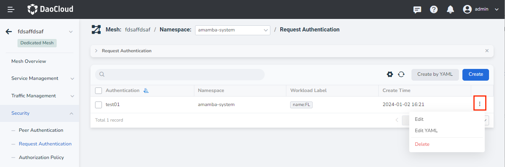

---
hide:
  - toc
---

# Request Authentication

This authentication mode can be used when an external user initiates a request for mesh internal services. In this mode, request encryption is implemented using JSON Web Token (JWT).
Each request authentication needs to configure an [Authorization Policy](./authorize.md).

All workloads labeled `app: httpbin` require JWT authentication. Examples are as follows:

```yaml
apiVersion: security.istio.io/v1beta1
kind: RequestAuthentication
metadata:
  name: httpbin
  namespace: foo
spec:
  selector:
    matchLabels:
      app: httpbin
  jwtRules:
  - issuer: "issuer-foo"
    jwksUri: https://example.com/.well-known/jwks.json
```

Service Mesh provides two creation methods: wizard wizard and YAML. The specific steps to create through the wizard are as follows:

1. On the left navigation bar, click `Security` -> `Request Authentication`, and click the `Create` button in the upper right corner.

    

2. In the `Create Request Authentication` interface, first perform the basic configuration and then click `Next`.

    

3. After completing the authentication settings according to the screen prompts, click `OK`, and the system will verify the configured information.

    

4. After the verification is passed, the screen prompts that the creation is successful.

    

5. On the right side of the list, click `⋮` in the operation column to perform more operations through the pop-up menu.

    

!!! note

    - For the configuration of specific parameters, please refer to [Security Governance Parameter Configuration](./params.md).
    - For a more intuitive operation demonstration, please refer to [Video Tutorial](../../../videos/mspider.md).
    - See [Service Mesh Identity and Authentication](./mtls.md).
