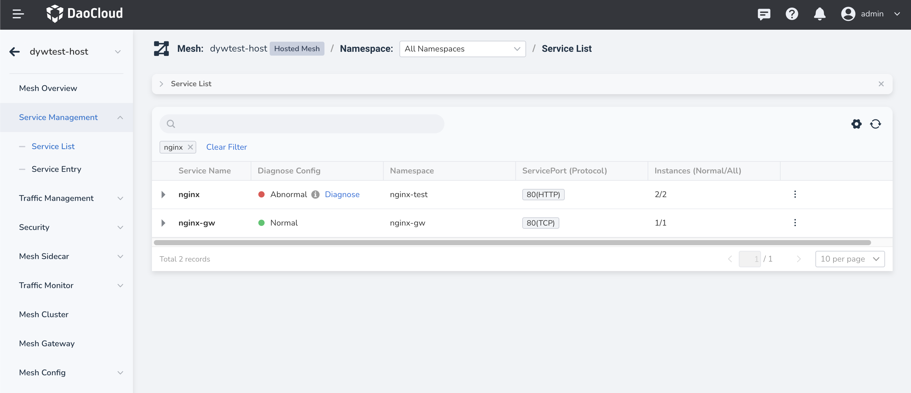
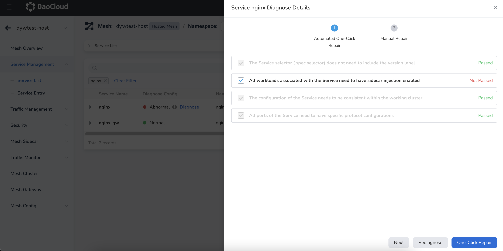
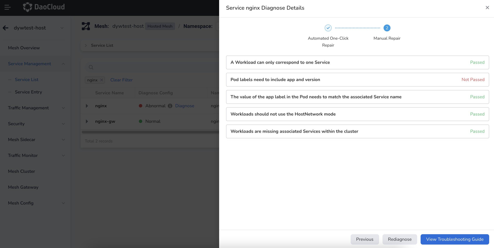

# One-click Diagnosis and Repair

DCE 5.0 Service Mesh provides built-in one-click diagnosis and repair functionality for managed services, which can be operated through a graphical user interface.

1. Enter a specific Service Mesh and click `Service Management` -> `Service List`.
   In the `Diagnosis Config` column, next to services with an `Abnormal` status,
   the word `Diagnose` will appear. Click `Diagnose`.

    

2. A diagnosis popup will appear on the right-hand side. Follow the built-in checklist for inspection.
   Green checkmarks indicate that the item has passed, while red crosses indicate items that need to be repaired.

    Check the items that have not passed and click the `One-click Repair` button.
    You can click `Rediagnose` to refresh the checklist, and the repair is usually
    completed within a few minutes.

    

3. After successful repair, all items in the checklist will turn gray and display as `Passed`. Click `Next`.

    

4. A list of items that require `Manual Repair` will be displayed.
   You can click `View Troubleshooting Guide` to read the proper documentation page and manually repair the items.

    

!!! note

    For system components such as coredns, calico, and insight-agent in the `kube-system` namespace, one-click repair is not recommended.
