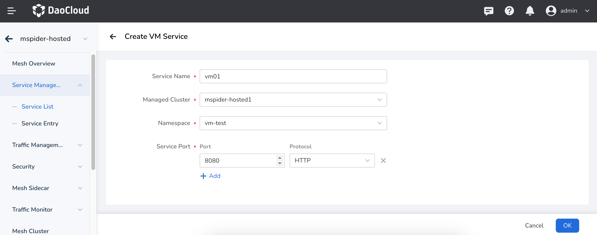

# Integrate Virtual Machine into Service Mesh

The service mesh provides the capability for virtual machines to integrate,
enabling traffic governance between the virtual machines and the cluster

## Prerequisites

The virtual machine needs to be able to access the control plane Istiod service and the east-west gateway service.

- Expose the control plane Istiod for virtual machine connections
  (Istiod defaults to a LoadBalancer service, and the control plane cluster must support assigning a load balancing IP)

    

- The mesh needs to be in multi-cloud interconnect mode

    

## Create a Virtual Machine Service


The service port and protocol need to match those of the accessing virtual machine.



## Integrate the Virtual Machine

Select a virtual machine service, integrate the virtual machine,
and copy the command to run on the virtual machine:


## Check the Running Status of the Virtual Machine

1. Check the health status of the virtual machine through the control platform.
2. Check the running status of the virtual machine on the virtual machine itself.

```bash
# Check the running status of the mspider vm agent
systemctl status mspider-vm-agent.service
```

View the Istio sidecar logs:

```bash
# View the virtual machine Istio sidecar running logs
tail /var/log/istio/istio.err.log /var/log/istio/istio.log -Fq -n 100
```

## Manually Update the Istio Virtual Machine Proxy Configuration

When users need to customize the sidecar configuration, they can perform the following operations:

!!! note

    Please exercise caution when manually changing configurations,
    as improper changes may cause the proxy to fail to operate.

```bash
# mspider default directory /var/local/mspider
[root@nicole-u-1 /var/local/mspider]# tree
.
├── bin
│   ├── docker-start.sh
│   ├── envoy
│   ├── install.sh
│   ├── istio-start.sh
│   ├── mspider-vm-agent
│   ├── pilot-agent
│   └── postinstall.sh
├── certs
├── conf
│   ├── config.yaml
│   └── istio
│       ├── cert-chain.pem
│       ├── cluster.env
│       ├── hosts
│       ├── istio-token
│       ├── key.pem
│       ├── mesh.yaml
│       └── root-cert.pem
└── istio
    ├── config
    │   └── mesh
    ├── envoy
    ├── envoy_bootstrap_tmpl.json
    ├── proxy
    │   ├── envoy-rev.json
    │   ├── grpc-bootstrap.json
    │   └── XDS
    └── sidecar.env
    
    ## Users can modify configurations as needed
    
    # Restart mspider-vm-agent
    systemctl restart mspider-vm-agent.service
```

## Uninstall the Virtual Machine

Deactivate the agent on the virtual machine:

```bash
systemctl stop mspider-vm-agent.service
systemctl disable mspider-vm-agent.service

rm /lib/systemd/system/mspider-vm-agent.service
systemctl daemon-reload

rm -rf /var/local/mspider
```

Manually remove resources related to the virtual machine:

```bash
# For the virtual machine's corresponding working cluster, delete wg
kubectl get workloadgroup -n <vm-ns> 
kubectl delete workloadgroup -n <vm-ns> <vm-wg>
 
# For the managed cluster, the pod shell of istio-system/hostd-api-service
kubectl get wls -n <vm-ns> 
kubectl delete wls -n <vm-ns>  <[cluster]-[vmName]> 
```
