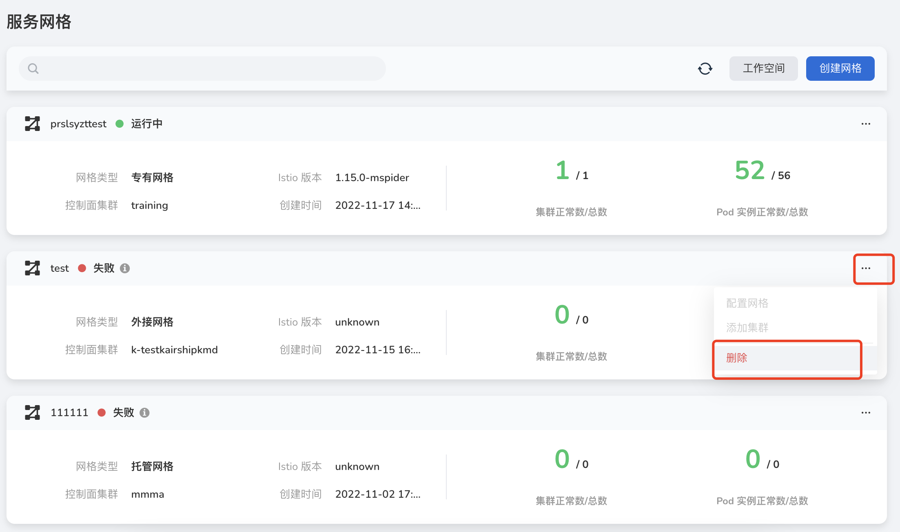
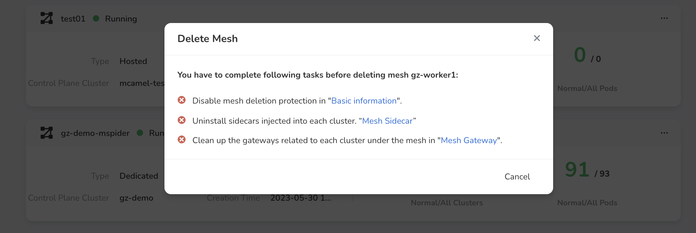
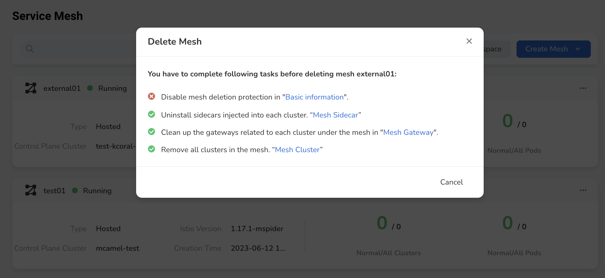

---
hide:
  - toc
---

# delete mesh

When the user no longer uses the mesh management service, the delete operation can be used. To delete the mesh, the user needs to complete a series of pre-operations before activating the `OK` button in the dialog box.

!!! danger

    After the delete operation is performed, the mesh cannot be restored. If you need to manage it again, you need to recreate the mesh.

1. On the right side of the Mesh List, click the `...` button, and select `Delete` from the pop-up menu.

    

2. Depending on the mesh type, the system will automatically detect whether the deletion conditions are met.

    - Delete External Mesh. Only need to confirm the mesh name to complete the deletion operation.

        

    - Delete Dedicated Mesh. Follow the prompts to disable mesh deletion protection, uninstall injected sidecars, clean up gateways, and then confirm the deletion operation by entering the mesh name.

        

    - Delete Managed Mesh. Follow the prompts to disable mesh deletion protection, uninstall injected sidecars, clean up gateways, remove clusters under the mesh, and then confirm the deletion operation by entering the mesh name.

        
