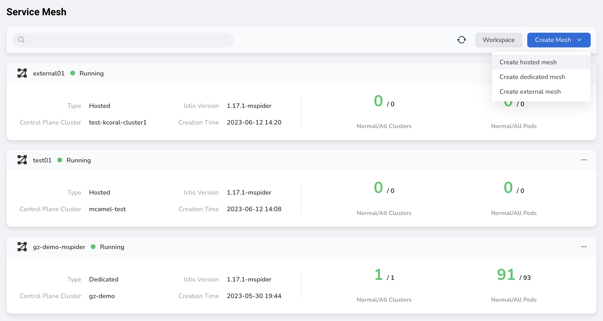

---
hide:
  - toc
---

# Create Hosted Mesh

1. On the right corner of the mesh list, click the __Create Mesh__ button and select **Create Hosted Mesh** from the dropdown list.

    

2. The system will automatically detect the installation environment. After successful detection, fill in the following basic information and click __Next__ .

    - Name: Must start with a lowercase letter, consist of lowercase letters, numbers, and hyphens `-`, and must not end with a hyphen `-`.
    - Cluster: This is the cluster where the mesh control plane runs. The cluster drop-down list displays the version and health status of each cluster.
    - Istio version: For a hosted mesh, the Istio version of all managed clusters will use this version.
    - Entry of control plane: Supports load balancer and custom.
    - Load balancer annotations: Add annotations in the form of key-value pairs.
    - Mesh component repo: The address of the container registry that contains the data plane component images. The default is `release.daocloud.io/mspider`.

    

3. System settings. Configure whether to report the trace, set the scale of the mesh, select the storage class, and click __Next__ .

    

    !!! note

        - The storage class only applies to a hosted mesh.
        - When the cluster where the control plane resides is OCP, you can optionally install OCP components.

4. Governance settings. Set outbound traffic policies, locality-aware load balancing, and request retries. See [Request Retry Parameters Description](./params.md#max-retries).

    

5. Sidecar settings. Set the global sidecar, sidecar resource limits, default sidecar log level, sidecar discovery limit, and sidecar registry setup, and click __OK__ . See [Log Level Description](./params.md#sidecar-log-level).

    

6. You will automatically return to the Mesh List page, and the newly created mesh will be listed at the top. After some time, the status will change from __Creating__ to __Running__ . Click the __...__ on the right to perform operations such as editing mesh basic information, adding clusters, and accessing the console.

    

!!! info

    After the hosted mesh is created, no hosted cluster has been connected, and the mesh is in the state of __not ready__ .
    Users can [add cluster](../cluster-management/README.md), wait for the cluster joined successfully, and select the cluster that requires service management.
