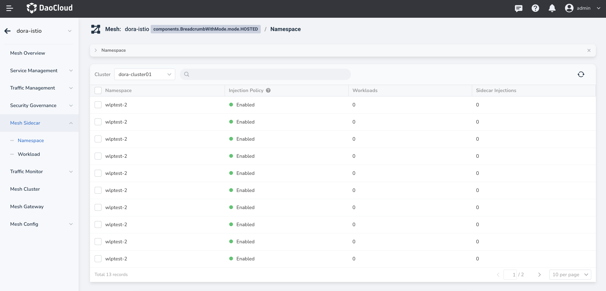

# Namespace Sidecar Management

You can enable, disable, or clear sidecar injection policies at the namespace level.

!!! note

    In the namespace sidecar list, only after selecting a sidecar, will the buttons for "Disable Injection", "Enable Injection", and "Clear Policy" be displayed in the upper right corner. 

## View Sidecar Injection Information

Click `Mesh Sidecar` -> `Namespace` in the left-hand navigation bar, and select a cluster (shown as `dora-cluster01`). This will display the status of all namespaces under that cluster.

When there are many namespaces, you can sort them by name and use the search function to find them.

## Enable Sidecar Injection

Users can choose one or more namespaces and enable sidecar automatic injection by following these steps:

1. Select a namespace that has not yet had sidecar injection enabled, and click on the "Enable Injection" button.

2. In the pop-up dialog box, confirm that the selected number of namespaces is correct. Once you are sure, click "OK".

3. The sidecar list for the namespace will automatically return, showing that the "Injection Policy" status has been changed to "Enabled". After the user restarts the workload, the sidecar injection will be completed, and the relevant injection progress can be viewed in the "Sidecar Injection Amount" column.

## Disable Sidecar Injection

Users can choose one or more namespaces and disable sidecar automatic injection by following these steps:

1. Select a namespace that already has sidecar injection enabled, and click on the "Disable Injection" button.

2. In the pop-up dialog box, confirm that the selected number of namespaces is correct. Once you are sure, click "OK".

3. The sidecar list for the namespace will automatically return, showing that the "Injection Policy" status has been changed to "Disabled". After the user restarts the workload, the sidecar injection will be disabled, and the relevant uninstall progress can be viewed in the "Sidecar Injection Amount" column.

## Clean up Policy

Users can choose one or more namespaces and clear the sidecar policies at the namespace level. After clearing the policies, the sidecar status of workloads under the namespace will only be controlled by "Workload Sidecar Management". Follow these steps:

1. Select a namespace where sidecar injection has already been enabled, and click on the "Clear Policy" button.

2. In the pop-up dialog box, confirm that the selected number of namespaces is correct. Once you are sure, click "OK".

3. The sidecar list for the namespace will automatically return, showing that the "Injection Policy" status has been changed to "Not Set". At this point, users can set the sidecar injection policy for specific workloads using "Workload Sidecar Management".
