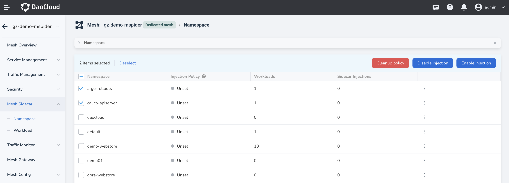
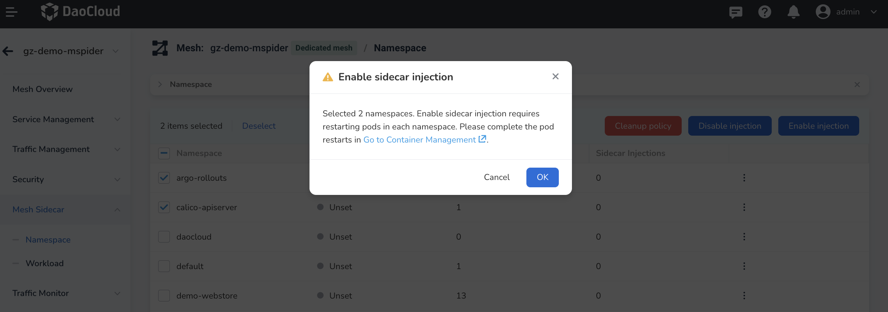
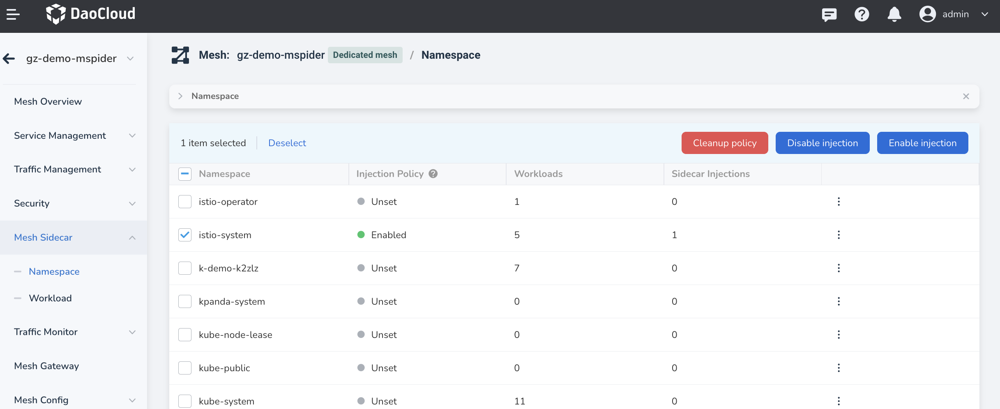
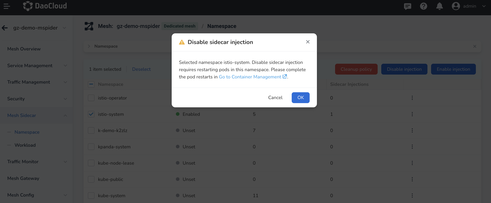
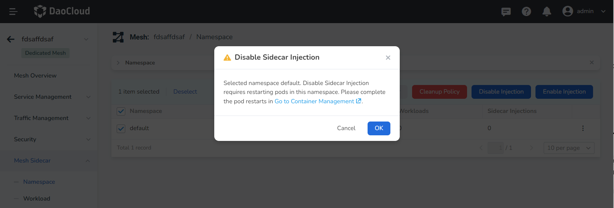
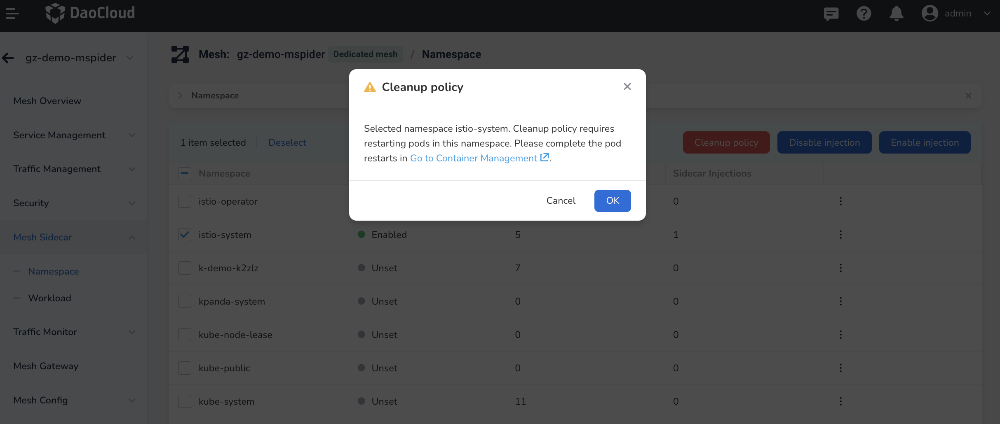
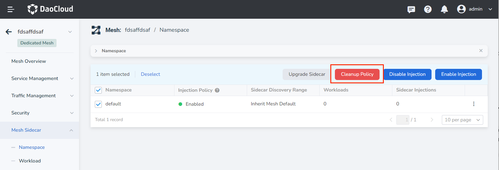
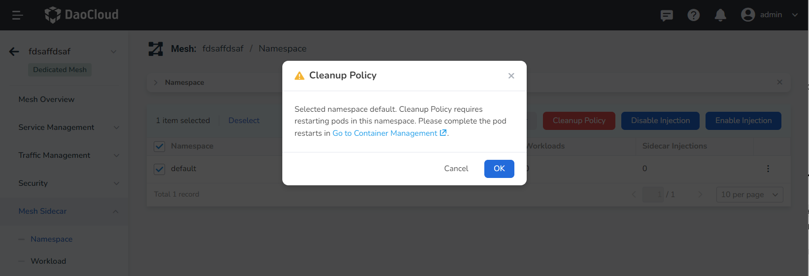
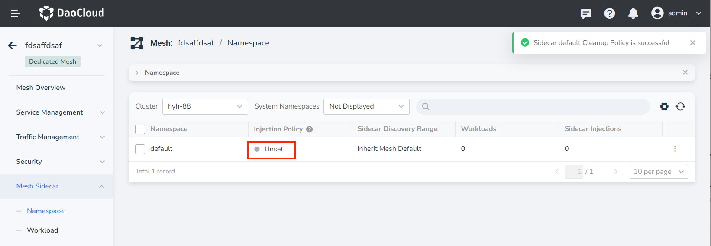

# Namespace Sidecar Management

You can enable, disable, or clean up the sidecar injection policy for namespaces in any cluster.

Note: If the sidecar injection setting for a workload is disabled, the workload will not have injection enabled even if its namespace has injection enabled.

## View Sidecar Injection Information

In the left navigation menu, click __Mesh Sidecar__ -> __Namespace__ , to view the sidecar status of all namespaces under the corresponding service mesh.

When there are many namespaces, you can sort them by name and search for them using the search function.

## Enable Sidecar Injection

You can select one or more namespaces and enable sidecar injection using the following steps:

1. Select one or more namespaces that have not had sidecars injected and click __Enable Injection__ .

    

2. In the pop-up dialog, confirm the selected namespace(s) and click __OK__ .

    

    Please follow the on-screen instructions to restart the corresponding Pods.

3. Return to the sidecar list of the namespace, and you can see that the __Injection Policy__ status of the selected namespace has been changed to __Enabled__ . After the user completes the restart of the workloads, the sidecar injection will be completed, and the relevant injection progress can be viewed in the __Sidecar Injections__ column.

    

## Disable Sidecar Injection

You can select one or more namespaces and disable sidecar injection using the following steps:

1. Select one or more namespaces that have sidecar injection enabled and click __Disable Injection__ .

    

2. In the pop-up dialog, confirm the selected namespace(s) and click __OK__ .

    

    Please follow the on-screen instructions to restart the corresponding Pods.

3. Return to the sidecar list of the namespace, and you can see that the __Injection Policy__ status of the selected namespace has been changed to __Disabled__ . After the user completes the restart of the workloads, the sidecar injection will be disabled, and the relevant uninstall progress can be viewed in the __Sidecar Injections__ column.

    

## Cleanup Policy

You can select one or more namespaces and clean up the namespace-level sidecar policy. After cleanup, the sidecar status of workloads in the namespace will only be controlled by __Workload__ . The following steps can be used:

1. Select one or more namespaces that have sidecar injection enabled and click __Cleanup Policy__ .

    

2. In the pop-up dialog, confirm the selected namespace(s) and click __OK__ .

    

3. Return to the sidecar list of the namespace, and you can see that the __Injection Policy__ status of the selected namespace has been changed to __Not Set__ . At this point, users can set sidecar injection policies for specific workloads using __Mesh Sidecar__ -> __Workload__ .

    

Next: [Workload Sidecar Management](./workload-sidecar.md)
