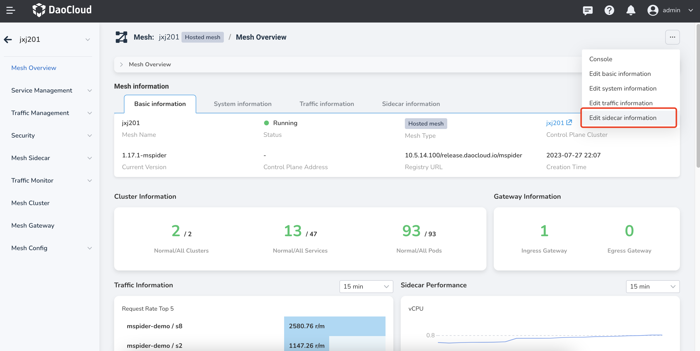
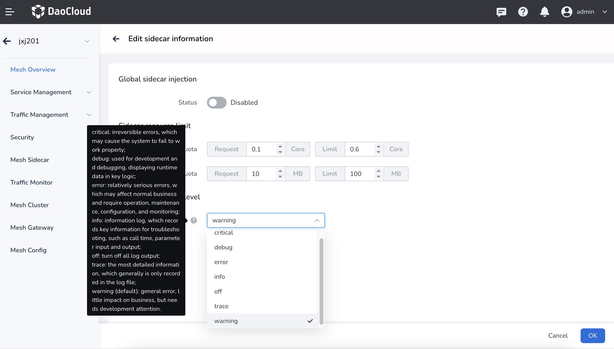
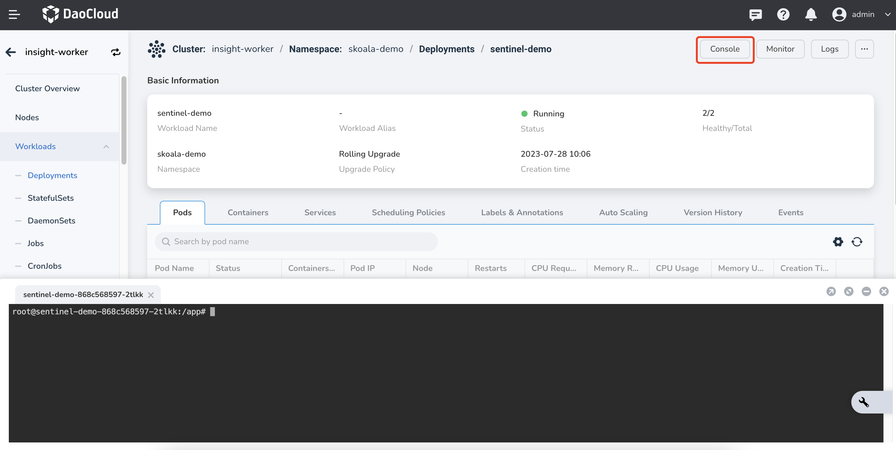
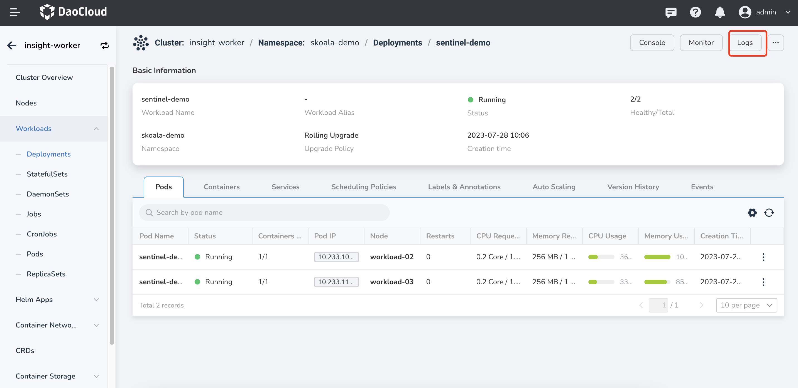

# Change Sidecar Log Level

The sidecar log is used to record the operation of the workload's sidecar. By controlling the log level, you can control the output of the sidecar log, thereby reducing log output, storage, and transmission.

When deploying a mesh instance, DaoCloud supports configuring the global default sidecar log level. By default, all workload sidecars will use this configuration.

## Sidecar Log Level Configuration

- Global Default Sidecar Log Level: By default, the log level of all sidecar logs can be configured in the sidecar information of the mesh instance.
- Temporary Modification of Workload Sidecar Log Level: This applies to modifying the log level of an individual workload's sidecar temporarily within the sidecar container.

### Global Default Sidecar Log Level

!!! warning

    The global default sidecar log level can only be modified by the mesh administrator.

1. Log in to the DaoCloud console, go to the mesh instance details page, and click `Edit Sidecar Information`
   to access the sidecar information modification page.

    

2. On the sidecar information modification page, you can modify the global default sidecar log level.
   After making the changes, click the `Save` button to save the modifications.

    

### Temporary Modification of Workload Sidecar Log Level

In most cases, when analyzing temporary issues, you may need to modify the sidecar log level of a specific workload.
DCE service mesh supports temporary modification of the sidecar log level within the sidecar container of the workload.



To update the configuration of the sidecar container, you need to use `kubectl`.
Access the cluster console, open the terminal, and execute the following command:

```shell
kubectl -n <namespace> exec -it <pod-name>  -c istio-proxy -- curl -X POST localhost:15000/logging?level=<log level>
```

- `<namespace>`: The namespace where the workload is located.
- `<pod-name>`: The name of the pod for the workload.
- `<log level>`: The sidecar log level. Possible values are `trace`, `debug`, `info`, `warning`, `error`, `critical`, `off`, etc.
- `istio-proxy`: The name of the sidecar container. No need to modify.
- `localhost:15000`: The listening address of the sidecar container. No need to modify.

For example, if you want to change the sidecar log level of the workload `productpage-v1-5b4f8f9b9f-8q9q2`
in the `default` namespace to `debug`, you would run the following command:

```shell
kubectl -n default exec -it productpage-v1-5b4f8f9b9f-8q9q2  -c istio-proxy -- curl -X POST localhost:15000/logging?level=debug
```

After executing the command, you can click the Logs button to verify if the sidecar log level has been successfully modified.


