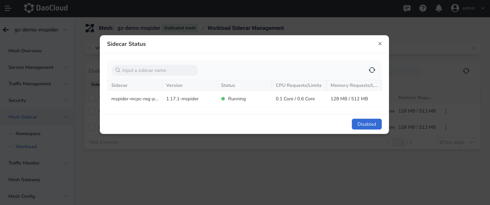
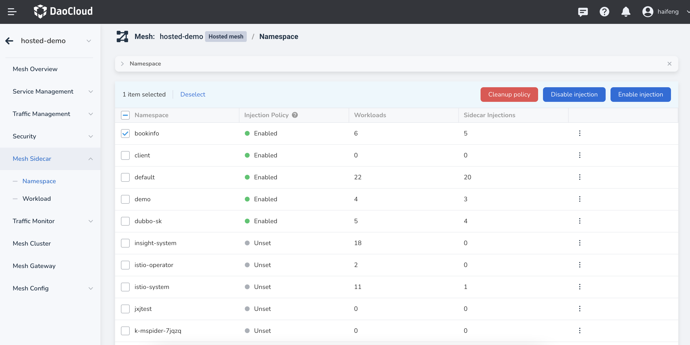
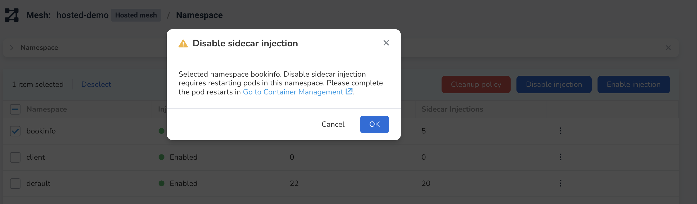
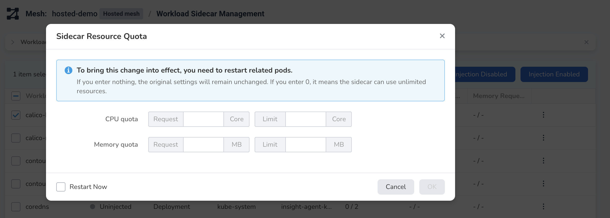

# Workload Sidecar Management

You can perform various operations on workloads regarding sidecar injection, such as enabling, disabling, and setting resource limits.

## View Sidecar Injection Information

In the left navigation menu, click on `Mesh Sidecar` -> `Workload Sidecar Management` and select a cluster to view all workloads, their related namespaces, sidecar injection statuses, and resource limitations under that cluster. 

The columns are defined as follows:

| Column Name | Definition |
| ----------- | ---------- |
| Workload    | All workloads in the selected cluster (excluding system workloads that cannot have sidecars injected) |
| Status      | Three statuses: Injected - The automatic sidecar injection is completed. Not Injected - Automatic sidecar injection is disabled. Pending Restart - The istio-injection of the corresponding namespace has changed but the related Pod has not been restarted yet. |
| Namespace   | The namespace to which this workload belongs. |
| Service     | The service(s) related to this workload, which may contain multiple items. You can click to expand the list. |
| Injected Pod/All Pods | The injection status of the workload's Pods. The format is "Number of pods with sidecars injected / Total number of injectable Pods." If the injection status of the workload is "Injected," but some Pods are not injected, such as 3/5, this item will be highlighted to remind you of the failed injections. |
| CPU Request/Limit | Contains two values: requested resources and limited resources. If you have not set any resource limit, this project will show as "Not Set." The format is "Request / Limit." |
| Memory Request/Limit | Contains two values: requested resources and limited resources. If you have not set any resource limit, this project will show as "Not Set." The format is "Request / Limit." |
| Operation | Injection Enable, Clear Policy, Sidecar Resource Limits, View Sidecar Status and Traffic Pass-Through Settings |

When there are many workloads, you can sort them by name and search for them using the search function.

## View Sidecar Running Status

If one workload has a sidecar injected, click the `⋮` at the end of the row and select `Check Sidecar Status` from the pop-up menu.

You can see the sidecar's current running status, resource requests, and limits.

## Enable Sidecar Injection

You can enable automatic sidecar injection for one or more workloads and restart their corresponding Pods. Please ensure that the Pods can be restarted before performing this operation. Follow these steps:

1. Select one or more workloads that have not had sidecars injected, click on `Injection Enable` at the top right.

    

2. In the pop-up dialog, confirm the selected workload(s) and check the `Restart Now` checkbox. Click `OK`.

    

3. Return to the workload list, and you can see the `Status` of the selected workloads has changed, such as from `Not Injected` to `Injected`. After completing the Pod restarts, the sidecar injection will be completed, and the relevant injection progress can be viewed in the `Injected Pod` column.

    

!!! note

    If the namespace to which the workload belongs has executed the `Injection Enable/Disable` operation but has not restarted the workload, the workload cannot perform new sidecar-related operations. You need to restart it before executing the new sidecar operation.

## Disable Sidecar Injection

You can disable automatic sidecar injection for one or more workloads and restart their corresponding Pods. Please ensure that the Pods can be restarted before performing this operation. Follow these steps:

1. Select one or more workloads that have had sidecars injected, click on `Injection Disable` at the top right.

    

2. In the pop-up dialog, confirm the selected workload(s) and check the `Restart Now` checkbox. Click `OK`.

    

3. Return to the workload list, and you can see that the `Status` of the selected workloads has changed to `Not Injected`. After completing the Pod restarts, the sidecar injection will be disabled, and the relevant uninstall progress can be viewed in the `Injected Pod` column.

    

!!! note

    If the namespace to which the workload belongs has executed the `Injection Enable/Disable` operation but has not restarted the workload, the workload cannot perform new sidecar-related operations. You need to restart it before executing the new sidecar operation.

## Set Resource Limits for Sidecar

You can set CPU and memory limits for one or more workloads that have had sidecars injected. Follow these steps:

1. Select one or more workloads that have had sidecars injected, click on `Sidecar Resource Limits` at the top right.

    

2. In the pop-up dialog, set the resource limits for the selected workload(s) and click `OK`.

    

3. Return to the workload list, and you can see that the resource limits of the selected workloads are displayed in the `CPU Request/Limit` and `Memory Request/Limit` columns.

    

## Clear Sidecar Policy

You can clear the sidecar policy for one or more workloads that have had sidecars injected. Follow these steps:

1. Select one or more workloads that have had sidecars injected, click on `Clear Policy` at the top right.

    

2. In the pop-up dialog, confirm the selected workload(s) and click `OK`.

    

3. Return to the workload list, and you can see that the sidecar policy of the selected workloads has been cleared.

    

## View Traffic Pass-Through Settings

You can view the traffic pass-through settings for one or more workloads that have had sidecars injected. Follow these steps:

1. Select one or more workloads that have had sidecars injected, click on `View Sidecar Status` at the top right.

    

2. In the pop-up dialog, click on the `Traffic Management` tab to view the traffic pass-through settings.

    

3. You can see the current traffic pass-through settings for the selected workload(s).

    
