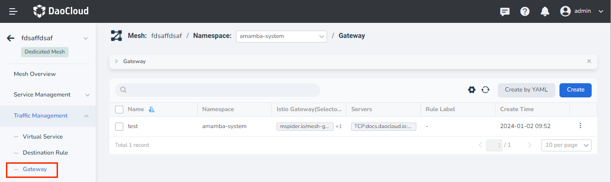
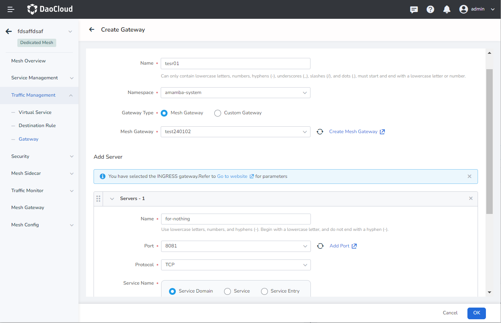
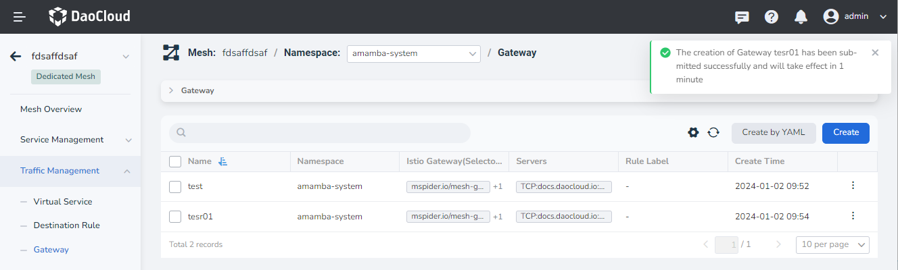
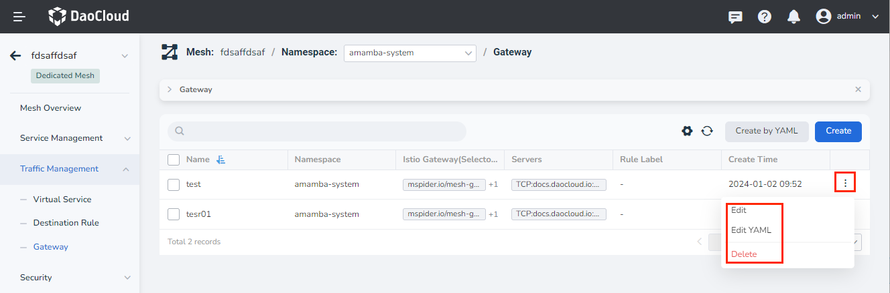

# Gateway

Gateway is used to expose services outside the mesh. Compared with Kubernetes ingress objects, istio-gateway adds more features:

- L4-L6 load balancing
- Outgoing mTLS
- SNI support
- Other internal network features already implemented in Istio: Fault Injection, Traffic Shifting, Circuit Breaking, image

## Concepts

For L7 support, gateway rules are implemented in conjunction with virtual services. Several important main fields are as follows:

- Selector

    Select the istio gateway for north-south traffic, you can use multiple or share one with other rules.

- Servers

    Information about services exposed externally, including hosts, listening port, protocol type, etc.

- TLS

    Provide external mTLS protocol configuration, users can enable three TLS modes, and can customize CA certificate and other operations.

Example:

```yaml
spec:
  selector:
    istio: ingressgateway
  servers:
  - port:
      number: 80
      name: http
      protocol: HTTP
    hosts:
    - istio-grafana.frognew.com
```

## Steps

Service mesh provides two creation methods: wizard and YAML. The specific steps to create through the wizard are as follows:

1. In the left navigation bar, click `Traffic Management` -> `Gateway`, and click the `Create` button in the upper right corner.

    

2. In the `Create Gateway` interface, configure the basic information, add the server as needed, and click `OK`.

    

3. Return to the list of gateway rules, and the screen prompts that the creation is successful.

    

4. On the right side of the list, click `⋮` in the operation column to perform more operations through the pop-up menu.

    
