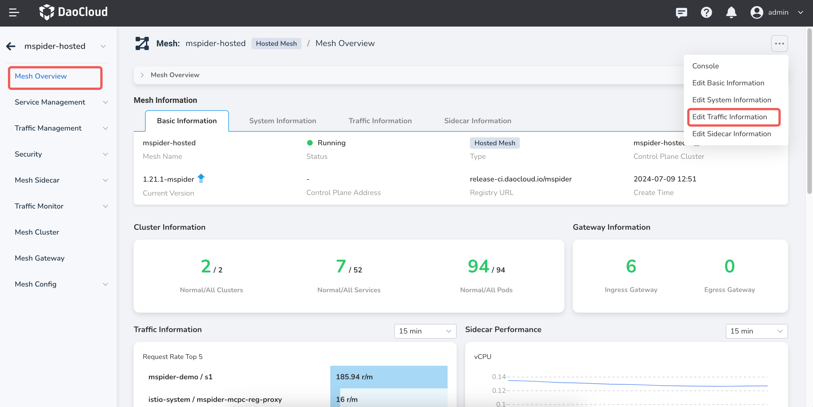
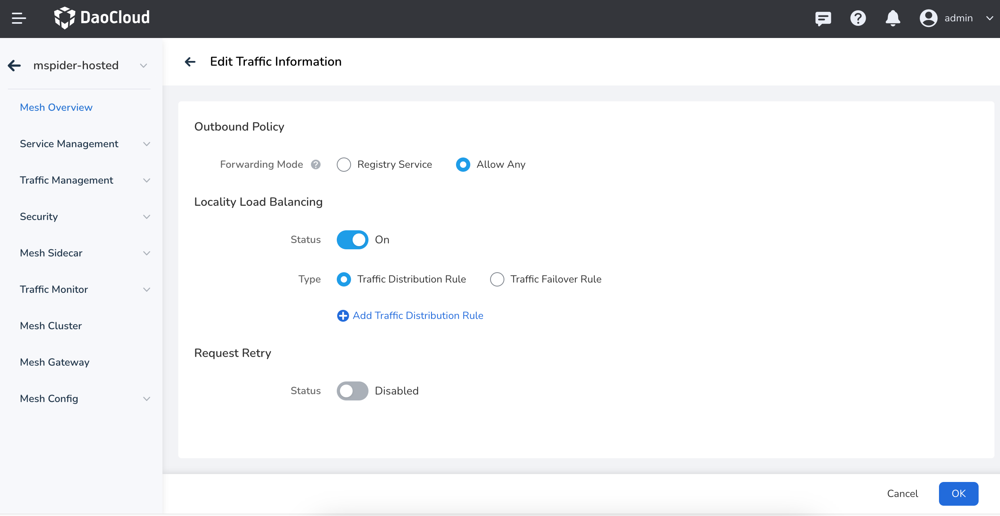
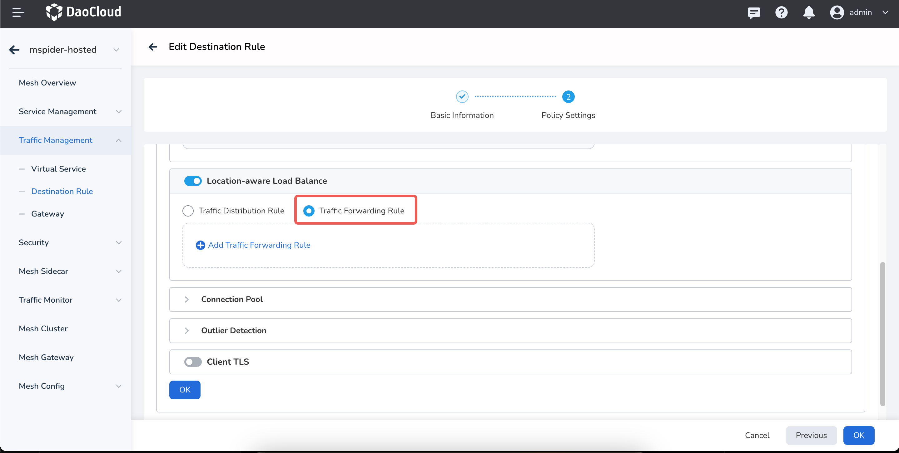
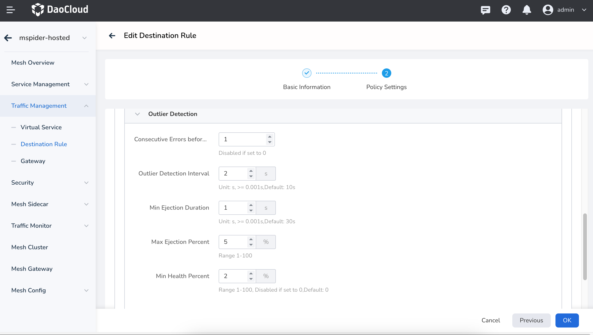

# Traffic Failover

In Istio, the Traffic Failover Rule in the localityLbSetting allows you to configure traffic to failover
to other regions or availability zones when a service instance in a specific locality
(such as a region or availability zone) becomes unavailable. This mechanism can enhance service availability,
especially in deployments that span multiple regions or availability zones.

## Configuration Structure of localityLbSetting

The traffic failover rules can be configured at the mesh level (Mesh Overview -> Traffic Information) or at the service level.  
The localityLbSetting is typically defined in the DestinationRule and includes three main components:

1. **enabled**: Whether to enable locality-aware load balancing.
2. **distribute**: Controls how traffic is distributed among different regions or availability zones.
3. **failover**: Defines the strategy for switching from one region or availability zone to another in the event of a failure.

## Mesh Level Configuration

__Mesh Overview__ -> __Traffic Information__ :

## Service Level Configuration

After configuring the traffic failover rules at the instance level and service level,
"outlier detection" must be configured individually for each service
(depending on the specific conditions that trigger outlier detection).

## Use Cases

1. **High Availability**: When a service instance in one region fails, automatically switching traffic to
   other regions ensures service continuity.
2. **Disaster Recovery**: In the event of a disaster or major failure, ensure that the system can
   automatically redirect traffic to other available regions or data centers.

## Summary

By configuring the failover rules in localityLbSetting, automatic region switching can be achieved.
When a region fails, traffic will be automatically redirected to other predefined regions.
This configuration is crucial for services deployed across multiple regions and helps
improve overall service availability and robustness.
