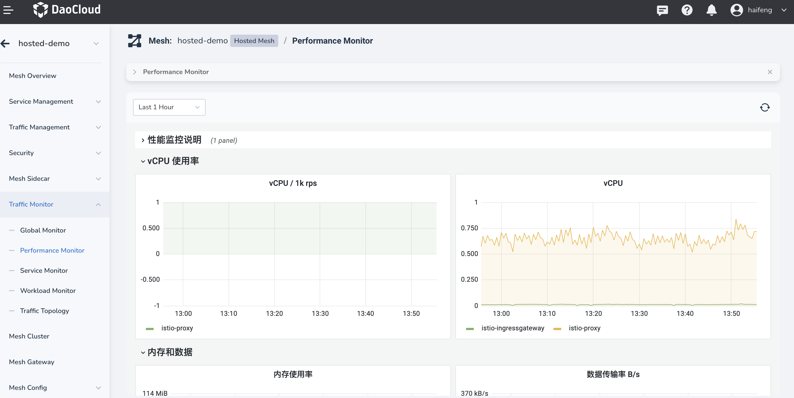
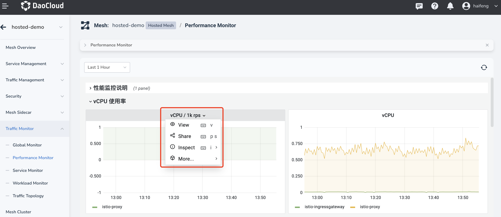
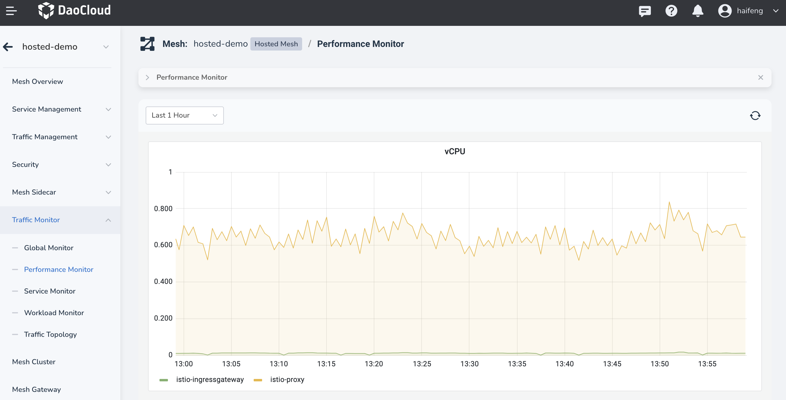
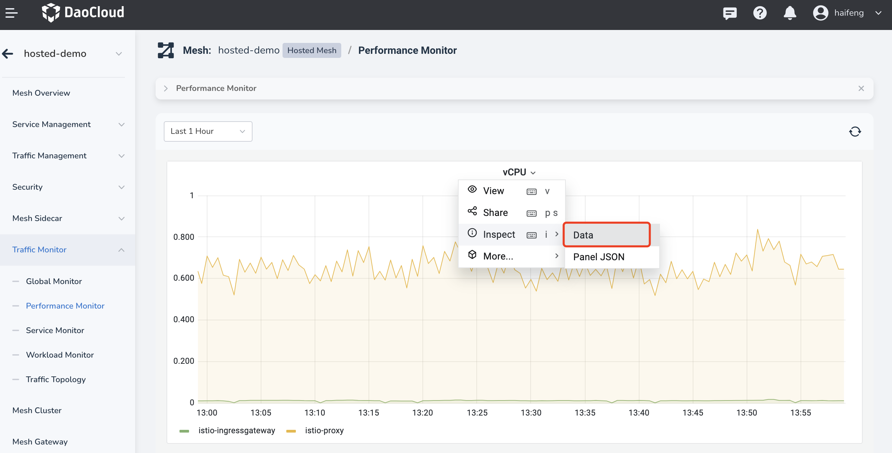
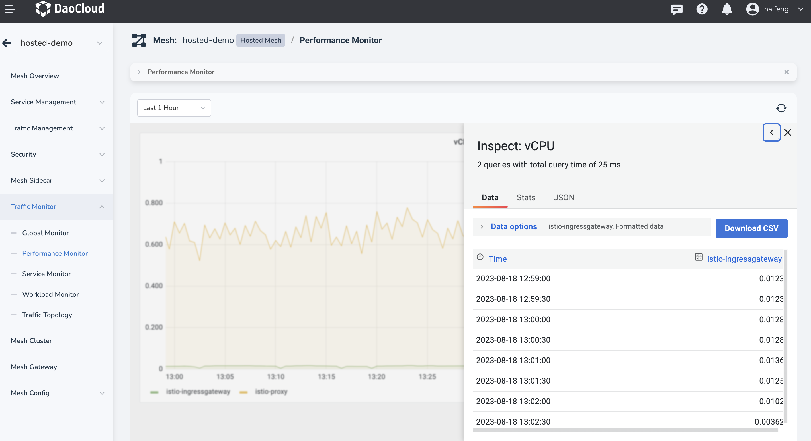
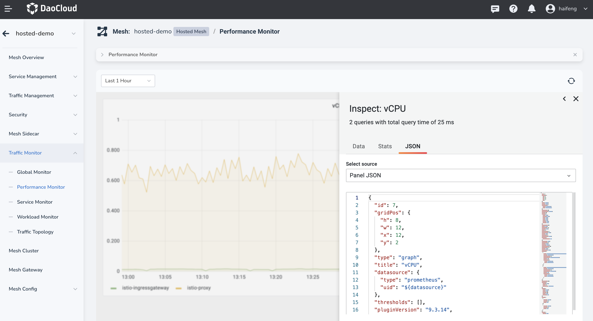

# Monitoring Dashboard Guide

The service mesh generates traffic monitoring dashboards for each instance based on the open-source Grafana Dashboard provided by Istio.

The dashboards primarily present the following dimensions:

- Global Monitoring: Displays overall information about the instance, including policy count, services, and workloads.
- Performance Monitoring: Emphasizes system resource performance of the instance and resource consumption by sidecar proxies.
- Service Monitoring: Focuses on traffic and workload status from a service perspective.
- Workload Monitoring: Provides resource consumption and business load data from a workload perspective.

## Guide to Reading Charts

Taking performance monitoring as an example, the charts provide monitoring data for various metrics. The presentation formats include numerical values, graphs, and tables.

The search bar at the top of the chart provides some auxiliary search fields for the monitoring dashboard. The available search fields may vary depending on the specific dashboard.

- Time Range (common)
- Refresh Button (common)
- Namespace
- Service Name
- Workload
- ...

### Full-Screen View of Metrics

By clicking on the title of a corresponding metric chart, you can expand the view to access more options. The first option is to view the method, which can be returned to using the **ESC** key.

### Exporting Metric Data

To view the raw data corresponding to a chart, click the title of the metric chart and select Inspect > Data to display the data in tabular form.

At this point, you can export the data in either CSV or Excel format.

### Viewing Metric Calculation Expressions

If you want to understand the calculation formula of a specific metric in detail, you can view the JSON structure of the metric chart. It provides the specific calculation method for the metric. The following steps demonstrate how to access this information:

