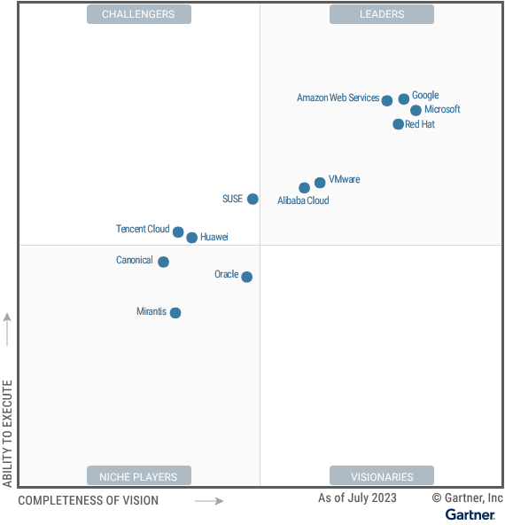
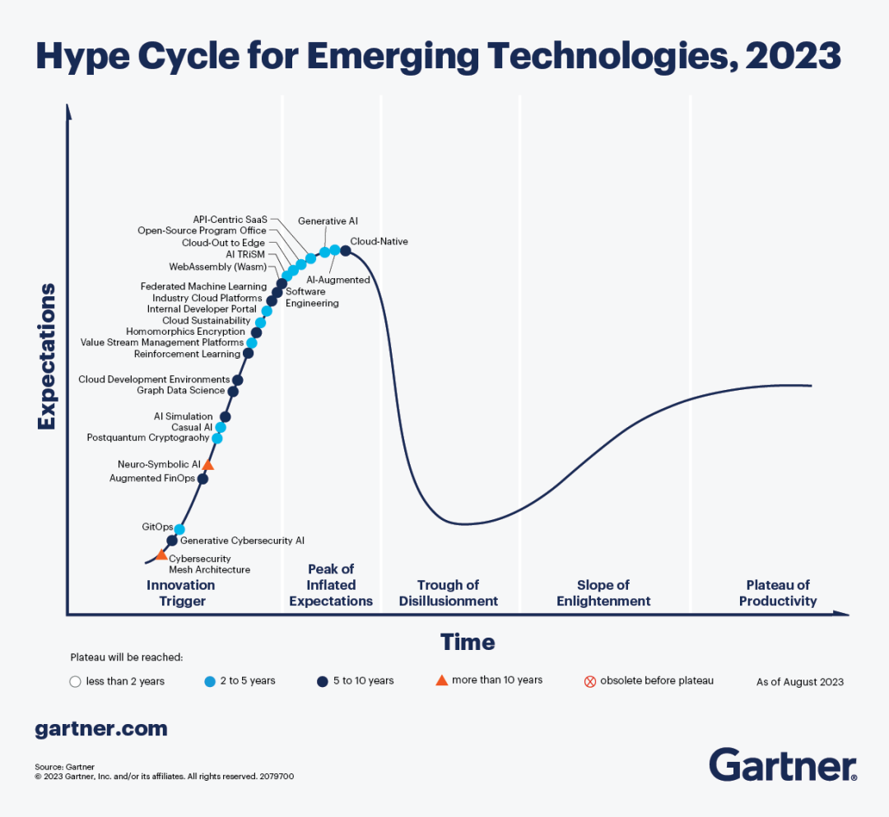

# Cloud native community news 2023

This page lists the more popular news, events, activities, etc. in the cloud native community in 2023 by month for your one-stop reference and retrieval.

> We will maintain regularly to ensure the validity of all traces and the timeliness of news.

### 2023-12

- [12.19 2023 Open Source Industry Ecology Conference Agenda Released](https://mp.weixin.qq.com/s/fEkNMM_a_01-AArogwv3RQ)
  
    2023 Open Source Industry Ecosystem Conference will open on December 19th in Shanghai, bringing together 20+ open source industry leaders and more than 50+ sharing sessions. The conference will showcase the most cutting-edge open source innovation projects, from the current hot open source big models, to the hottest industries such as smart cars, advanced manufacturing, to financial technology, consumer goods and a series of disruptive technology applications.

- [12.16 Global Edge Computing Conference-Shanghai will be held on December 16 in Shanghai](https://mp.weixin.qq.com/s/n8IXZ10XCIBx-BSEvFyAFQ)
  
    The theme of this conference is Edge Computing in the Era of Big Models, and other important topics related to Edge Computing, such as Edge Computing Enterprises Going Overseas and Edge Computing Open Source, will also be discussed. The conference will invite top edge computing & AI experts and scholars from all over the country to discuss the latest research results and development trends in the field of big model as well as edge computing.

- [Mid-December 2023 Open Atom Developer Conference Call for Papers is Hot](https://mp.weixin.qq.com/s/nVHijaI0ReF17HU_fvEv5A)
  
    The Open Atom Developer Conference (OADC) is to be held in Wuxi, Jiangsu Province, in mid-December. The conference features a main forum, technology parallel sessions, Code Camp developer workshops, hackathon, open source festival, and other special events. Currently, the conference is soliciting topics for the "Technology Parallel Session", including but not limited to new AI technologies and applications, operating system technology innovation and development, new database technologies and applications, hardcore technologies, cloud native core technologies and practices, etc. The conference will be held in mid-December in Wuxi, Jiangsu Province, China.

- [12.15 Call for Papers for ICCSECE 2023 is in progress (12.15 deadline)](https://mp.weixin.qq.com/s/jPugcYD1eq3GedHcJK5Tdg)
  
    ICCSECE 2023 will focus on the latest research fields of "Computer Science" and "Electronic Communication Engineering", and provide an opportunity for experts, professors, scholars, engineers, etc. from domestic and foreign universities, scientific research institutes, enterprises and institutions to share their professional experiences, expand their professional networks, exchange new ideas face-to-face, and present their research. It provides an international platform for experts, professors, scholars and engineers from domestic and foreign universities and institutes to share their professional experiences, expand their professional networks, exchange new ideas face-to-face, and display their research results. The topics of the conference include but are not limited to machine learning, network analysis, distributed and parallel systems, high performance computing and algorithms, cloud computing, etc.

- [12.12 KubeDay Singapore Program Announced](https://mp.weixin.qq.com/s/DPCDflFJnYtwNoGCQLNZLg)
  
    KubeDay Singapore will be held on December 12, 2023. KubeDay is a CNCF-sponsored regional cloud-native event series targeting regions with active communities and interest in cloud-native technologies such as Kubernetes.

- [12.1-12.3 CCF ChinaSoft 2023 China Software Conference Registration Channel Open](https://mp.weixin.qq.com/s/4TBhPCZWDk2SjOOXslw7rw)
  
    CCF ChinaSoft 2023, organized by the China Computer Federation (CCF), will be held on December 1-3 at the Shanghai International Convention Center. The theme of the conference is "Intelligent Software Innovation to Promote the Development of Digital Economy and Society", and there will be more than 40 sub-forums on academics, industry, education, and competitions.

- [12.1 2023 Cloud Native Industry Conference Launches | Call for Proposals Continues](https://mp.weixin.qq.com/s/1uMxhOMXTxL8H-w54Ww5fA)
  
    The China Academy of Information and Communications Technology (CACT) is organizing the 2023 Cloud Native Industry Conference on December 1st, 2023 . The conference will include sub-forums on Application Modernization and Reshaping the Software Industry, Cloud Native Security Development Forum, Cloud Native Accelerated Arithmetic Industry Development Forum, Serverless Leading the Next Generation of Computing Architecture Forum, and Cloud Native Opening a New Era of AIGC Forum.

### 2023-11

- [11.30 Call for Reports | 2023 AI Development Platform Evolution Path Research Report in the Age of Big Models (11.30 Deadline)](https://mp.weixin.qq.com/s/Zn___162BAAZgZQQ9BIdnQ)
  
    Ai Rui Consulting Research Institute is planning to release the "2023 AI Development Platform Evolution Path Research Report in the Era of Large Models" in December 2023, which will be published by Ai Rui Consulting Research Institute. Against this background, AiRui Research Institute officially opens the vendor call for AI development platform report to discuss the current situation and future trends of China's AI industry and AI development platform.

- [11.25 Call for Papers | 11.25 Guangzhou Meetup (Deadline 11.13)](https://mp.weixin.qq.com/s/xrNT66QKYqIqD-QvTmJIlw)
  
    The KubeSphere Community Guangzhou Meetup is an open call for speakers and topics. The event includes lightning talks (10 min) and single/double keynotes (40 min). Topic scope: Cloud Native.

- [11.24 Edge Computing Community's Annual Edge Computing Awards Open (Deadline 11.24)](https://mp.weixin.qq.com/s/XV-Ns3PPRApw1-RFut0KVg)
  
    The Edge Computing Community's Edge Computing Annual Awards competition consists of three categories: company, product and task. Regarding the entry requirements, the company's business and products should fulfill the relevant scope of the edge computing industry. For individual entries, they should meet the deep commitment to the edge computing field for no less than 8 years or more.

- [11.20 Call for Papers for the 4th International Conference on Computing, Big Data and Artificial Intelligence (ICCBDAI 2023) is in progress (11.20 deadline)](https://mp.weixin.qq.com/s/3s7rKLurviG9vdLyPJExjA)
  
    The conference aims to build a high-end frontier exchange platform in the field of high-performance computers, big data and artificial intelligence, to promote exchanges and cooperation among experts and scholars at home and abroad, and to promote the innovation and development of big data technology industry. The topics of the call for papers include (but are not limited to) computers (including cloud computing, edge computing, etc.), big data, artificial intelligence, and so on.

- [11.19-11.20 The first FCon Global Fintech Conference will be held on November 19-20 in Shanghai](https://mp.weixin.qq.com/s/KpqNfTNNEhmJEvSmbL7BlQ)
  
    The conference will invite big names from financial institutions such as ICBC, China Merchants Bank, Industrial Bank, Ping An Life, Sunshine Insurance, Guangfa Securities, Guotai Junan, etc., to share the landing cases of cutting-edge technologies in the financial field, such as big models, Web 3.0, privacy computing, digital currency, etc.

- [11.9 "2023 Distributed Storage Industry Forum" will be held on November 9 in Beijing](https://mp.weixin.qq.com/s/8nCm9W3joaMvD-FGvshGSA)
  
    The forum, themed on "strong computing with storage, building AI data engine", will bring together outstanding experts in the field of distributed storage and representatives of distributed storage industry members to explore the direction of industrial development distributed storage industry annual white paper release and interpretation. At the same time, the "Cloud Storage Interconnection Promotion Program" will be launched, the 2023 distributed storage ecosystem picture will be released, and excellent application cases, case studies and evaluation results of distributed storage will be released.

- [11.6-11.9 KubeCon + CloudNativeCon North America 2023 Conference Agenda Released](https://www.cncf.io/announcements/2023/08/30/cloud-native-computing-foundation-unveils-schedule-for-kubecon-cloudnativecon-north-america-2023/)
  
    This year's KubeCon will be held 11.6-11.9 in Chicago, USA. It consists of 196 sessions, keynotes, lightning talks, and breakout sessions, 97 of which are hosted by CNCF program maintainers.

- [11.5 Call for Proposal | The First KCD in the Greater Bay Area (11.5 Deadline)](https://mp.weixin.qq.com/s/4vN2nisdRTXPPTVi_1kw-Q)
  
    Kubernetes Community Day Shenzhen is co-sponsored by CNCF China Director, DaoCloud, Ant Group, Second State, Tencent, and Shopee, and will be held on December 16th, divided into the Cloud Native Main Forum and the WASM Special Forum. Topics can cover any open source project in the CNCF ecosystem and cloud native technology practices.

- [11.5 Amazon Cloud Tech User Group Community Day Chengdu will be held on 11.5](https://mp.weixin.qq.com/s/tLosimMIOzJRgOM0Dpk1XQ)
  
    With the theme of Generative AI-driven Cloud Native Application Development, this Community Day will cover the most cutting-edge generative AI and cloud native topics, bringing developers the most cutting-edge cloud native application development and data processing under generative AI.

- [11.4 CNCF Cloud Native Sustainability Week Meetup (China) will be held on November 4](https://mp.weixin.qq.com/s/88xBXVWfUbEn4hRMKfdhkg)
  
    CNCF Global Cloud Native Sustainability Week is an event organized by the CNCF TAG Environmental Sustainability and the CNCF community to address the emerging themes of environmental sustainability in the cloud native industry and open source space. The event aims to engage with the entire community and IT industry to better understand the current environmental sustainability landscape. This year's CNCF Global Cloud Native Sustainability Week in China will be held offline in Beijing and Shanghai, and will be simulcast live online.

- [11.4 Cloud Native + AI Meetup Chengdu Station 11.4 officially opens](https://mp.weixin.qq.com/s/FMlO4tSXgqZJqsQak6IlTQ)
  
    Cloud Native + AI Meetup Chengdu, initiated by KubeSphere community, has invited experts from Ant Group, Cloud Ape Data, Qingyun Technology, etc. to share technical knowledge on AI and Cloud Native topics.

- [11.4 2023 SkyWalking Summit Shanghai Speakers Wanted](https://mp.weixin.qq.com/s/7BcCqQOIkDY84YQZrYx1kw)
  
    SkyWalking is an application performance monitoring tool for distributed systems, designed for microservices, cloud-native architectures, and container-based (Docker, K8s, Mesos) architectures. As the first offline Apache SkyWalking Summit since the outbreak, it will be held on November 4 in Shanghai, and there is an open call for instructors.

- [11.2 Research Launch of the Report "IDC PeerScape: Case Insights on Cloud Native Practices in the Financial Industry"](https://mp.weixin.qq.com/s/oHzu6meecMffP1alaVwnTA)
  
    In order to understand the concerns of financial institutions in cloud-native technology application practices (e.g., technical capability requirements, main directions and concerns of applications, challenges faced, etc.), especially in terms of the degree of application cloud-ification, observability, high availability management, configuration automation, Devops, cloud platform capabilities, cloud-native security, containerization, etc., IDC Financial Insights Launched a report study of cloud-native practice cases for the financial industry.

### 2023-10

- [10.31-11.2 2023 Yunqi Conference will be held on 10.31-11.2 in Hangzhou Yunqi Town](https://mp.weixin.qq.com/s/UJ7xBX9j0tvkzTGtcee6Tw)
  
    2023 Cloud Amphibious Conference covers 2 main forums, 500+ hot topics, 1000+ industry practitioners' topic sharing and on-site practice. Among them, there are 50+ topics in Cloud Native, covering Containers, Middleware, Serverless, Application Architecture, Open Source Tech.

- [10.31 Cloud Native Resource Effectiveness - Elastic Scheduling Capability Assessment Registration Launch (Deadline 10.31)](https://mp.weixin.qq.com/s/zXVjNLYLECP8hVabXeL4Bg)
  
    The Cloud Native Elastic Scheduling Capability Assessment (CNESCA) relies on the common standard model of Cloud Native Resource Effectiveness - Elastic Scheduling Capability, and measures Cloud Native Elastic Scheduling Capability in four dimensions: elasticity policy, scheduling policy, elasticity scheduling effectiveness metrics, and elasticity scheduling observation. The first evaluation results will be released on December 1, 2023 at the Cloud Native Industry Conference.

- [October Industry Cloud Platform Series Platform Operation and Maintenance Capability Assessment Open Enrollment (Deadline in October)](https://mp.weixin.qq.com/s/p6e9TnCaqOQWnQpnZRGr_g)
  
    Industry Cloud Platform Series Platform Operation and Maintenance Capability Assessment is aimed at the operation and maintenance parties of cloud platforms in finance, telecom, government affairs, transportation, energy and other industries. The assessment dimensions include personnel and qualifications, operation and maintenance service desk, platform maintenance, security management, stable operation of the five major capabilities and industry scenarios, and the capabilities are measured from multiple perspectives of technology, personnel, services, and processes.

- [10.28 Ray Meetup Shanghai Registration Open](https://mp.weixin.qq.com/s/47DyzP1NteQ4fApW5NM0BQ)
  
    Ray Meetup, as the industry's leading offline communication forum, brings together technical experts and engineers from Ant Group, VMware, Kyligence, Intel and other companies to bring a series of Ray-related technical speeches and sharing for domestic distributed computing technology developers.

- [10.27-10.28 FCon Global FinTech Conference Kickoff](https://mp.weixin.qq.com/s/RGxolyUBKAT-tbwXJYcIpQ)
  
    On October 27-28, 2023, Geekbang Technology will organize FCon Global FinTech Conference in Shanghai. The conference will bring together technology, business and product experts from Chinese Internet financial enterprises, banks, insurance, securities and other fields to discuss in-depth on hot topics such as digital financial transformation, blockchain, big model application, AI and big data, payment innovation, smart investment, risk and compliance technology, and so on.

- [10.24 China Academy of Information and Communications Technology (AICT) 2023 H2 Trusted Cloud - Government Cloud Assessment Registration Launched](https://mp.weixin.qq.com/s/N7eKjWSbTYK5Q2hPk6vKXg)
  
    The assessment is open to enterprises that provide construction and services of intelligent operation and maintenance platforms for governmental clouds. The assessment relies on the standard "Technical Requirements for Integrated Government Cloud Intelligent Operation and Maintenance Platform" and focuses on the capabilities of portal management, operation and maintenance scenario layer, service management layer, service support layer, data resource layer, data access layer, and integrated management.

- [10.21 The 4th China Cloud Infrastructure Developer Conference Full Agenda Revealed](https://mp.weixin.qq.com/s/XrJP7Yrv6LLM6EzlyeREjw)
  
    The 4th China Cloud Infrastructure Developer Conference will be held on October 21, 2023 in Shenzhen, China. The conference will present nearly 30 exciting technical keynote presentations covering a wide range of topics such as storage, virtualization, cloud orchestrators, cloud operating systems, cloud security, DPUs/IPUs/smart NICs, and other cloud-native technologies, with guest speakers from Tencent Cloud, Aliyun, Huawei Cloud, Intel, Volcano Engine, Baidu Intelligent Cloud, Pinnacle Cloud, Tianyi Cloud and other cloud technology head vendors and many excellent companies and developers in the industry.

- [10.21 KCD 2023 Hangzhou Registration Open! Focus on Cloud Native Supply Chain, AI Infrastructure](https://mp.weixin.qq.com/s/dknboCgSiN3rCzz8lm8H4Q)
  
    This Kubernetes Community Days Hangzhou is co-sponsored by CNCF, Ant Open Source, Dragon Lizard Community, Dragonfly Community, and Harbor Community, and includes two events, AI Infrastructure Forum and Cloud Native Supply Chain Forum.

- [10.20 First Assessment of Observability Building Maturity Levels Launched](https://mp.weixin.qq.com/s/7MKmWaEVsFatGh66jgfvag)
  
    The assessment system is constructed based on the Observability Construction Maturity Model standard, and the Observability Construction Maturity is divided into 4 levels: Perception, Exploration, Insight, and Excellence. The first certificates of Observable Construction Maturity will be awarded at the System Stability Conference in December.

- [10.20 China Academy of Information and Communications Technology (AICT) 2023 New Batch of "Software R&D Effectiveness Evaluation Series" Registration Launched](https://mp.weixin.qq.com/s/R_8-LpOGrzqXSfbVuZfGxg)
  
    The software R&D effectiveness evaluation system includes three directions: evaluation of cloud-based software R&D effectiveness measurement platform, evaluation of mobile application development cloud platform capability, and evaluation of DevOps solutions. The evaluation results will be released by the end of 2023.

- [10.20 2023 Annual "One Cloud, Multiple Core Excellent Cases" Collection Starts (Deadline: 10.20)](https://mp.weixin.qq.com/s/cpjd31nIZx3xgbcsZixMEQ)
  
    In order to stimulate the vitality of "one cloud with multiple cores" technological innovation, summarize and promote the excellent practices of one cloud with multiple cores scenarios, and further support enterprises to broaden the business market of their advantageous solutions, China Academy of Information and Communications Technology (CICT) is calling for "one cloud with multiple cores" excellent cases from cloud service providers and users. The selection results will be published in 2023. The results will be released in November 2023 on the whole website.

- [10.16 Notice on Organizing and Carrying Out the Declaration of National Technology Innovation Demonstration Enterprises in 2023 (10.16 Deadline)](https://mp.weixin.qq.com/s/Y8-dBItcx6ZWkiKnIcyrJg)
  
    National Technology Innovation Demonstration Enterprises are required to have core competitiveness and leading position, sustained innovation ability and R&D investment, industry-driven usefulness and independent brand, strong profitability and high management level, strong ability to apply new technologies, as well as innovative development strategy and innovative culture.

- [10.17 Lightweight Cloud Series of Standards Call for Participants](https://mp.weixin.qq.com/s/lGHAXfbMWf6Q4ftISFerOQ)
  
    With its higher resource utilization rate and faster application deployment speed, lightweight cloud is highly attuned to the needs of small and medium-sized enterprises for digital transformation and cost reduction and efficiency. In order to promote the development of lightweight cloud ecosystem and promote the research of lightweight cloud technology, capabilities, application scenarios and other related standards. The Cloud Computing Standards and Open Source Promotion Committee is now recruiting standard editing units and experts to jointly discuss and compile lightweight cloud-related standards.

- [10.16 One Cloud, Many States Launch | Call for Expert and Participating Organizations](https://mp.weixin.qq.com/s/3RczpX9dABkHfjB8dbPaxw)
  
    The cloud value proposition of "One Cloud, Many States" is to be able to provide consistent cloud services, operation and maintenance capabilities, and governance tools on the basis of compatibility with heterogeneously deployed chips, multiple operating systems, and multiple arithmetic resources, to support more business scenarios, including low-latency computing, migration and modernization, and data flow. The Cloud Computing Standards and Open Source Promotion Committee calls for experts on the topic of "One Cloud, Multiple States", and the panel of experts will participate in the compilation of the One Cloud, Multiple States standard system, and the analysis of the current status and trends.

- [10.15 The Second China Saibao Information Technology Application Innovation Excellent Solution Collection Activity Hot Registration (10.15 Registration Deadline)](https://mp.weixin.qq.com/s/uJP07OZGBGdkMiMV9xwpkA)
  
    Co-sponsored by the Fifth Institute of Electronics of the Ministry of Industry and Information Technology and the China Communications Enterprises Association, the event is divided into two major directions: application innovation demonstration direction and full-stack solutions, of which the application innovation demonstration direction is centered on typical user scenarios, including ten scenario propositions.

- [Mid-October 2023 Second Half Trusted Cloud - Financial Proprietary Cloud Assessment Registration Underway (Deadline Mid-October)](https://mp.weixin.qq.com/s/-8NL8eILZBUY9TOilKDKuA)
  
    This assessment centers on the technical and industry capability requirements to be supported by the financial proprietary cloud, covering 6 capability domains and 127+ capability items, including basic services, platform services, proprietary architecture, disaster recovery, security, and heterogeneous capabilities.

- [10.9 China Academy of Information and Communications Technology (AICT) 2023 Second-Half [Trusted Cloud-Container Class Evaluation] Officially Launched (10.9 Deadline)](https://mp.weixin.qq.com/s/QsU8G9o6B0PDChVDpNfuGg)
  
    The assessment includes five parts: assessment of full-stack container cloud solutions (including three categories of general-purpose containers, edge containers, and hybrid multi-cloud containers), performance assessment of component-level container platforms, performance assessment of large-scale container platforms oriented to financial scenarios, assessment of container platform security capabilities, and assessment of container security solutions.

### 2023-09

- [9.30 2023 Second Half of Trusted Cloud - Cloud Native Middleware Assessment Series Officially Launched (9.30 Deadline)](https://mp.weixin.qq.com/s/dgFmbdwQPi4Mq7S8ZHwmyQ)
  
    The cloud-native middleware maturity assessment relies on the generic maturity model of cloud-native middleware to measure the maturity of middleware in seven dimensions: elasticity, observability, portability, maintainability, high availability, security, and openness; and the assessment of the middleware management capability of cloud-native platforms mainly examines middleware management capability in eight parts: access management, lifecycle governance, operation and maintenance support, operational services, high availability, compatibility, openness, and security. The assessment of middleware management capabilities of cloud-native platforms is mainly based on eight parts: access management, life cycle governance, operation and maintenance support, operation services, high availability, compatibility, openness and security.

- [9.28 China Academy of Information and Communications Technology Industry Cloud Platform Excellent Case Selection Activity Officially Launched (9.28 Deadline)](https://mp.weixin.qq.com/s/kN8rXtr54l8m6zVguH3hEg)
  
    The "Industry Cloud Platform Pilot" Excellent Case Selection Activity aims to select a batch of industry cloud typical cases with industry-leading and application-promoting utility, including four industry cloud platform pioneer pioneering projects, industry cloud platform innovative practice projects, industry cloud platform excellent operation projects, and industry cloud platform one-cloud-multi-core demonstration projects.

- [9.28 2023 Demonstration of Integration of New-Generation Information Technology and Manufacturing Industry Launched](https://mp.weixin.qq.com/s/VMHSZkVCrKzp0OnIH3Rm9w)
  
    The declaration includes three directions: "digital navigation" enterprises, the standardization of two-chemical fusion management system, and special professional industrial Internet platforms. The main body of the declaration in the direction of "digital navigation" enterprises is the manufacturing enterprises that have won the pilot demonstration in the field of digital transformation of the manufacturing industry of the Ministry of Industry and Information Technology; the main body of the declaration in the direction of the standardization of the two-chemical fusion management system and the special professional industrial Internet platform includes the manufacturing enterprises, information technology enterprises, Internet enterprises, telecommunication carriers, scientific research institutes and so on.

- [9.26 China SODA Open Source Community + NextArch Foundation - Intelligent Data Management MEETUP event will be held on 9.26 in Shanghai](https://mp.weixin.qq.com/s/L8Yctw9Q2UGDXaM8OLq7CQ)
  
    The event invites technical experts and leaders from Huawei, Tencent, Intel, OPPO, NetEase, and Yixin Technology to share the latest open source projects, use cases and challenges of data management faced by large end-customers around the world, as well as innovations in data and storage technologies in the areas of cloud-native, hybrid multi-cloud, unstructured data management, and more.

- [9.26 IstioCon 2023 schedule released](https://mp.weixin.qq.com/s/crwlO55E5KqcGuvubyOpOA)
  
    IstioCon 2023, a co-located community event hosted by CNCF to provide a platform for Istio ecosystem maintainers to network, will be held in Shanghai on September 26th in the same period as KubeCon China 2023.

- [9.26 ONE Summit Regional Day Shanghai will be held on 9.26](https://mp.weixin.qq.com/s/BybwCqFai6i-RAwcOINAgg)
  
    Co-located with KubeCon + CloudNativeCon + Open Source Summit China 2023, this year's ONE Summit Regional Day will focus on regional networking events on artificial intelligence, network access, edge computing, 5G and open source cloud technology development. Topics will be announced at the end of this month.

- [9.23-9.24 See the new future of open source, open source innovation sink (GOSIM2023) is coming](https://mp.weixin.qq.com/s/3iiFp_t7s1UELob3p7NaUg)
  
    This year's GOSIM conference has set up GOSIM Workshop and GOSIM Open Source Innovation Session 2023. GOSIM Workshop on September 23-24 is for developers to share the latest open source technology trends and development trends; GOSIM Open Source Innovation Session on September 26 is for users, strategists, CxOs, architects, open source experts, and other guests, aiming at promoting grassroots open source projects, promoting project cooperation, and helping projects grow. Promote project cooperation, and help projects grow, develop and mature.

- [9.24 The First Community Summit of Cloud Native Community will be held on September 24 in Shanghai](https://mp.weixin.qq.com/s/vQtZB5W2i2mwdozaP6q3FA)
  
    The Cloud Native Community will hold its inaugural Cloud Native Community Summit in Shanghai on September 24, 2023, the day before KubeCon China 2023, which will be held in Shanghai, China. The summit is expected to reach about 200 people. Sponsors for the summit are currently being solicited. The call for speakers will be launched soon.

- [9.22-9.24 2023 CSDI China Software R&D Innovation Summit will be held on September 22-24 in Shenzhen](https://mp.weixin.qq.com/s/JqtC1DV4OPhJ_Yc5m70EvA)
  
    The summit is initiated by the domestic consulting organization Bailinzhe, and collaborates with the R&D frontline technical experts from domestic and foreign famous software, Internet and other enterprises, focusing on the fields of Internet, finance, communication and other fields, in the areas of AI, Big Data, Cloud Computing, Service Architecture, R&D Effectiveness, Organizational Digitization, Cutting-edge Testing, and AIGC Product Innovation, etc. The summit will be held in Shenzhen from 22 to 24 September.

- [9.20 Market research organization Gartner released "Magic Quadrant for Container Management 2023"](https://www.gartner.com/doc/reprints?id=1-2ERCVZ3N&ct=230821&st=sb)

    Domestic vendors AliCloud, Huawei Cloud, and Tencent Cloud have been shortlisted in the Magic Quadrant for Container Management 2023, with AliCloud making its debut in the report's Leaders quadrant. According to Gartner, "By 2027, more than 90 percent of organizations worldwide will be running containerized applications in their production environments, compared to just under 40 percent in 2021.

    

- [9.20 KCD 2023 Hangzhou Call for Papers (9.20 Deadline)](https://mp.weixin.qq.com/s/zaqnLdgfsjywvjR-QVD1xQ)
  
    Jointly sponsored by CNCF, Ant Open Source, Dragon Lizard Community, Dragonfly Community, and KubeEdge Community, KCD 2023 consists of two themed sessions on cloud-native supply chain and AI infrastructure. Topics may include software supply chain, AI Infra, container mirroring, DevOps, observable, security and other hot areas. any CNCF ecosystem related to the theme of the open source project and cloud native technology practice content can participate.

- [9.19 Gartner Releases 2023 Emerging Technology Maturity Curve](https://mp.weixin.qq.com/s/RAs8CXgATaiYSJdnbLXMmQ)
  
    The 2023 Gartner Technology Maturity Curve identifies 25 emerging technologies to watch that are expected to have a significant impact on business and society over the next 2-10 years. Emerging AI technologies, developer experience, cloud computing technologies, and human-centered security and privacy are the four emerging technology trend themes to think about in 2023 and beyond.

    

- [9.15 2023 Second Half of the Year [Trusted Cloud - Cloud Native Technical Architecture Maturity Assessment] Registration Open (9.15 Deadline)](https://mp.weixin.qq.)
  
    The cloud native capability maturity system includes five parts: technical architecture, business application, security, middleware, and big data. The cloud-native technical architecture maturity model focuses on enterprise cloud-native base capabilities, covering four capability domains: resource management, operation and maintenance, R&D and testing, and application services. The assessment results are categorized into maturity levels 1-5, which are Initial, Basic, Comprehensive, Excellent and Superior.

- [9.15 Call for Speakers for COSCon'23 (Deadline 9.15)](https://mp.weixin.qq.com/s/HlaxT1MWjEsgITWReMhzoA)
  
    COSCon'23 will be held on October 28~29 in Chengdu, Sichuan Province. The conference will last for two days and the planned topics include: Artificial Intelligence, Open Source Business, Cloud Computing, Big Data, Blockchain, Internet of Things, Open Source Education, Open Source Culture, Open Source Governance, Open Source Hardware, Open Source Operating Systems, Programming Languages, Women's Forum, Open Source Public Interest, Web Application Development, Open Source Treasure Chest, and Lightning Talks, among other directions.

- [9.10 Call for Proposals for "2023 Edge Computing Industry Atlas" (Deadline 9.10)](https://mp.weixin.qq.com/s/wSV9onDU0O6NAgbX2ydHPw)
  
    Edge Computing Industry Atlas is the most widely disseminated publicity activity in the field of edge computing in the second half of each year. Edge Computing Community is now soliciting enterprises to declare "2023 Edge Computing Industry Atlas", and the final full version of the Atlas will be included in the Edge Computing Industry Report led by the Edge Computing Community and released at the 2023 Global Edge Computing Conference - Shanghai. -The final full version of the map will be included in the Edge Computing Industry Report written by the Edge Computing Community and released at the 2023 Global Edge Computing Conference.

- [9.9 EdgeX+OpenVINO Developer Eco-Conference will be held on 9.9 in Shenzhen](https://mp.weixin.qq.com/s/xJHUm5UTOm7t6Zn6xed0sg)
  
    This event invites dozens of R&D experts in the field of edge computing and artificial intelligence from Intel, Lenovo Research Institute, Linux Foundation, AliCloud, Baidu Intelligent Cloud, etc., to share the latest practices and applications of edge computing technologies and products in various fields, and show the latest edge computing product demos.

- [9.8 2023 Shanghai Excellent Xinchuang Solution Declaration Opens (9.8 Deadline)](https://mp.weixin.qq.com/s/dCuMp-sd0MKq5mPDFnqhaw?search_click_id=7610669108742676665-1693533185112-4691780093&scene=25#wechat_redirect)
  
    The declared solutions should be products and solutions in the field of government services, key industries or public services in 2022 and beyond, fully highlighting the characteristics of the industry, with certain promotional value, advanced technical architecture and good application results. Projects that have been selected as "Outstanding ICT Solutions" in previous years cannot be declared again. In principle, each organization can declare at most 3 application fields and 1 solution for each application field.

- [9.7 2023 Bund Conference - Green Computing in the Cloud Native Era will open on September 7](https://mp.weixin.qq.com/s/iFO8Wttr619MsdOiXHTcvQ)
  
    The Green Computing in the Cloud Native Era sub-forum of the Bund Conference invites all parties from government, industry, academia, research and application to propose effective ideas and paths for the industry to build green computing. Including the industry perspective of building end-to-end green computing power and focusing on the computing power application perspective; the proposition of improving the utilization of computing power resources through high-quality software, solving the bottleneck problem of intelligent computing power, and realizing the greening of computing.

- [9.6-9.7 WasmCon 2023 Conference Program Released](https://events.linuxfoundation.org/wasmcon/program/schedule/)
  
    The two-day WasmCon is designed to provide WebAssembly-related technicians with the latest information and trends, including use cases, best practices, insights, and emerging technologies.

- [9.6 China's First Observability Maturity Model White Paper Released](https://mp.weixin.qq.com/s/AxXejH0uSw2ayYrncm_85Q)
  
    The Observability Maturity Model White Paper discusses all aspects of the Observability Maturity Model in depth, focusing on the design ideas, functions and goals of each stage of the Observability Maturity Model. At the same time, it focuses on the design ideas, functions and goals of each stage of the Observability Maturity Model, and further elaborates on the five stages of the Observability Maturity Model based on the trend of observability development and core requirements.

- [9.6 CNCF Releases Wasm Landscape](https://mp.weixin.qq.com/s/EIYONoQzHl4fm3MBrzAPwA)
  
    The first version of the Wasm Panorama, released at WasmCon, consists of 11 categories and 120 projects or products.The Wasm Panorama is organized into two main areas: Dev (application development) and Ops (application deployment). The Wasm panorama is divided into two main areas: Dev (Application Development) and Ops (Application Deployment). Application Development includes programming languages and associated tool ecosystems, while Application Deployment includes orchestration and management tools, hosting platforms, decentralized platforms, debugging and observability, and Artifact.

### 2023-08

- [8.31 China Academy of Information and Communications Technology (CAICT) Call for Participating Units in the Industry Cloud Platform Development Insight Report](https://mp.weixin.qq.com/s/OoLOLax_ZPuKAS1u7bXlvw)
  
    CICT is now openly soliciting participating units to set up the compilation group of the Industry Cloud Platform Development Insight Report. The compilation group will write and improve the content of the report through in-depth cooperation with participating units and experts, open discussions, field visits and research, and 1v1 expert interviews, etc., and complete the development of the report together with all industrial parties.

- [8.30 2023 Open Source and Information Consumption Competition - The First Open Atom Open Source Competition Continues Hot Registration](https://mp.weixin.qq.com/s/9WaLM8Ym6XL5jocd-V7ODA)
  
    The competition is divided into two tracks, open source and information consumption, in which the Open Atom Open Source Competition focuses on more than ten fields, including basic software, industrial software, cloud native, blockchain, artificial intelligence, big data, open source hardware, security governance, etc., and the questions will be given by leading enterprises and research institutes. In addition, the Open Atom Open Source Competition will be accompanied by more than 20 industry-financing docking activities to actively promote the engineering of open source technology and the industrialization of open source achievements.

- [8.28 China Academy of Information and Communications Technology (AICT) Hybrid Cloud Assessment for the Second Half of 2023 Officially Launched](https://mp.weixin.qq.com/s/hnVj4l-X5KdRUW_opWTMDA)
  
    Hybrid cloud assessment includes hybrid cloud solution capability assessment (including compatible adaptation capability for public cloud service providers, private cloud vendors, and CCTV), hybrid cloud security capability assessment, hybrid cloud hyper-converged platform capability assessment, application scenario assessment (including data analysis, load scheduling, disaster recovery and backup, and research and development operation), and comprehensive capability assessment.

- [8.27 Amazon Cloud Tech Shanghai Community Day Community Carnival Event Agenda Released](https://mp.weixin.qq.com/s/sLFEc70cjXB9Uch8HFkMaQ)
  
    This Community Day event will focus on AIGC and Cloud Native technology topics in the main session, as well as two sub-sessions: Cloud Native Codelab and Data Security Compliance. Currently, registration is underway for the event's partner recruitment, volunteer recruitment, and Free Talk quick talk sessions.

- [8.23 Notice on the Declaration of "2023 China Software and Information Technology Service Industry Enterprise Credit Evaluation"](https://mp.weixin.qq.com/s/S62K1QQxmW1cv-M-HGW9jQ)
  
    China Software Industry Association (CSIA) regularly pushes the list of enterprises with good credit evaluation to the authorities in charge of economy, credit and industry, and the AAA grade enterprises will be preferentially recommended by CSIA when declaring the support funds, awards and honors of the relevant state ministries and commissions. Enterprises with AAA rating for two consecutive times will be awarded the title of "China Software Integrity Demonstration Enterprises" by the China Software Association, and the list will be submitted to the Department of Information Development of the Ministry of Industry and Information Technology for the record, so as to get the opportunity of key publicity.

- [8.20 CommunityOverCode Asia's Cloud Native Special Session will be held on 8.20 in Beijing](https://mp.weixin.qq.com/s/v2GkbH6oeBx20wB_X7FX1A)
  
    The Cloud Native Special Session at CommunityOverCode Asia 2023 (formerly ApacheCon Asia) will introduce Apache projects (including SkyWalking, APISIX, Kafka, ShardingSphere, etc.) practicing in cloud native environments, as well as experience sharing on observability in cloud native environments.

- [8.20 China Software Industry Association Launches Collection of Excellent Industrial Software Cases (8.20 Deadline)](https://mp.weixin.qq.com/s/6BCQXKzCSTXSrtIRcrd1RA)
  
    The China Software Industry Association (CSIA) is launching the "Software Enabling Manufacturing Upgrading" excellent industrial software case collection activity for the society, and is openly soliciting the excellent application and practice cases of industrial software in promoting the digitalization and upgrading of the manufacturing industry in the year of 2023. It focuses on collecting excellent cases of industrial software in the fields of R&D and design, production and manufacturing, operation and management, and operation and maintenance services.

- [8.18-8.19 AI+ Software R&D Digital (AiDD) Summit will be held on 8.18-8.19 in Beijing](https://mp.weixin.qq.com/s/xQJTE2XdJDQ0cvbtWkAswA)
  
    With the theme of "AI-Driven Software R&D Entering the Digital Era", the summit will focus on 12 thematic forums and one enterprise session, and plan 60+ exciting topics, including knowledge engineering, digital R&D, AI native development, code generation and refactoring, AIGC-based test generation, etc. The summit will be held on August 18-8.19 in Beijing.

- [8.19 Cloud Native Community Meetup in Chengdu is hotly anticipated](https://mp.weixin.qq.com/s/1FTrfRtGBrKBc3uf7aveyg)
  
    Cloud Native Community Meetup Chengdu will invite senior technologists from Huawei, Flomesh, and Ant Group to bring exciting sharing in the field of Rutt & C++ for cloud native high performance.

- [8.16 CNCF Establishes End-User Technical Advisory Committee](https://mp.weixin.qq.com/s/dV8m390_c4hL38IjSqw8xw)
  
    The End-User Technical Advisory Committee, comprised of representatives from end-user members, will serve as a bridge between end-users and the various CNCF governance bodies, including the Governance Board (GB) and the Technical Oversight Committee (TOC).

- [8.16 Singapore 2023 International Open Source Festival Cloud Native Technology Salon opens registration](https://mp.weixin.qq.com/s/R7YW3VcNO_WR_ZSVLY1VgQ)
  
    On August 16, 2023, ByteDance Open Source will join hands with CNCF Foundation, Cloud Native Community, and 2023 Singapore International Open Source Festival to organize a technical salon focusing on Cloud Native Open Source projects. This technical salon will share the background of contemporary enterprise needs, how to meet the needs of enterprises on the cloud, cost reduction, efficiency, environmental isolation, multi-cloud architecture.

- [8.15 2023 LF AICON Middle East Summit, Call for Sharing Topics for the World (8.15 Deadline)](https://mp.weixin.qq.com/s/YKCShe73mrUMZLvmTppY4w)
  
    The 2023 LF AICON Middle East Summit, organized by the LF AI&DATA Foundation, will be held on October 8-9 in Saudi Arabia. Proposed topic forums include AIGC (ChatGPT), MLOps, AI Security, Big Language Modeling, AutoML, Privacy Computing.

- [8.13 CICT's Edge Computing Industry Development Research Report (2023) Continues to Solicit Participating Units](https://mp.weixin.qq.com/s/triWpYx8mDGDcvJ3gbuUeg)
  
    In order to take a closer look at the development process, key technologies, application practices, challenges and opportunities of China's edge computing industry and summarize practical experience, China Academy of Information and Communications Technology (CICT) has officially launched the compilation of "Edge Computing Industry Development Research Report (2023)", and is openly soliciting for participating units from the society.

- [8.11-8.12 SECon Global Software Engineering Innovation Summit will be held on August 11-12 in Shanghai](http://www.secon.com.cn/)
  
    SECon covers one main forum and fifteen vertical sub-forums, which invite frontline experts from Tencent, NetEase, Ali, Baidu, and major banks to deliver 60 in-depth technical presentations covering the following topics: cloud-native architecture, big data mainstream frameworks and practices, AIGC, platform engineering, Java innovation and practices, digital transformation, and financial-grade architecture.

- [8.10 IDC China 2023 Open Source Peak Case Selection is officially launched (8.10 deadline)](https://mp.weixin.qq.com/s/wklB0eWIgQeQcXgmp_R3Bw)
  
    Open Source Peak Case Awards are divided into: "Open Source People", "Open Source Projects", "Open Source Communities", "Open Source Enterprises", "Open Source Technologies", "Open Source Projects", "Open Source Projects", "Open Source Communities", "Open Source Enterprises" and "Open Source Technology". "Open source technology innovation (commercial products)" five areas. The results will be announced on September 21, 2023 at the OSCAR Open Source Industry Conference.

- [8.7 CNCF Releases Second Edition of Cloud Native Security White Paper in Chinese](https://mp.weixin.qq.com/s/zngMGP4VDF8MZk2viXDIgA)
  
    [Cloud Native Security White Paper, Chinese Second Edition](https://github.com/cncf/tag-security/blob/main/security-whitepaper/v2/cloud-native-security-whitepaper-simplified-english.md) describes the different phases of cloud-native development: "development," "distribution," "deployment," and "Runtime", the concepts, tools and processes related to implementing cloud-native security, and the security protection of cloud-native runtime environments.

- [8.5 Call for Papers | KubeSphere Meetup Shanghai Starts August 5](https://mp.weixin.qq.com/s/4BX9U60biHdp_gsNkMJShg)
  
    This Meetup will focus on AI + Serverless, but topics related to KubeSphere and Cloud Native are also welcome. The Meetup will continue to use an open call for speakers and topics. The event will include lightning talks (10 min) and single/double keynotes (40 min).

- [8.2 Global Cloud Native Technology Summit KubeCon China 2023 Detailed Agenda Announced](https://mp.weixin.qq.com/s/whL_xzVmRT6JHgvyJuKkbg)
  
    The summit will bring together nearly 100 technologists and industry leaders from around the world to deliver hundreds of keynote presentations covering Supply Chain Security, Observability, Security, Platform Engineering, Open Source Hardware, Operating Systems, Data+Processing+Storage, Databases, Emerging and Advanced Technologies, Service Grids, Ops+Performance, SDLC (Software Development Lifecycle), Network+Edge Computing, Network+Edge+Telecommunication , Open AI + Data, and other areas.

### 2023-07

- [July "cloud service stable operation capability standard system" first evaluation registration channel opened (July registration deadline)](https://mp.weixin.qq.com/s/dP6JExm6wsqFb20qv6zxSQ)
  
    The assessment is open to cloud service operators for cloud hosting, cloud storage, cloud network services, message middleware, container services, distributed caching, content distribution CDN, converged cloud DNS services and other eight cloud services to start the first assessment of stable operation capacity. The first evaluation results will be announced at the Trusted Cloud Conference 2023.

- [7.31 China Federation of Electronic Information Industry (CFEI) Launches Declaration of "2023 Software and Information Technology Service Famous Brand Enterprises" (Deadline: 7.31)](https://mp.weixin.qq.com/s/iTx4al1i8D1Vk-NRab10wQ)
  
    The declaration is open to enterprises engaged in basic software, industrial software, application software, emerging platform software and embedded software. Enterprises are required to have made outstanding contributions in the current year, such as owning key core technologies and products, and effectively solving the pain points and difficulties in the industry. The final results will be announced at the 25th China International Software Expo to be held in Tianjin on August 31st.

- [7.25 China's First "Cloud Native Security Configuration Baseline Specification" Standard Officially Released](https://mp.weixin.qq.com/s/nK-a2Hf4ARVI4hqIeJy6BA)
  
    The Cloud Native Security Configuration Baseline Requirements in [Cloud Native Security Configuration Baseline Specification](https://pan.baidu.com/s/1ISmM1yp4cjlZo698WM2ORA?pwd=cnsl#list/path=%2F) are requirements for the security configuration baseline of Kubernetes, a cloud native tool, which mainly Includes security configuration requirements for Kubernetes master nodes API Server, control manager, scheduler, etcd, security configuration requirements for worker nodes kube-proxy, kubelet, workloads, and requirements for CNI and network policy configuration for add-ons.

- [7.25 DaoCloud Selected for "Hybrid Cloud Industry Panorama (2023)"](https://mp.weixin.qq.com/s/ouqE5Is1bb1C5HFx_MEJ5A)
  
    Based on the "Hybrid Cloud Industry Panorama (2021)", the "Hybrid Cloud Industry Panorama (2023)" is updated, targeting multi-dimensional vendor capabilities such as hybrid cloud network, security, service provision, application, management, and industry construction to realize a panoramic industry display. DaoCloud DaoCloud was selected as the hybrid cloud PaaS segment of the panorama.

- [7.25 CAICT releases Cloud Computing White Paper (2023)](https://mp.weixin.qq.com/s/N8y7WlbmWgqK8MfeJlwFSw)
  
    This is the ninth time that the China Institute of Information and Communications Technology (CAICT) has released a white paper on cloud computing. [This white paper](http://www.caict.ac.cn/kxyj/qwfb/bps/202307/P020230725521473129120.pdf) focuses on the new developments and changes in the cloud computing industry over the past year or so, summarizes and combs the characteristics of the development of domestic and international cloud computing policies, markets, technologies, applications and other aspects. It summarizes the development characteristics of cloud computing policies, markets, technologies and applications at home and abroad, and looks forward to the future development.

- [7.24 China Academy of Information and Communications Technology (CICT) has opened the declaration of CCTI compatibility assessment](https://mp.weixin.qq.com/s/-Ej872dIIgCHgk8XyauDUQ)
  
    The Institute of Cloud Computing and Big Data of the China Academy of Information and Communications Technology (CICT) has issued a number of compatibility assessment standards for server virtualization, virtualized cloud platforms, container platforms, cloud management platforms, desktop clouds and other compatibility assessment standards based on the quality assessment dimensions of compatibility, performance, reliability, and security for the compatibility of information systems in the autonomous basic software and hardware environments, and other typical issues. Compatibility assessment declaration is now open.

- [7.22 Shanghai DevOps Community 14th Meetup Online Event Registration Open](https://mp.weixin.qq.com/s/mGucjsKsh3uOzHBy6Kzsbg)
  
    The 14th Shanghai DevOps Community Meetup will be held online on 7.22, inviting experts from Huawei Cloud and Shunfeng Technology to share topics on improving R&D organizational effectiveness.

- [July 21-July 22 2023 ArchSummit Global Architect Summit - Shenzhen Presentation Topics Wanted](https://mp.weixin.qq.com/s/oxtXzu3Nme1QvSgYjiT5zQ)
  
    The ArchSummit Global Architect Summit is a technical conference focused on high-end technical managers and architects, launched by the InfoQ China team. The Shenzhen Summit will function topics such as Microservice Architecture, Sustainable Software Architecture, ChatGPT + Big Data Exploration, Digital Transformation Exploration in the Financial Industry, and Business Going Abroad. Each presentation will be 45 minutes long, including a 5-minute Q&A session at the end.

- [7.20 IstioCon 2023 Call for Proposals Open (7.20 deadline)](https://sessionize.com/istiocon-2023)
  
    IstioCon 2023 will be held in Shanghai from 9.25-9.26. Recommended topics include: case studies, new features, Istio configuration and project updates, etc. Presentation types include single presentations (30 minutes), dual presentations (30 minutes), and panel discussions (30 minutes). The summit supports both live and online presentations.

- [7.20 2023 NJSD Global Software Conference & IAS National Internet Architecture Summit Call for Session Topics](https://mp.weixin.qq.com/s/RDXGL3ux4GQ1ysaIYVSuXQ)
  
    This year's NJSD conference content will be held in Nanjing on October 20-21, focusing on large model training and application development of generative AI, including the technical practices and changing software engineering therein.The IAS Summit will be held in Nanjing on November 25, with the topic of Platform Architecture Technology and Engineering Practices.

- [7.18 "China DevOps Status Survey Report (2023)" officially released](https://mp.weixin.qq.com/s/mKKHYAmhpZdCG3xVNg02hA)
  
    The survey report shows that: 60% of domestic enterprises have reached DevOps maturity full-scale level, 60% of the interviewed enterprises have carried out pipeline construction, the defect escape rate of most of the projects focuses on the range of 2%~5.9%, and the enterprises practicing DevSecOps have exceeded 70% for the first time.

- [7.16 2023 Trusted Cloud Conference - Cloud Native Technology and Practice Sub-forum will be held on 7.26 in Beijing](https://mp.weixin.qq.com/s/uDEjlAQ7v4Pm8h6_IFcm_g)
  
    2023 Trusted Cloud Conference will be held on July 25-26, 2023 at Beijing International Convention Center. This year's conference will feature "Cloud Native Technology and Practice Sub-forum", which will present the sharing of application modernization and construction methodology, release the survey results of 2023 China Cloud Native Middleware Users, and discuss the best path of cloud native technology practice.

- [7.16 China's first Platform Engineering Summit will be held in Beijing on September 2, the call for presentations has been opened (7.16 deadline)](https://mp.weixin.qq.com/s/jnQXmVuv7wrIg4Tnxy9fIg)
  
    The first Platform Engineering Summit in China will feature 10 presentations covering topics such as cloud-native, DevOps, platform engineering, and R&D effectiveness, with technical experts invited to share technical insights and implementation practices. The recommended topics include: cutting-edge trends of cloud-native technologies, case sharing of platform engineering, R&D performance improvement practices, cloud-native-enabled platform engineering, and DevOps implementation practices.

- [7.15 IDC launches two major reports on cloud-native infrastructure and low-code/no-code research (research collaboration application deadline 7.15)](https://mp.weixin.qq.com/s/d4u24cNjQxYtILftHMoYJA)
  
    The Cloud Native Infrastructure Technical Capabilities Assessment report study will provide an in-depth assessment of the key capabilities and characteristics of various cloud native infrastructure solutions in the market, as well as insight into their strengths and challenges in dimensions such as runtime, cloud native storage, cloud native networking, mirroring, and orchestration scheduling. The low-code/no-code development platform vendor assessment will combine both capability and strategy dimensions to provide a comprehensive assessment of the mainstream low-code/no-code development platform vendors in the market and explore the optimal solution in the cloud-native development model.

- [7.15 Cloud Native Open Source Project Application Practice Session 3rd Registration Open](https://mp.weixin.qq.com/s/3YO0RvsCfQLZLCo2PyTVUg)
  
    On July 15, the third stop of "Cloud Native Open Source Project Application Practice Session" will come to Shenzhen. "DaoCloud will join hands with Tencent Cloud, Microsoft, OpenCloudOS community, WasmEdge community, and DCE community to share the most cutting-edge cloud-native technologies, open source projects, solutions, and typical cases.

- [7.15 Harbor & Narrows & Velero Open Source Project Technical Salon to be held on July 15](https://mp.weixin.qq.com/s/HSVLUfDZpYSWyNakP60CJQ)
  
    The Cloud Native Technology Salon, hosted by VMware, will focus on the technical sharing activities of the Harbor, Narrows, and Velero open source projects. The event brings together a number of cloud-native technical experts from VMware, Ant Group, Microsoft, Geberit, and Yak Cloud to share full-stack open source projects and the implementation and practice of cloud-native applications.

- [7.15 The 7th Global Edge Computing Conference will be held in Shenzhen on 7.15](https://mp.weixin.qq.com/s/xMEPFjaVRds4PlwoEc0WHw)
  
    The conference invites more active industry opinion leaders and A-side enterprises in edge computing to share more than 20 topics to discuss edge computing landing practices, application cases, edge cloud, AI, open source, computing power, chips, audio and video, going to sea, industrial IoT, investment, etc.

- [7.14 Financial, Telecom and Pan-Industry Classes "Industry Cloud Platform Operation and Management Capability Maturity Part 1: Tenant Operations" First Assessment Open for Registration (7.14 Deadline)](https://mp.weixin.qq.com/s/3DqBclaA2h3uQyHsLi-vIQ)
  
    Industry Cloud Platform Operation and Management Capability Maturity Part 1: Tenant Operations" focuses on three dimensions: enterprise qualification, tenant operation and management capabilities, and tenant technical support, and examines the operational capabilities provided by industry cloud platform operators to tenants for financial-grade and telecom-grade scenarios.

- [7.12 "IDC Perspective: China Cloud Backup Market Analysis" and "IDC Perspective: China Cloud Storage Market Analysis" studies officially launched](https://mp.weixin.qq.com/s/C2m-3LE04DvrrSwGv121kw)
  
    Cloud Backup Market Analysis and Cloud Storage Market Analysis will start from the business needs of cloud platform users, and provide a comprehensive analysis of the current market status and development trends, as well as the products and solutions of mainstream vendors, summarizing the core viewpoints of the cloud backup and cloud storage markets, as well as providing actionable recommendations for technology buyers, and additionally describing and presenting the industry's best practices and the core competencies of mainstream vendors.

- [7.10 "IDC China Container Market Share, 2022" Research Report Officially Launched](https://mp.weixin.qq.com/s/-avYYKsjf4INqAN2DAzmLw)
  
    How big is the container market space in China today? What changes are different players bringing to the market? How will the Containers market evolve in the future? How do technology buyers view the container market? The report "IDC China Containers Market Share, 2022" will decipher these questions.

- [7.6-7.8 2023 World Congress on Artificial Intelligence to be Held in Shanghai, July 6-8](https://mp.weixin.qq.com/s/LlDOc9R2_1o31AuWzlPPFA)
  
    This year's conference focuses on the frontier of science and industrial development, around the three major topics of technology, industry and humanities, focusing on the ten frontier winds of big models, smart chips, scientific intelligence, robotics, brain-like intelligence, metaverse, autonomous driving, data forum, rule of law and security, blockchain, etc.

- [7.7 China Academy of ICT "Cloud Optimization Capability Enhancement Program" Fourth Batch of Member Units Recruitment Opened (7.7 Application Deadline)](https://mp.weixin.qq.com/s/pnHwqln-JujuJxfD-6u-xA)
  
    Members of the "Cloud Optimization Capability Enhancement Program" can participate in the discussion and preparation of standards, research reports, white papers, and other group documents, and can obtain the working documents and official documents, as well as participate in various salons, trainings, industry conferences and other activities organized by the Enhancement Program, and enjoy priority display opportunities in various activities. The list of the fourth batch of members will be officially announced at the Trusted Cloud Conference on July 25.

- [7.3 China Academy of Information and Communications Technology officially launches the preparation of "Distributed Storage Industry Development White Paper 2023"](https://mp.weixin.qq.com/s/943mhXE46Ht79BsurGI_Sw)
  
    The White Paper on Distributed Storage Industry Development 2023 will focus on the development environment of distributed storage industry, research path of distributed storage technology, analysis of application scenarios of distributed storage technology, challenges and response strategies, industry development trend and sharing of excellent application cases. Currently, the call for units and experts to participate in the preparation of the white paper is open. After the examination and approval, qualified units and experts will have the opportunity to participate in the preparation and discussion of the white paper.

### 2023-06

- [June 30-7.1 Juejin Developer Conference 2023 will be held in Beijing from 6.30-7.1](https://conf.juejin.cn/xdc2023/?utm_source=gzh)
  
    This year's Juejin Developer Conference invites industry experts from Byte, Tencent, Intel, Ali, B-site, Little Red Book and other companies to give presentations and share, covering 12 sub-forums including "Big Model and AIGC, Front-end Future, Low-Code Technology Practice and Innovative Applications, Cloud Native Practice, Front-end Engineering Practice, Distributed Cloud and Edge Computing, Observability Exploration, Architecture Design and Evolution, Audio and Video Technology Frontier, R&D Effectiveness and team management, offshore business exploration, and 12 other sub-forums.

- [6.30 IDC Perspective: China Container Security Market Insights, 2023" report research officially launched (6.30 application deadline)](https://mp.weixin.qq.com/s/xrCrRW6Nqwunpso-2VjAQQ)
  
    To further showcase the Chinese container security product market in 2023, IDC officially launched the "IDC Perspective: China Container Security Market Insight, 2023" report to showcase the performance of security technology providers in the container security market, and to discuss the current state and future trends of container security technology development.

- [6.30 IDC MarketScape: China Hybrid Cloud Infrastructure Vendor Assessment study officially launched (6.30 application deadline)](https://mp.weixin.qq.com/s/nk5uoSBYs9_ViHBeYlwuDQ)
  
    IDC will analyze the market position and product technologies of different vendors across the market by providing strategic and capability dimensions of infrastructure services, infrastructure platforms, security, monitoring and management based on public cloud, private cloud/hyperconverged, and hybrid cloud/edge computing deployment forms from different levels of technology perspectives. Based on the analysis of this market, IDC will select 8-10 mainstream vendors in the market as participants in this vendor assessment.

- [June 30 2023 Cloud Edge Collaboration Conference will be held in Beijing on 6.30](https://mp.weixin.qq.com/s/pIh5JYfhLW2QA7zn9sPNvQ)
  
    The third "Cloud Edge Collaboration Conference" is organized by China Academy of Information and Communication Technology and China Communications Standards Association, with the theme of "Cloud Intelligence, Edge Computing", focusing on the frontier focus of distributed cloud, edge computing, AIoT platform and other fields. The research results such as "Edge Computing Industry Development Research Report (2023)" and "Edge Computing Industry Panorama (2023)" will be released, as well as innovative practices such as "Edge Computing Technology Innovation and Best Practice Pioneer Cases (2023)" and the latest evaluation results of "Trusted Edge Computing".

- [June 30 Notice of the General Office of the Ministry of Industry and Information Technology on Organizing the Selection of Typical Products, Applications and Service Cases of New Generation Information Technology in 2023](https://mp.weixin.qq.com/s/qAfOPlNvcM3OMjeSyPqgbg)
  
    Typical product directory collection of industrial software products; typical application cases collection of industrial Internet platform, block chain, enterprises on the cloud with the cloud and other cases; typical service model collection of school-enterprise talent training services, standardization workstations and other cases. Typical cases include manufacturing enterprises, information technology enterprises, Internet enterprises, research institutes, colleges and universities or their consortia.

- [June 30 China Academy of Information and Communications Technology launches the registration of digital service capability assessment of smart marketing in the first half of 2023 (registration closes on 6.30)](https://mp.weixin.qq.com/s/yQfz9X3oPKWDSeqgxwzs8g)
  
    Smart marketing digital service capability assessment includes six modules: digital use cases, digital governance, platform-based products, digital service operations, trustworthy and compatible ecology and digital trust security service capabilities. Among them, the platform-based product capability focuses on whether it has the ability of customer insight, marketing planning, customer reach, customer conversion, customer operation and other smart marketing whole-chain traces.

- [6.28 "2022-2023 Container Network Usage Research Report" released](https://mp.weixin.qq.com/s/68crXAGMfPfBrFKAGRZGsw)
  
    The report shows that the percentage of containers running in public clouds and virtual machines is still the highest, but the percentage running on bare metal at the same time is increasing year by year, from 45% to 50%. Among open source container networking solutions, Calico has the highest adoption rate. In addition, the use of IPv6 or dual-stack container networks in production environments has increased significantly, reaching 30.21%.

- [6.28 2023 CCF China Software Conference Special Issue Call for Papers](https://mp.weixin.qq.com/s/ZFSOrVuAVczfRN08D_LzDQ)
  
    CCF ChinaSoft, organized by the Chinese Computer Society (CCF), is a national academic conference with the highest specifications, the largest number of participants, the widest influence and the most comprehensive coverage in the field of software science and engineering in China. At present, the call for manuscripts for special issues of Journal of Software, Journal of Computer Science and other journals is in full swing.

- [Late June: China Academy of Information and Communications Technology (CAICT) officially launches the first batch of evaluation of the first half of the One Cloud, Many Cores series of standards (registration closes in mid-late June)](https://mp.weixin.qq.com/s/XKpcv_QdP2lQX_a-eq_TuA)
  
    The evaluation items of this assessment include: One Cloud Multi-core IaaS/PaaS platform capability assessment, One Cloud Multi-core IaaS/PaaS platform performance assessment, and One Cloud Multi-core cloud management platform capability assessment. The evaluation results will be released at the Trusted Cloud Conference in July.

- [June 27-June 28 Amazon CloudTech China Summit will be held in Shanghai from 6.27-6.28](https://mp.weixin.qq.com/s/sMb7VYFfWQHJ0kGgtOI6CA)
  
    The 2023 Amazon CloudTech China Summit features four technology forums: Next Generation Cloud Infrastructure, High Performance Computing, Cloud Native Applications, and Cloud Networking and Cloud Edge. In the Cloud Native Application Forum, it will introduce how Amazon Cloud Technologies provides a secure, reliable and easily scalable experience for large-scale container cluster management, and will detail Amazon Cloud Technologies Serverless, containers and other core cloud native application development services.

- [June 25 Shanghai Industrial Internet Professional Service Provider Recommended Directory Declaration (6.25 Declaration Deadline)](https://mp.weixin.qq.com/s/MYPgcyK0TsfM0YzTqpg6FQ)
  
    The declaration work focuses on key industries such as advanced materials, electronic information, biomedicine, energy, fashionable consumer goods, major equipment and automobiles, and supports service providers that provide third-party digital transformation professional services such as cloud network services, logo resolution services, consulting services, industrial data services, system integration services, industrial information security services and industrial software services for the whole country and the Yangtze River Delta region.

- [June 25 Trusted Cloud - Cloud Native Security Hosting Service (MSS) Capability First Assessment Officially Launched (6.25 Registration Deadline)](https://mp.weixin.qq.com/s/xf4R90G_2rf7fPOb7uryyA)
  
    Cloud Native Security Hosting Service (MSS) capability assessment includes six basic parts: service operation capability, platform capability, service assurance capability, cloud data access capability, specification requirements, and personnel capability, and two optional parts: environment adaptation capability and local access capability, which provide a comprehensive assessment of cloud native security hosting service from multiple dimensions such as service security operation, event management, and vulnerability management.

- [June 25 Linux Foundation Officially Launches WasmCon 2023 Call for Topics (6.25 deadline)](https://events.linuxfoundation.org/wasmcon/)
  
    WasmCon 2023 is a new event from the Linux Foundation for WebAssembly developers and users. The event will be held in Washington, DC, USA on September 6-7 this year. Topics to be submitted may include: Introduction to Wasm, Wasm Performance Optimization, Wasm Security, Wasm and the Cloud, Use Cases, Debugging Wasm Applications, Wasm Tools and Ecosystem, and more.

- [June 15 & June 23 2023 IDC Global FinTech Vendor Ranking and Real Value Case Selection Officially Launched](https://mp.weixin.qq.com/s/0z2h92akTEOVF1hqa3Q9GQ)
  
    FinTech vendor rankings are divided into two categories: FinTech vendors (Top 100) and integrated industry IT service vendors (Enterprise 25), with registration deadline on June 23. The Financial Industry Real Value Case Awards are submitted by vendors alone or jointly with their industry users, with a deadline of June 15. Based on case studies of FinTech service providers serving financial institutions, the eight financial services categories will be evaluated and finalists selected, and the overall digital transformation excellence award will be based on the overall evaluation of the eight categories.

- [June 19 KubeDay Israel will be held on June 19](https://www.cncf.io/blog/2023/04/06/announcing-kubeday-israel-will-take-place-on-june-19/)
  
    KubeDay is a regional cloud-native event series hosted by CNCF, targeting regions with active communities and interest in cloud-native technologies such as Kubernetes.
    After kicking off in Japan last December, KubeDay makes its second stop in Tel Aviv, Israel. Applications for speaker proposals are now open (until 4.30), and speakers need to be present in person.

- [June 17-June 18 RustChinaConf 2023 Conference Schedule Released](https://mp.weixin.qq.com/s/scm7k9vE7uLdjBmRe12VWQ)
  
    The conference will be held in Shanghai from 6.17 to 6.18, with two main forums (morning) and six breakout sessions (afternoon). The six sessions focus on Rust language and high-performance practices, databases, embedded and operating systems, cloud-native, blockchain, cryptography and security, WebAssembly, and more.

- [June 18 KubeCon + CloudNativeCon North America 2023 Open Call for Proposal (6.18 Deadline)](https://events.linuxfoundation.org/kubecon-cloudnativecon-north-america/program/cfp/)
  
    KubeCon + CloudNativeCon North America 2023 will be held in Chicago from 11.6-11.9. The summit updates and expands on topics such as cloud-native novice, application delivery and CI/CD combination, platform engineering, security, and network + edge + telecom. Session types include five categories: single presentations (30 min), dual presentations (30 min), panel discussions (30 min, 3 to 5 presenters), lightning talks (5 min), and tutorials (90 min).

- [June 18 Call for Topics for KubeCon + CloudNativeCon or Open Source Summit 2023 in Shanghai (6.18 deadline)](https://www.lfasiallc.com/kubecon-cloudnativecon-open-source-summit-china/program/call-for-proposals/)
  
    The summit will be held in Shanghai from 9.25 to 9.27. Topics to be submitted can focus on software development lifecycle, platform engineering, O&M+performance, security, data+processing+storage, network+edge+telecom, service mesh, etc. The topic types include four categories: single talk (30 min), double talk (30 min), panel discussion (30 min, 3 to 5 (30 min), panel discussion (30 min, 3-5 speakers), and tutorial (90 min).

- [6.18 2023 Trusted Cloud Technology/Industry Service/User Best Practices Call Launch (6.18 Registration Deadline)](https://mp.weixin.qq.com/s/GHIU1ftOoGbbzytxIJKfGw)
  
    This registration is open to all service providers and user companies that have passed and are participating in the Trusted Cloud evaluation, and each of them can declare up to four options in all categories. The scope of the call is divided into three categories: technical best practices, industry service best practices, and user case best practices.

- [6.17 KCD Beijing will be held on 6.17](https://mp.weixin.qq.com/s/ZOTstisfzACFg_Sxt8K90Q)
  
    The conference invites cloud-native technology experts from DaoCloud, Microsoft, AliCloud, Huawei Cloud, IBM, Intel, Geberit, Flomesh, VMware and other companies to discuss service meshes, supply chain security, observability, machine learning, Kubernetes, eBPF, multi-cluster management technologies and more.

- [June 15 2023 China Cloud Native Middleware User Survey Launched](https://mp.weixin.qq.com/s/ssMAkdrr2tDG6VKrTrh1ZQ)
  
    In order to further investigate the current state of the industry and explore the new features, changes, demands and trends of cloud-native middleware in the new cycle, China ICT has officially launched the 2023 China Cloud-Native Middleware User Survey. The deadline for the survey is June 15, 2023.

- [June 15 2023 Annual China DevOps Status Survey Excellent Practice Case Collection Officially Launched (6.15 Application Deadline)](https://mp.weixin.qq.com/s/jJIO3T4YB0giW5HAripGEg)
  
    This DevOps Excellent Practice Case Collection is open to all enterprises and institutions in China, and each unit can declare up to 2 cases, which can be jointly declared by A and B units. The call for cases includes 11 areas, which can be declared in any one of them or across them: agile development, continuous delivery, technical operation, continuous testing, application design, security and risk management (DevSecOps), R&D and operation performance metrics, BizDevOps, system and tools, platform engineering, and autonomous controlled tool chain.

- [6.10 EdgeX+OpenVINO Developer Ecology Conference to be held in Shanghai on 6.10](https://mp.weixin.qq.com/s/fPHHx_i36of_ZqiaWKyX-Q)
  
    The conference will bring together top experts and innovative companies from two major fields, including Daoq Cloud, Ali Cloud, Intel, Lenovo, VMware, Centric, EMQ, and others, in the areas of edge computing and visual reasoning. Focusing on the latest advances and innovative applications of edge computing and visual reasoning, the conference will discuss how to leverage EdgeX and OpenVINO technologies to drive the development of smart edge for smarter and more efficient edge computing applications.

- [6.6 Cloud Native Industry Development Forum Full Agenda Announced](https://mp.weixin.qq.com/s/sGHXKRqf6JdHAoKP5gjHzg)
  
    ICT China-2023 High Level Forum - Cloud Native Industry Development Forum, hosted by the Ministry of Industry and Information Technology and organized by the China Academy of Information and Communication Technology, will focus on the theme of "New Base of Cloud Wisdom and Native, New Journey of Digital and Real Integration". A series of cloud-native technology and service evaluation and excellent case results, white papers, etc. will be released, and the development of cloud-native industry will be interpreted.

- [June 6 ASF Conference Asia 2023 opens Call for Topics (6.6 deadline)](https://apachecon.com/acasia2023/index.html)
  
    ASF Conference Asia 2023 will be held in Beijing from 8.18-8.20. The summit will focus on AI/Machine Learning, APIs/Microservices, Community, Cloud Native, Data Storage/Computing, Performance Engineering, and other topics.

- [June 6 ICT China-2023 High Level Forum - Cloud Native Industry Summit will kick off on June 6 in Beijing](https://mp.weixin.qq.com/s/FTOBYjCZxYMoOM8WJUz8mQ)
  
    Sponsored by the Ministry of Industry and Information Technology, the Cloud Native Industry Summit Forum will invite leading think tanks, government leaders, academician experts, enterprise executives and other heavyweight guests to discuss the cloud native ecology and explore the cloud native future.

- [6.5 Gartner Releases First Magic Quadrant for DevOps Platforms Report](https://www.gartner.com/doc/reprints?id=1-2DW4I0FF&ct=230601&st=sb)
  
    In addition to public cloud vendors (Microsoft, Amazon Web Services, Google Cloud Platform) and traditional DevOps vendors (Gitlab, Atlassian), cloud-native vendors (Red Hat, VMware, LingQun Alauda) also feature in the report, signaling that Cloud-native has become a core technology for building the next generation of DevOps value chain platforms.

    

- [6.5 IDC Releases "China Software-Defined Computing Software Market Tracker, 2022" Report](https://mp.weixin.qq.com/s/ON9EozhX6ksyL_q2bk_r4Q)
  
    IDC defines the software-defined computing software market as consisting of three main submarkets: virtualization software, cloud systems software, and container infrastructure software. In the 2022 container infrastructure software market, three of the top five vendors in terms of revenue are those providing public cloud services (Huawei, Alibaba, and Tencent). IBM/Red Hat ranks third in this market in terms of revenue due to its relatively large presence in the market and rich product portfolio. Boyun's revenue was ranked fifth.

- [June 5 Notice on the collection of 2023 Shanghai Software Industry Association group standard project declaration](https://mp.weixin.qq.com/s/8LUr4OXjIkkdAic3FH8HnA)
  
    Group standards focus on new products, new technologies, new industries and new models, including product standards, technical standards, management standards, service standards, etc.; the main direction is to focus on the urgent needs of industry development and participation in domestic and international market competition; mature enterprise standard projects are encouraged to be upgraded and transformed into group standards. Group standard declaration for the whole year collection.

- [June 3 Cloud Native Community Chongqing Meetup to be held on June 3](https://mp.weixin.qq.com/s/pwf5_k5CWXTqZLpoKtGpCg)
  
    The Meetup will share topics such as: how to build lightweight, high-performance, high-reliability web applications using open source software pipy; the application of open source software technologies in enterprise data solutions; how to use OpenTelemetry to monitor and track the performance and behavior of cloud-native applications across multiple clusters; the future potential of ChatGPT and AIGC technologies. potential.

- [June 3 KubeSphere Community Cloud Native Meetup Hangzhou](https://mp.weixin.qq.com/s/UaR40LZvTiINcq1D8dKc_A)
  
    This Meetup is jointly organized by KubeSphere community and Polar Fox GitLab and Curve community, including 4 sharing sessions and 1 WorkShop session, covering topics such as cloud-native security, cloud-native storage, service mesh, etc.

- [June 3 KCD Beijing Open Call for Topics (5.8 deadline)](https://mp.weixin.qq.com/s/iX7Qk8jr7vM13srimYs_rA)
  
    This KCD Beijing event is co-sponsored by CNCF and technology enthusiasts from DaoCloud, Microsoft, and Tetrate, and includes three sharing formats: lightning talk (10min), single/double talk (40min), and roundtable discussion (30min). Topics may include eBPF, WASM, Multi Cluster, Observability, Software Supply Chain Security, Serverless, DevOps, HPC, Streaming and other hot areas.

### 2023-05

- [End of May 2023 Trusted Cloud First Performance Specialized Testing Launch (Registration closes at the end of May)](https://mp.weixin.qq.com/s/9WmnPUeAQP8e-UfWYMg5Hg)
  
    The Trusted Cloud Performance Special Test covers three major categories, including basic resources, platforms, and tools, including 13 cloud service performance test items such as proprietary cloud, container platform, Cintron cloud management platform, and hybrid multicloud management platform, etc. It also provides the ability to provide scenario-based and customized performance tests.

- [End of May China Academy of Information and Communications Technology officially launched the assessment of cloud consulting, cloud migration, cloud management and cloud disaster recovery in the first half of 2023 (registration closes at the end of May)](https://mp.weixin.qq.com/s/yZxSP5xb5juE9C-UWRoQAw)
  
    The cloud consulting assessment system aims to assess the service capabilities provided in enterprise cloud adoption and digital transformation; the cloud migration assessment system aims to assess cloud migration platform capabilities and service capabilities; the cloud management assessment system assessment mainly assesses enterprise-level integrated cloud management platform capabilities, one-cloud multi-core cloud management platform capabilities, and multicloud management platform solutions; the cloud disaster recovery assessment system aims to assess cloud multi-live, cloud disaster recovery, and cloud dual-live disaster recovery solutions.

- [End of May China Academy of Information and Communications Technology officially launches hybrid and proprietary cloud assessment in the first half of 2023 (registration closes at the end of May)](https://mp.weixin.qq.com/s/qWtNRf5pQ5jpcam4uTSu1w)
  
    The Trusted Cloud Proprietary Cloud Assessment aims to assess the comprehensive level of proprietary cloud capabilities (including self-built and dedicated models), maturity (general), industry capabilities (financial), and special capabilities (compatibility) of the participating units.
    The hybrid cloud assessment evaluates the basic platform capabilities (including public cloud part, private cloud part, hyper-converged platform, and Cintron compatibility), special capabilities (security), use cases (data analysis, R&D operation), and comprehensive capabilities of the participating units.

- [May 31 China ICT launches the first batch of service quality evaluation of large-scale edge container clusters (5.31 deadline)](https://mp.weixin.qq.com/s/8TjJBIFp46vscKBMILZBUg)
  
    The evaluation system includes node management metrics system and application distribution metrics system. Node management focuses on the management performance, stability, efficiency and other metrics of cluster nodes; application distribution focuses on the functionality and performance of different stages of application copy creation and the comprehensive management capability of applications.

- [May 30 "Cloud Management Products and Services Atlas (2023)" officially launches the call for applications (5.30 application deadline)](https://mp.weixin.qq.com/s/gXGxUqTdO46US74gYrYEPw)
  
    The scope of the "Cloud Management Products and Services Atlas (2023)" collection includes two categories of solutions and products and services.
    Among them, solutions are divided into industry solutions, intelligent application solutions and general solutions on the cloud; product services are divided into consulting planning, migration implementation, operation management, value-added development and optimization governance.

- [5.26 SRE R&D Operation System Reliability and Continuity Assessment Registration Officially Opened](https://mp.weixin.qq.com/s/FT4lGZzWTqkf6L7mh20AKA)
  
    The assessment is completed on site by the engineers of China Academy of Information and Communications Technology (CAIC) and is divided into two major parts: reliability and continuity assurance capability of R&D process and reliability and continuity assurance capability of technology operation process. The assessment results are divided into five levels: initial, robust, optimized, leading and excellent based on the maturity of the capability.

- [5.26 "Cloud Service Stability Operation Capability Standard System Part V Cloud Network Service Stability" First Assessment Officially Opened](https://mp.weixin.qq.com/s/uOFAQ08M65vlIc6FmIyErg)
  
    The assessment is oriented to cloud network service providers, and with the help of chaos engineering technology, the stability level of cloud network services provided by service providers is comprehensively assessed from two aspects of network product service stability and special capabilities.

- [May 19 China Academy of Information and Communication Technology Enterprise Digital Development Common Construction and Sharing Platform opened the latest batch of members of the "Digital Business Safety Production Promotion Center" recruitment (5.19 recruitment deadline)](https://mp.weixin.qq.com/s/ZNlJ76nTw4nj_z174Sqg0Q)
  
    "The main work of the Digital Business Safety Promotion Center is to improve the digital business safety production related to risk identification and prevention, business global awareness, real-time monitoring and early warning, rapid fault location, accident emergency disposal capabilities.
    The standardization and scientificity of the digital business safety production system and processes of enterprises in various industries.

- [May 18 Global Distributed Cloud Conference Distributed Innovative Companies List is Hot Call](https://mp.weixin.qq.com/s/HzcSrjs1a-jD-Oo568y-Xw)
  
    The Distributed Innovative Companies list is based on the [Distributed Cloud Top 10 Technology Trends Radar Chart] and is based on ten keywords: Distributed Cloud, Distributed Storage, Distributed Data Center, Distributed Database, Distributed Computing Power, Distributed Network, and Distributed Innovation, to select companies with outstanding contribution and influence in this field. Applicant companies are required to provide 2~3 practical cases to introduce their products or services.

- [May 18 Call for Standard Participants | DevOps Series Standard Part 13: Platform Engineering Capability Requirements (5.18 Deadline)](https://mp.weixin.qq.com/s/zz4_f0XSQC57ecOpuOAFgg)
  
    The DevOps Capability Maturity Model Part 13: Platform Engineering Capability Requirements is the first standard for DevOps platform engineering capability maturity, and is now open for participation and experts.

- [May 16 CICT Launches "Cloud Native Product Catalog 2.0" Call (5.16 deadline)](https://mp.weixin.qq.com/s/xDq9APQec-h-tSx8-JICIw)
  
    The scope of "Cloud Native Product Catalog 2.0" includes infrastructure, cloud native middleware, cloud native data, cloud native security, and cloud native converged services. The results of the selection will be presented at the ICT China - High Level Forum - Cloud Native Industry Summit on June 6.

- [May 15 KubeSphere Community Open 5.27 Cloud Native Meetup Hangzhou Call for Topics (5.15 deadline)](https://mp.weixin.qq.com/s/C3IvXg_zNxUtNK2_3cZRzw)
  
    The Cloud Native Meetup, co-organized by KubeSphere and GitLab, will be held in the afternoon of 5.27, and will consist of lightning talks (10 min) and single and double talks (40 min).

- [May 15 "Cloud Native Application Engine Technology Development White Paper" Released](https://mp.weixin.qq.com/s/oHEZE3RtcdAsU2Ck95eK2w)
  
    The white paper provides an in-depth analysis of the current situation and future of cloud-native application engine technology development in China from the definition of cloud-native application engines, product forms, industry use cases and future trends, as well as how to achieve a breakthrough in cloud-native "root" technology through application engines and drive the construction of cloud-native industrial ecology.

- [May 12 China ICT officially launched the first batch of assessments for cloud computing storage category in the first half of the year](https://mp.weixin.qq.com/s/4rZJKe5uQIFZREQzjZvCgg)
  
    The evaluation items of this assessment include: assessment of the effectiveness of distributed storage platform construction, assessment of the effectiveness of hyper-converged platform construction, and assessment of the effectiveness of hyper-converged platform implementation in cloud-native and Trustworthy use cases. The evaluation results will be released at the Trusted Cloud Conference in July.

- [May 12 2023 Trusted Edge Computing Innovation and Practice Cases and Industry Panorama Collection Launch (5.12 Filing Deadline)](https://mp.weixin.qq.com/s/KM2hnAoJ1KXJ6J0eovPzcw)
  
    The scope of Trusted Edge Computing Technology Innovation Cases includes full-stack technology areas such as IoT edge computing, edge cloud, edge native, edge AI, edge data, management scheduling, edge-cloud collaboration, and performance/stability.
    The scope of best practice cases includes edge computing application construction practices in various industries such as communication, government, and finance. The scope of the panorama includes edge software and solutions, edge applications, edge open source, industry services and other edge industry ecology.

- [May 8-9 cdCon + GitOpsCon North America 2023 Conference Agenda Released](https://events.linuxfoundation.org/cdcon-gitopscon/program/schedule/)
  
    This session will function 60+ presentations sharing topics including but not limited to
    The difference between DevOps and GitOps, security/compliance practices for software delivery platforms, static configuration, advanced deployment, and more.

- [May 8-9 cdCon + GitOpsCon 2023 Call for Topics (2.10 deadline)](https://events.linuxfoundation.org/cdcon-gitopscon/program/cfp/)
  
    cdCon + GitOpsCon 2023 is hosted by the CD Foundation and the CNCF Foundation and will be held in Vancouver from 5.8-5.9.
    Topics may include: Getting Started with GitOps, Scaling and Managing GitOps, Lessons Learned from Production Deployments, Advanced Delivery Technologies, Open Source GitOps and CD Technology Practices in Cloud-Native Environments, Supply Chain Security, and more.

### 2023-04

- [March-Late April China Academy of Information and Communications Technology officially launches the "Trusted Cloud - Cloud Infrastructure and Cloud Software Assessment Series" in the first half of 2023](https://mp.weixin.qq.com/s/iB3anpkeXoiLxIiC7FDAgw)
  
    The cloud infrastructure and cloud software assessment system includes five modules.
    Virtualization domain assessment (virtualization cloud platform assessment, private cloud construction effectiveness assessment, etc.), hyper-convergence domain solution, construction effectiveness and application scenario assessment, distributed storage domain assessment, and other assessments (cloud desktop assessment, cloud native API gateway, etc.).

- [April Cloud Cost Optimization Series and Cloud Resource Benefit Metrics Assessment Launched (Registration Deadline in April)](https://mp.weixin.qq.com/s/FGk8x5OaL4gYpnjGHa2Llg)
  
    The Cost Optimization Series standard assessment aims to evaluate cost optimization services, native cost optimization tools, and hybrid multicloud cost optimization tools.
    The Resource Benefit Metrics Assessment is for cloud platform builders, operators, and users to assess the use and effectiveness of cloud resources. Participating companies can choose one or more of the three categories of cloud resource benefit modules: cost, performance, and security, for assessment.

- [April 22 Observability Summit 2023 to be held in Beijing](https://mp.weixin.qq.com/s/UTLrc97XaPpo1DCrw85xaQ)
  
    The "Observability Summit 2023" is organized by the cloud-native community to discuss and share best practices on observability.
    This includes the latest technologies and tools for enabling observability in cloud-native applications and infrastructure, such as Prometheus, SkyWalking, eBPF, and more.

- [April 21-22 InfoQ ArchSummit Global Architect Summit to be held in Shanghai, Call for Topics](https://mp.weixin.qq.com/s/u3EJewx2gO_P-x1xZgCW6Q)
  
    The topics identified for the summit include: Exploring Digital Transformation in the Financial Industry, Combining Big Data + Architecture Applications, ToB Software Quality Assurance, Enterprise Architecture Evolution, Application Modernization and Architecture Stability Assurance under Digital Transformation.
    The summit's [Call for Proposal](https://jinshuju.net/f/PS5OHF) is still in progress, and we welcome proven and implemented practical cases to share at the conference.

- [April 8 and April 22 The 2nd Open Source Cloud Native Developer Day will be held in Shanghai & Beijing, the call for lecturers has been launched](https://mp.weixin.qq.com/s/C9aIJAt2g5AmX-uCewo2kA)
  
    The second annual Open Source Cloud Native Developer Day, co-sponsored by Microsoft and Intel, will explore four key topics: examples of cloud native practices at scale, the latest open source cloud native technologies, the secure software supply chain, and GitOps.
    The event is expected to take place in Shanghai (April 8) and Beijing (April 22).

- [April 21 Edge Native Platform Technology Salon to be held in Beijing](https://mp.weixin.qq.com/s/3uYaLamKdeHAJrQEhWLsPw)
  
    The Edge Native Platform Technology Salon, hosted by VMware, is a technology sharing and discussion event that takes the edge as the target scenario and enables the combination of multicloud/cross-cloud services and edge computing with the help of cloud native technology (Kubernetes).
    The event invites several technical experts in the field of edge computing to share edge-native application platforms, infrastructure, frameworks, use cases and other related technical topics, and the event will also launch the ACE Edge Native Alliance for the first time.

- [April 20 China Academy of Information and Communications Technology launches the 2023 Cloud Native Excellence Case Call (4.20 filing deadline)](https://mp.weixin.qq.com/s/K3awjJQPCnE30bTEER-vcg)
  
    There are four major categories of cloud-native excellent cases: excellent cases of cloud-native applications, cloud-native technology innovation solutions and products, excellent cases of cloud-native security, and new enterprises in cloud-native field.
    Cloud service providers can jointly declare with their A-side customers, with the application cases of A-side customers as the main participants and cloud service providers as the technology provider as the joint declaration unit.

- [April 20 China ICT officially launches industry cloud platform management assessment series](https://mp.weixin.qq.com/s/YTJSLiAF8OMcUG6eF2YRWg)
  
    The industry cloud platform management assessment series includes industry cloud platform management service (tenant management) capability assessment, industry cloud platform management (platform management) capability assessment, and industry cloud platform usage benefit maturity assessment. The first batch of assessments are for financial-grade, telecom-grade, and general industry cloud platform management service (tenant management) capabilities. The final results will be released at the Trusted Cloud Conference in July.

- [April 17 InfoQ released "China Open Source Ecological Mapping 2023"](https://mp.weixin.qq.com/s/ea-2bd_Ohy_BxaPVbx9d6A)
  
    The mapping includes a total of 913 Chinese open source projects, of which front-end, AI and cloud-native are the most active areas of Chinese open source, middleware, database, big data and operating system have higher average scores than the overall average score (based on code value and community activity), and more than half of the Top100 projects are in the three major areas of front-end, database and AI.

- [April 15-16 Global Open Source Technology Summit GOTC 2023 will be held in April in Shanghai, and the call for proposal is now open](https://gotc2023.oschina.net/)
  
    The Global Open Source Technology Summit is co-sponsored by Shanghai Pudong Software Park, Linux Foundation Asia Pacific, and Open Source China. The conference focuses on hot topics such as cloud native, metaverse, eBPF, Web3.0, open source governance, open source education and training, front-end, infrastructure software, AI, IoT, etc.

- [April 15 Microservices x Containers Open Source Developer Meetup to be held in Chengdu](https://mp.weixin.qq.com/s/GaluU-zRXKrtVvtR9H-hWQ)
  
    This Microservices x Containers Open Source Developer Meetup will focus on technology sharing and enterprise practices of the current hot open source projects in the cloud native area.
    The core maintainers of Dubbo, KubeVela, OpenSergo, OpenYurt, Seata, Higress and other cloud-native open source projects will be invited to share cutting-edge technologies, recent community developments, architecture practices and enterprise application cases.

- [April 15 Deadline: Open Call for Topics for 2023 Open Atom Global Open Source Summit](https://mp.weixin.qq.com/s/Z1W7x2-d7eTcj2jVHhiDUw)
  
    The Open Atom Global Open Source Summit 2023 is sponsored by the Open Atom Open Source Foundation and will open in mid-June with the theme of "Open Source Empowers, Include the Future".
    This year's summit focuses on the latest development of global open source ecology and cutting-edge technology dynamics, covering open source governance, open source projects, open source cutting-edge technologies, open source industry practices and other directions.
    It focuses on new technologies in the fields of database, cloud-native, blockchain, artificial intelligence, smart driving, Internet of Things, front-end technology, and the latest application results in various fields and industries.

- [April 15 2023 Cloud Native Community Observability Summit to be Held, Instructor and Sponsor Recruitment Underway (3.10 Deadline)](https://mp.weixin.qq.com/s/erf33B2--kUgLg1D730tOg)
  
    The Cloud Native Community will hold an Observability Summit in Beijing on Saturday, April 15, 2023. Topics will focus on open source projects and applications in observability-related areas, including but not limited to: metrics monitoring, distributed tracking, log collection, technology innovation, application practices, etc.

- [April 12 CNCF Platform Working Group Releases White Paper on Cloud Native Computing Platform](https://appdelivery.cncf.io/whitepapers/platforms/)
  
    The platform enables the rapid integration of infrastructure and application components to accelerate the delivery of applications and services.
    The white paper describes the nature and benefits of the cloud-native platform, how the CNCF project serves as the foundation for the platform in conjunction with platform construction, and the challenges that platform teams may face as well as best practices.

- [April 12 IDC Officially Launches Cloud Native Research Series](https://mp.weixin.qq.com/s/Sj5OFKy0Shyk1XSwZvAQfw)
  
    This research will start from six major areas and business cases of cloud native, deeply analyze cloud native technologies, and conduct relevant research on technology development trends, market space situation, key vendor products and solutions, and excellent practices.

- [April 8 KubeSphere Meetup Shenzhen Station has been launched](https://mp.weixin.qq.com/s/QGFS8nO6qMClUBdn2Bav3g)
  
    KubeSphere Meetup Shenzhen will cover topics such as multi-Kubernetes cluster traffic management, Jenkins practice, KubeSphere pluggable architecture, and more. In addition, the Meetup currently has one topic open for submissions to share practical experience in the cloud-native space or KubeSphere.

- [April 8 2023 China's First KCD in Dalian, Call for Topics Opened (3.20 Deadline)](https://mp.weixin.qq.com/s/hO8MLV80Z9CoQLbVTesyOA)
  
    Kubernetes Community Days (KCD) Dalian is co-sponsored by CNCF and technology enthusiasts from Huawei Cloud, Flomesh, and Extreme Fox GitLab.
    The event will focus on open source projects and technical practices in the cloud native ecosystem.
    The event is tentatively scheduled for April 8 and will cover any open source projects and cloud-native technology practices in the CNCF ecosystem, not limited to Kubernetes itself.

- [April 8 KubeSphere Meetup Shenzhen, Call for Topics (3.27 deadline)](https://mp.weixin.qq.com/s/WSSSdgcm9i9fowLnQstvxg)
  
    The Meetup includes lightning talks (10 min) and single/duo talks (40 min).
    Topics must be related to open source and cloud-native ecosystem, and topics related to KubeSphere are more than welcome.

- [April 6 "Financial e-Commerce" magazine released the "Banking Industry Private Cloud Construction Development Research Report"](https://mp.weixin.qq.com/s/QHyDhH54LP5FeUs-Fr-jCw)
  
    The report shows that among the 129 banking financial institutions participating in the survey, 53.5% adopt private clouds and 28.7% adopt container clouds.
    The financial infrastructure construction is crossing three stages of virtualization, private cloud and container cloud.
    The ability to smoothly upgrade and "one cloud with multiple cores", and the ability to support the construction of Cintron platform and application migration are the top two high-value technologies that receive the most attention in private cloud construction.

- [April 6 "2023 Cloud Cost Optimization Capacity Building - Enterprise Sharing Session" will be held in Beijing](https://mp.weixin.qq.com/s/ZD8CTtFsCkxVzVcISai60w)
  
    This sharing session will release the evaluation results of the first batch of MSPs, native cost optimization tools, and hybrid multicloud cost optimization tools (the first batch) in 2023, and announce the latest members of the Cloud Optimization Working Group.
    In addition, several business users and service experts with best practices in cloud cost optimization will be invited to share their real-world experiences related to cloud cost optimization.

### 2023-03

- [March The "multicloud Data Storage White Paper", written by DaoCloud, was officially released](https://mp.weixin.qq.com/s/mbUpKTNI231ehgf3cSaNeQ)
  
    The White Paper systematically sorts out the driving forces and data challenges in the multicloud era, and proposes measures and development trends for multicloud data storage.
    The white paper emphasizes that the development of multicloud data storage focuses on expanding data sharing applications, enhancing data storage intelligent grading capabilities, enabling data flow across clouds, helping transform applications to the cloud through container-oriented storage innovation, and developing new storage and computing architectures to achieve flat hierarchy and flexible assembly of cloud computing infrastructures.

- [March 27-April 2 The 2023 "Workforce Shanghai" Innovation Conference Series will be held from March 27-April 2](https://mp.weixin.qq.com/s/BvxB3K5vWhl2zqy_c6PvBA)
  
    The theme of the 2023 Innovation Conference series is "Digital Intelligence Ecology and Integration Link". Chen Qiyan, Founder and CEO of DaoCloud, was invited to participate in the roundtable forum of the Innovation Conference on 3.27 to discuss the best practices of industrial digital transformation with the theme of "Digital Intelligence Convergence for New Industrialization Development" and to participate in the TED talk of the Founder Summit on 3.29 with the theme of "Finding Global Optimal Solutions for Industrial Digitalization". He shared his thoughts on the optimal solution for industrial digitalization from a global perspective.

- [March 31 Global Edge Computing Conference & Open Source Forum on Edge Computing will be held in Beijing](https://mp.weixin.qq.com/s/qBo4a3zo3wN6sxejOdnyBQ)
  
    The Global Edge Computing Conference is centered around edge computing, focusing on Edge Cloud, Edge Intelligence, Arithmetic Networks, Open Source and 6G & Frontier Networks. The concurrent Edge Computing Open Source Special Forum invites core maintainers of open source projects such as Edge X Foundry, LF Edge ekuiper, KubeEdge, Akraino, Shifu, YoMo, etc. to share their experiences and technologies at the conference.

- [March 31 China Academy of Information and Communications Technology officially launches the assessment of "System Stability Assurance System" in the first half of 2023 (3.31 registration deadline)](https://mp.weixin.qq.com/s/N2DbhxL81M2AUYcPiSy0GQ)
  
    The "System Stability Assurance" assessment system includes three modules: platform capability assessment (chaos engineering, observability, full-link pressure test, application multi-live evaluation), construction effectiveness assessment (distributed system stability, stability of important systems in securities, funds and futures industry, etc.)
    and cloud service stability and security operation capability assessment (message queue, cloud database, cloud host, content distribution service, container cluster, cloud storage, network service stability).

- [March 29-30 KubeCon Europe 2023 Preview Event - 'KubeCrash Spring 2023' will be held online from 3.29-3.30](https://www.kubecrash.io/)
  
    KubeCrash Spring 2023 invites experts from Xbox, Boeing and other experts as well as CNCF project maintainers to share their talks.
    The first day will be a Zero Trust Day, focusing on secure access to clusters, intra-cluster communication security, managing TLS certificates and policy definitions, etc. The second day will be an Innovation Day, focusing on gaming, ML/AI and other breakthrough technologies.

- [March 29 InfoQ Research Center Releases White Paper "China Open Source Ecological Mapping 2022 - Cloud Native Domain"](https://mp.weixin.qq.com/s/jyUR2BaD32--f0B_1LFRBQ)
  
    The white paper shows that there are more than 110 domestic open source projects in the cloud-native domain, involving 26 project sponsors.
    They can be divided into 7 major technology segments, which are microservices, middleware, service mesh, container technology and orchestration, platform & database & data collection, framework & engine, and functional system.
    Among them, microservices, container technology and orchestration, service mesh and other cloud-native core technology areas are the core of the cloud-native technology system.

- [March 27 LF Research Launches "Focus on Global 2023" Open Source Trends Survey, Open Call for Sponsors and Partners](https://mp.weixin.qq.com/s/j82QnOQym8W2WtXsTpT87g)
  
    Linux Foundation Research has launched the "Focus on Global 2023" project to investigate perceptions of open source participation in different regions, providing valuable insights to better understand and support open source participation around the world.
    This includes: the scope of open source projects across organizations and industries, opportunities and challenges for private and public sector participation in open source, the value proposition of open source, leading open source technologies and best practices.

- [March 25, on the Magic City! Cloud Native Open Source Project Application Practice Session 2 Registration Open](https://mp.weixin.qq.com/s/RHcxtZlSBfabuPDkCBGQbw)
  
    On March 25, DaoCloud, Observation Cloud, Stacked Realm Digital and DCE 5.0 community will jointly host a special session on cloud-native open source project application practice in Shanghai, with the participation of Microsoft, China Mobile and CloudSpace.
    The event will focus on cluster management, cloud-native virtualization technology, digital twin, observability and other hot topics, discussing technical breakthroughs and application practices of cloud-native open source projects.

### 2023-02

- [February 25 Cloud Native Open Source Project Application Practice Session in Beijing will be held on 2.25](https://mp.weixin.qq.com/s/NrVnvAg5w8EzWBAhQA6cfA)
  
    The event is co-hosted by DaoCloud, Edgeless, Tianmou Technology and DCE 5.0 community, with live dialogues with technical experts, end users and open source project contributors in the field of cloud-native.
    From the perspective of cloud-native technology, the event will focus on container management, cloud-native storage, low-code development, AIoT and other hot areas, and share the latest breakthroughs and application examples of cloud-native open source projects.

- [February 21 OSS Compass Open Source Compass Officially Released: Focus on Open Source Ecological Health Assessment, No More Single Look at Star Number](https://mp.weixin.qq.com/s/M52CyVyunH913PXhmxhi2Q)
  
    [OSS Compass](https://oss-compass.org/) is a SaaS platform for open source ecosystem health assessment, open to all open source projects on GitHub, Gitee and other platforms.
    Simply enter the name of a repository or community on GitHub or Gitee's hosting platform to get a comprehensive view of the health of that repository or project.
    Currently, OSS Compass has built an open source ecosystem assessment system that includes three dimensions: productivity, robustness, and innovation, and covers 14 metric models.

- [February 8 KubeCon + CloudNativeCon Europe 2023 Conference Agenda Released](https://events.linuxfoundation.org/kubecon-cloudnativecon-europe/program/schedule/)
  
    KubeCon + CloudNativeCon Europe 2023 will be held simultaneously offline and online from 4.18-21.
    There will be 303 events, keynotes, lightning talks and breakout sessions, 91 of which will be led by CNCF project maintainers.
    Session topics included compliance, Pod security, environmental sustainability, hybrid/multicloud, CNCF projects, and more.

- [February 6 IDC Officially Launches "China Government Cloud Solution Vendor Assessment, 2023"](https://mp.weixin.qq.com/s/N2DbhxL81M2AUYcPiSy0GQ)
  
    The China Government Cloud Solution Vendor Assessment, 2023 aims to help the industry gain a comprehensive understanding of the latest developments in the government cloud market and related technologies through a comprehensive assessment of core government cloud solution providers in the domestic market and interviews with a large number of government customers.
    The assessment results will be released on 6.31 and presented in the form of a report, including assessment quadrant charts, IDC market observations, recommendations for technology buyers, introduction of selected vendors, and assessment criteria.

- [February 6 China Academy of Information and Communications Technology (CAIC) Assessment of Trusted Cloud - Cloud Native Security Category in the First Half of 2023 Officially Launched (3.10 Assessment Registration Deadline)](https://mp.weixin.qq.com/s/RQfZt4XnN9f1Ckluh-NO_w)
  
    The Trusted Cloud Container Class - Cloud Native Security Class assessment system consists of 6 aspects.
    Cloud Native Security Maturity Assessment, Cloud Native Application Protection Platform (CNAPP) Capability Assessment, Container Platform Security Capability Assessment, Container Security Solution Assessment, Cloud Native API Security Governance Capability Assessment, and Web Application and API Protection (WAAP) Capability Assessment.
    The assessment results will be released in June at ICT China - High-End Forum.

- [February 2 China Academy of Information and Communications Technology (CAIC) Trusted Cloud-Container Class Assessment Launched in the First Half of 2023 (Registration for Assessment Closed on 3.10)](https://mp.weixin.qq.com/s/V2-v9rPWnXQ5WlN4kEnVVw)
  
    The Trusted Cloud Container Class Assessment System consists of five aspects: full-stack container cloud solution assessment (including three types of general-purpose containers, edge containers and hybrid multicloud containers), component-level container platform performance assessment, component-oriented container platform performance assessment, and container platform performance assessment.
    component-level container platform performance assessment, large-scale container platform performance assessment for financial use cases, container platform security capability assessment, and container security solution assessment.
    The evaluation results will be released in June at ICT China - High-End Forum.

- [February 1 CNCF Foundation to launch Kubernetes and Cloud Security (KCSA) certification in Q3](https://www.cncf.io/blog/2023/02/01/kubernetes-and-cloud-security-associate-kcsa-certification-coming-in-q3-2023/)
  
    The KCSA certification exam is designed to provide an entry point for individuals who wish to work in cloud-native security.
    The exam tests candidates on their ability to develop security policies and procedures, identify assess and mitigate security risks and vulnerabilities, assist in incident response and forensic investigations, and test and monitor security systems, among other cloud-native security competencies.
    The exam system is currently in the development phase and is expected to be generally available in advance of KubeCon North America in November.

- [February 1-2 CNCF CloudNativeSecurityCon conference is coming up, agenda is now available](https://events.linuxfoundation.org/cloudnativesecuritycon-north-america/program/schedule/)
  
    CloudNativeSecurityCon is the first independent conference focused on cloud-native security projects and enterprise security challenges in practice.
    The conference features 72 presentations on topics including architecture and strategy, secure software development, supply chain security, identity and access, forensics, and more.

### 2023-01

- [January 22 Open Source Press Releases 2022 China Open Source Annual Report](https://mp.weixin.qq.com/s/zlxVme_0hj7RHdDyb3gULQ)
  
    The [2022 China Open Source Annual Report](https://kaiyuanshe.feishu.cn/wiki/wikcnnJ8b90pOoDRFzXngfRslkd) consists of four parts: a chronology of events, a data chapter, a commercialization chapter, and a questionnaire chapter.
    In the GitHub Data Top 30 list, China's top open source projects stand out in front-end, database, cloud-native, and artificial intelligence.
    In addition, in terms of globalizing open source software business, building a highly active global open source community, fully participating in international open source organizations such as the Open Source Foundation, globalizing services, and globalizing sales are all possible paths to implement.

- [January 11 2022 CNCF and Linux Foundation Open Source Project Rankings Announced](https://www.cncf.io/blog/2023/01/11/a-look-at-the-2022-velocity-of-cncf-linux-foundation-and- top-30-open-source-projects/)
  
    Among CNCF open source projects, Kubernetes has the most contributors, OpenTelemetry is in second place, and Backstage, which did not make the cut a year ago, is in fourth place this year.
    In addition, GitOps project Argo, service mesh technology Envoy, Cilium and Istio also ranked high.
    The [2022 CNCF Project Rankings](https://docs.google.com/spreadsheets/d/1NifFdE45BlscO6j7vlDspccQ-i9Ksgip6yx2bmhmCCs/edit#gid=976519966) are shown below (bubble area is proportional to the number of authors) and the number of pr and issue on the y-axis, and the number of commits on the x-axis).

    

- [January 9 China ICT Academy released 2022 China Serverless User Survey Report](https://mp.weixin.qq.com/s/qpWr5o3GTynHXhexHidx3Q)
  
    The survey report is divided into five parts: basic information, current situation of function-as-a-service application, current situation of Serverless container service application, current situation of Serverless application hosting service application, summary and outlook.
    Among them, 80% of users have started to adopt Serverless, but the adoption rate of production environment needs to be further improved.
    Serverless still has a long way to go from large-scale promotion, and needs to be continuously optimized in terms of transformation cost, user habits, and startup performance.

- [On January 9,the "Application Modernization Construction Guide" led by ICT Academy and compiled by DaoCloud was officially released](https://mp.weixin.qq.com/s/rfUZjEx452640_BTRG_nJg).
  
    The "Application Modernization Construction Guide" systematically composes the development history of application modernization, gives a clear definition of application modernization, breaks down the "Five Modernization and Two Guidelines" construction methodology, and presents a complete application modernization construction path.
    "DaoCloud's application modernization experts mainly contributed to the application modernization construction ideas, application architecture modernization, and application modernization construction path.

- [January 9 Cloud Native Industry Alliance Annual Conference to be Held Online](https://mp.weixin.qq.com/s/cyVz5LC4JJ7ImRuqtOYqGA)
  
    The Cloud Native Industry Alliance (CNIA) is a sub-consortium of the Cloud Computing Open Source Industry Alliance, which is jointly formed by top cloud native vendors and typical users of cloud native in the industry.
    At the conference, 3 major reports will be released: "Application Modernization Construction Guide", "2022 China Cloud Native Security User Survey Report", "2022 Serverless User Survey Report", and 5 major cloud native field reports.
    The conference will also feature reviews of 5 major cloud-native areas: storage, security, big data, hybrid, and middleware.

- [January 6 "Hybrid Cloud Industry Panorama (2022)" collection officially launched (deadline on January 31)](https://mp.weixin.qq.com/s/VtARdGKHTSn0hkIdIQ_Iag)
  
    China Academy of Information and Communications Technology (CAICT) and the Hybrid Cloud Industry Alliance (HCI) launched the preparation of the "Hybrid Cloud Industry Panorama (2022)".
    The Hybrid Cloud Industry Panorama (2022) is based on the Hybrid Cloud Industry Panorama (2021) and will update and improve the technical architecture of the panorama based on the development of the hybrid cloud industry and technology integration.
    Vendors that pass the review will be included in the panorama and released at Hybrid Cloud 2023.

- [January 2 CNCF to open 2023 Technical Oversight Committee (TOC) elections](https://www.cncf.io/blog/2022/12/01/cncf-toc-elections-for-2023/)
  
    The TOC has one end-user appointed seat and three Management Board appointed seats open for 2023.
    Nominations for the election will open next January, and candidates should be senior engineers within the CNCF community.
    have the necessary qualifications and time to be involved in the TOC and be able to maintain vendor or project neutrality in discussions.

- [On January 2, CNCF will start the 2023 Technical Oversight Committee (TOC) election](https://www.cncf.io/blog/2022/12/01/cncf-toc-elections-for-2023/)
  
     The TOC has one end-user-appointed seat and three management-committee-appointed seats vacant for 2023.
     Nominations for the election will begin in January next year, candidates should be senior engineers within the CNCF community,
     Have the necessary conditions and time to participate in TOC work, and be able to maintain vendor or project neutrality in discussions.

[Download DCE 5.0](../../download/index.md){ .md-button .md-button--primary }
[Install DCE 5.0](../../install/index.md){ .md-button .md-button--primary }
[Free Trial](../../dce/license0.md){ .md-button .md-button--primary }
